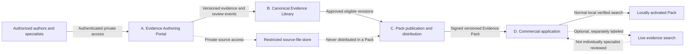
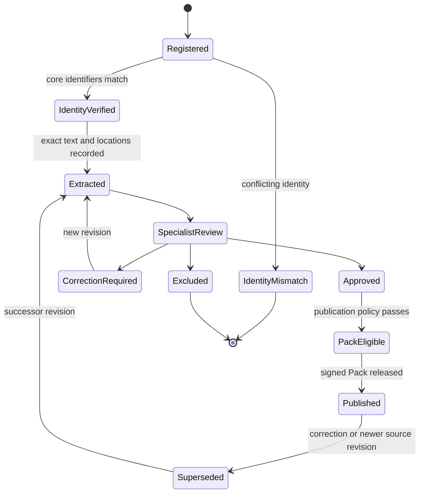
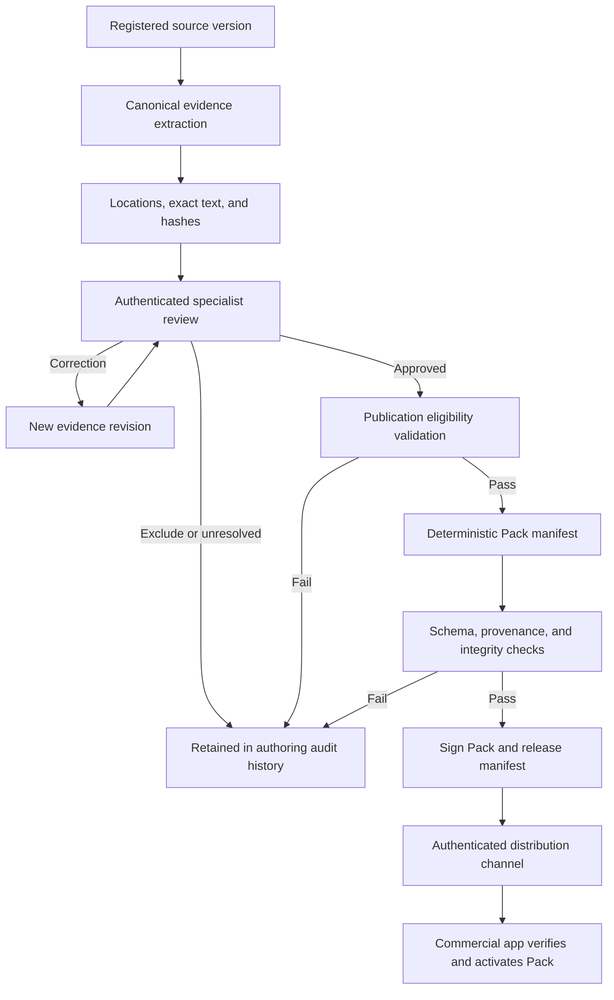
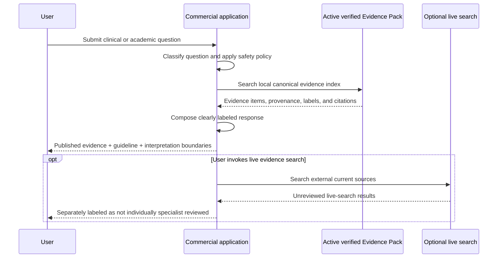

# Aortic Evidence Studio master architecture requirements

## 1. Purpose and authority

This document defines the approved target architecture for Aortic Evidence Studio (AES). It is the master product and system requirements baseline for future architecture, data-model, security, Evidence Pack, and commercial-application design work.

The target architecture replaces question-by-question duplication with a canonical, source-level evidence model. A source and each distinct evidence item are reviewed once, versioned, and then reused across any number of clinical questions. Evaluation Questions Q02 and Q03 remain example and regression questions, but they must not define a permanent requirement to repeat source-level specialist review for each question.

This document is intentionally vendor-neutral. Product and safety requirements are normative; named technologies, cloud providers, databases, identity systems, signing services, and deployment products are deferred implementation choices.

## 2. Product goals

AES must:

1. Provide a private cloud Evidence Authoring Portal that authorized users can access from the United States, Japan, and other approved locations.
2. Maintain a canonical Evidence Library in which a source and each distinct evidence item are reviewed once and reused across unlimited questions.
3. Make every approved evidence item traceable to the exact source identity, version, location, supporting text, and specialist decision.
4. Reduce uncertain citation chaining by linking recommendations and secondary citations to verified original primary sources whenever possible.
5. Separate published evidence, guideline recommendations, expert interpretation, and AI synthesis so users can understand the provenance and authority of every statement.
6. Publish signed, immutable, versioned Evidence Packs containing only approved published evidence.
7. Let the commercial application search and answer from a locally verified Evidence Pack during normal operation, without direct access to private authoring data.
8. Clearly identify live-search material that has not been individually specialist reviewed.
9. Preserve the complete history of evidence corrections, supersession, review, and publication.
10. Increase measurable evidence coverage and reliability with each Pack release.
11. Preserve bilingual English/Japanese product behavior and specialist-level terminology.
12. Remain portable across infrastructure vendors and compatible with multiple commercial delivery environments.

## 3. Non-goals

The target architecture does not:

- make the commercial application a direct browser of the private authoring repository;
- publish private PDFs or grant commercial users access to private source files;
- treat AI extraction or synthesis as specialist approval;
- automatically approve an evidence item, recommendation, synthesis, or answer;
- infer primary-source verification merely because a guideline or review cites a study;
- treat a secondary citation as equivalent to review of the original primary source;
- overwrite or silently correct previously published evidence;
- guarantee that a current Evidence Pack contains all available medical literature;
- describe live evidence search as specialist validated unless the individual evidence has completed the canonical review workflow;
- replace clinical judgment, original-source review, multidisciplinary discussion, regulatory confirmation, or instructions-for-use review;
- prescribe a particular cloud provider, database, identity provider, cryptographic service, search engine, or AI model;
- use Q02 or Q03 question-specific storage as the permanent canonical evidence model.

## 4. Governing principles

### 4.1 Source-level canonical review

- A source has one canonical identity and a version history.
- A distinct evidence item has one canonical record per source version and meaningfully distinct source location.
- Question mappings reference canonical evidence items; they do not copy their medical content or specialist decisions.
- The same evidence item may support unlimited questions, domains, comparisons, and answer components.
- A question-specific interpretation or synthesis remains separately versioned and must not alter the canonical source evidence.

### 4.2 Evidence integrity

- Evidence is extracted from the original source, never from memory.
- Exact quotations and locations must be preserved without fabrication or normalization that changes meaning.
- Recommendation class, strength, and level of evidence must be stored exactly as printed when applicable.
- Numerical measurements, thresholds, surrogate endpoints, remodeling endpoints, and clinical outcomes must remain distinguishable.
- Nonsignificant results must not be represented as equivalence.
- Remodeling must not be represented as proof of survival benefit.
- Observational association must not be represented as randomized causal evidence.
- Regulatory and IFU claims must include jurisdiction and verification date.

### 4.3 Human approval boundary

- Extraction, normalization, matching, translation assistance, and draft synthesis may be machine-assisted.
- Specialist approval is always an explicit authenticated human action.
- `verified_by_reviewer` and equivalent approval states must never be set automatically.
- Evidence becomes eligible for an Evidence Pack only after all required review and publication controls pass.

### 4.4 Immutability and correction

- Published evidence is immutable within a released Evidence Pack.
- Every correction creates a new evidence revision.
- A revision records its predecessor, reason, author, reviewer, timestamps, and affected Pack versions.
- Historical revisions, signatures, review events, and Pack manifests remain available for audit.
- Superseded evidence must remain identifiable and must not silently disappear from historical Pack reconstructions.

## 5. Four-part system architecture

### Part A: Private Evidence Authoring Portal

The private cloud portal supports source registration, controlled source-file access, extraction, original-source comparison, specialist review, reference-chain resolution, corrections, question mapping, synthesis drafting, and Pack-release preparation.

Required characteristics:

- authenticated, role-based access;
- access from the US, Japan, and other explicitly authorized locations;
- policy-controlled regional access rather than hard-coded geography;
- bilingual review interfaces where required;
- private source files never exposed through public or commercial routes;
- append-only audit events for material authoring and review actions;
- safe, atomic, version-aware evidence updates;
- explicit conflict handling when concurrent reviewers act on the same revision.

### Part B: Canonical Evidence Library and provenance service

The canonical library is the authoritative source for source identity, source versions, evidence items, source locations, supporting text, specialist decisions, reference chains, question mappings, and publication eligibility.

Required characteristics:

- source-level reuse across questions;
- immutable identifiers for sources, source versions, evidence items, and evidence revisions;
- explicit provenance and evidence-type classification;
- cryptographic hashes for source files and supporting text;
- traceable relationships from secondary sources to primary evidence;
- revision history and supersession links;
- validation rules independent of user-interface behavior;
- no automatic promotion from extraction to approved evidence.

### Part C: Evidence Pack publication and distribution

The publication system selects eligible evidence revisions, validates them, builds a deterministic manifest, signs the Pack, records the release, and distributes the Pack through an authenticated update channel.

Required characteristics:

- only approved, published evidence is included;
- no private PDFs, local paths, reviewer-only notes, or authoring credentials are included;
- deterministic or reproducibly verifiable Pack contents;
- manifest-level and file-level integrity checks;
- signature verification with explicit key identity and rotation support;
- semantic or otherwise ordered Pack versioning;
- rollback and revocation metadata without rewriting history;
- release metrics for coverage and reliability;
- compatibility metadata for commercial-app versions and data schemas.

### Part D: Commercial application and local verified search

The commercial application downloads, verifies, activates, and searches an Evidence Pack locally during normal operation. It does not directly query the private authoring system for routine evidence retrieval.

Required characteristics:

- reject Packs whose signature, manifest, schema, compatibility, or integrity verification fails;
- activate a Pack atomically and retain a safe prior version for rollback according to policy;
- search only the active verified Pack for normal validated-evidence queries;
- preserve evidence type, source identity, version, locations, and approval provenance in displayed citations;
- label expert interpretation and AI synthesis separately from published evidence;
- label live-search evidence as not individually specialist reviewed;
- never imply that Pack verification alone substitutes for clinical judgment or original-source review.

## 6. Expert-Validated Evidence requirements

Every Expert-Validated Evidence revision must identify, as applicable:

### 6.1 Source identity

- exact paper, clinical guideline, IFU, regulatory document, or other primary source;
- source type and publication status;
- title and responsible author, group, society, manufacturer, or regulator;
- edition, guideline edition, document revision, and publication version;
- journal, publisher, issuing organization, publication year, and publication date when verified;
- DOI, PMID, trial registration number, regulatory identifier, official document identifier, or another stable official identifier;
- jurisdiction and verification date for IFU and regulatory material;
- canonical source identifier and canonical source-version identifier.

### 6.2 Exact source location

- printed page;
- PDF page;
- chapter and section;
- recommendation identifier and exact recommendation wording when applicable;
- paragraph or stable text anchor;
- exact supporting text;
- Table number and row/column when applicable;
- Figure number and panel when applicable;
- appendix, supplement, protocol, or erratum location when applicable.

Both printed and PDF pages must be recorded when both exist. A stable text anchor must preserve enough normalized surrounding text or structured location data to relocate evidence after lawful source-file replacement or rendering changes.

### 6.3 Integrity and provenance

- cryptographic hash of the reviewed source file;
- cryptographic hash of the exact supporting text using a documented normalization rule;
- hash algorithm and normalization version;
- extraction revision and evidence revision;
- source-file acquisition provenance and access classification;
- links to superseded and successor revisions;
- reference-chain relationships;
- Pack versions containing the revision.

Hashes verify that reviewed bytes and text have not changed; they do not establish medical correctness or source identity by themselves.

### 6.4 Specialist review record

- reviewer identity;
- professional specialty and relevant reviewer qualification metadata;
- review date and timestamp;
- decision;
- comments or correction rationale;
- original-source confirmation;
- evidence revision reviewed;
- authenticated approval event and audit-event identifier;
- second-review or adjudication record when policy requires it.

Reviewer identity must be available for governance and audit. Whether it is displayed to commercial users is a separate product-owner decision.

## 7. Evidence classification and labeling

AES must store and display the following categories as distinct states, not as interchangeable labels:

| Category | Meaning | Pack eligibility |
|---|---|---|
| Guideline recommendation directly verified | The exact recommendation was checked in the original guideline version | Eligible after required approval |
| Underlying primary evidence verified | The original primary study or document supporting a statement was independently reviewed | Eligible after required approval |
| Secondary citation only | A guideline, review, or other secondary source cites or summarizes the primary source, but that primary source was not independently verified | Eligible only if policy permits, with explicit secondary-only labeling |
| Primary source not verified | The claimed primary source has not completed identity and content verification | Not eligible as primary-verified evidence |
| Citation mismatch | The cited source does not support the attributed statement, location, population, endpoint, or identity | Not eligible; requires correction or exclusion |
| Expert interpretation | A specialist's contextual interpretation or application of published evidence | Stored separately; never labeled published evidence |
| AI synthesis | Machine-generated combination, summary, or explanation | Stored separately; never labeled published evidence or specialist approval |

An evidence item may have multiple provenance relationships, but each displayed assertion must carry one clear authority label and traceable supporting records.

## 8. Reference-chain requirements

AES must reduce uncertain citation chaining by representing reference chains explicitly.

- A guideline recommendation may link to its supporting narrative, cited study, evidence table, and directly verified primary evidence item.
- A review or meta-analysis statement may link to cited studies and indicate which were independently verified.
- Each chain edge must identify the citing source version, cited identifier as printed, resolved canonical source when known, verification state, and reviewer decision.
- A chain must distinguish exact support, partial support, indirect support, unsupported attribution, and identity mismatch.
- Unresolved references remain visible and count toward release-quality metrics.
- The system must never infer that every cited primary source supports the secondary source's exact wording.
- Question synthesis may traverse only relationships permitted by publication and evidence-classification policy.

## 9. Evidence lifecycle

The canonical lifecycle is:

1. Register source identity and acquisition metadata.
2. Verify source identity and version.
3. Securely ingest or reference the private source file.
4. Extract distinct claims, recommendations, outcomes, definitions, and relevant source relationships.
5. Record exact source locations, exact supporting text, and integrity hashes.
6. Classify evidence type and verification depth.
7. Resolve or record reference chains.
8. Perform specialist review against the original source.
9. Correct by creating a new revision when required.
10. Approve, exclude, or retain as unresolved according to policy.
11. Map approved canonical evidence to questions and domains without copying the evidence record.
12. Create separately versioned expert interpretation and AI synthesis when needed.
13. Select only publication-eligible evidence revisions for a Pack candidate.
14. Validate, sign, publish, and audit the Pack release.
15. Monitor freshness, corrections, withdrawals, and newly resolved reference chains.
16. Supersede through a new revision and new Pack release; never rewrite prior Packs.

## 10. Authoring-to-Pack publication requirements

Pack publication is a controlled release process, not an export of the authoring database.

The release record must identify the evidence revisions included, excluded candidate counts, schema version, compatibility range, build process version, integrity hashes, signing key identity, publication approver, publication timestamp, and quality metrics.

## 11. Commercial-app query flow

The normal validated-evidence query path is local to the commercial application and its active verified Pack.

The commercial app must not silently combine Pack evidence and live-search material under a single validated label.

## 12. High-level canonical data entities

The detailed schema is deferred, but the target model must support at least:

- **ClinicalDomain** — controlled clinical taxonomy and bilingual labels.
- **EvaluationQuestion** — stable question identity, wording versions, scope, status, and domain mappings.
- **Source** — canonical intellectual-work or official-document identity.
- **SourceVersion** — exact edition, publication, correction, supplement, IFU revision, or regulatory version.
- **SourceFile** — restricted file metadata, storage reference, access class, and cryptographic hash; never a browser-visible private path.
- **SourceLocation** — printed/PDF page, section, paragraph/text anchor, table cell, figure panel, recommendation, or supplement location.
- **EvidenceItem** — stable conceptual evidence identity within a source.
- **EvidenceRevision** — immutable version of exact text, structured meaning, category, locations, and hashes.
- **NumericalResult** — population, endpoint, estimand, denominator, time point, uncertainty, and exact location, separated from descriptive thresholds.
- **Recommendation** — exact recommendation wording, class/strength, evidence level, jurisdiction or society, and exact location.
- **Definition** — source-specific terminology, disease phase, population, measurement, or endpoint definition.
- **ReferenceChainEdge** — typed relationship from a citing evidence revision to a cited source or evidence revision, with resolution and verification state.
- **SpecialistReview** — reviewer, specialty, reviewed revision, decision, confirmation, comments, and timestamp.
- **AuditEvent** — append-only record of security-relevant and evidence-relevant actions.
- **QuestionEvidenceMapping** — reusable mapping from a question version to canonical evidence revisions, with role and relevance.
- **ExpertInterpretation** — separately governed human interpretation linked to evidence revisions.
- **AISynthesis** — separately versioned machine-generated content linked to inputs, generation policy, and approval state.
- **EvidencePack** — immutable release identity, schema version, compatibility data, quality metrics, and publication status.
- **EvidencePackManifestEntry** — exact evidence revision and asset included in a Pack.
- **PackSignature** — signature, key identity, algorithm, timestamp, and verification metadata.
- **CorrectionNotice** — reason for correction, affected revisions and Packs, successor relationship, and disposition.

Stable IDs must not encode private paths, vendors, mutable titles, reviewer names, or deployment regions.

## 13. Storage and trust boundaries

### 13.1 Restricted source-file boundary

- Stores lawful private review copies, licensed materials, or controlled official documents.
- Accessible only to authorized authoring roles and controlled processing services.
- Never distributed in an Evidence Pack unless redistribution rights explicitly permit it and product policy approves it.
- Private paths and storage credentials never enter browser payloads, Pack manifests, logs intended for commercial clients, or user-visible citations.

### 13.2 Canonical authoring-data boundary

- Stores source identities, evidence revisions, review decisions, provenance, reference chains, question mappings, corrections, and audit events.
- Accessible only through authenticated, authorized authoring and governance services.
- Not directly accessible to the commercial application.
- Supports backup, disaster recovery, retention, and audit reconstruction policies.

### 13.3 Publication boundary

- Receives only publication-eligible records through a controlled release process.
- Produces immutable Pack artifacts, manifests, signatures, release metrics, and revocation or supersession metadata.
- Must prevent authoring-only fields and restricted file references from crossing into Pack contents.

### 13.4 Commercial local-data boundary

- Stores downloaded Pack artifacts, verification state, the active local index, and permitted application settings.
- Does not store authoring credentials or private source files.
- Treats unverified, corrupted, incompatible, revoked, or partially downloaded Packs as inactive.

### 13.5 Live-search boundary

- Is operationally and visually distinct from the verified-Pack path.
- Stores or caches results only under an explicit retention and privacy policy.
- Never upgrades live results to Expert-Validated Evidence without canonical ingestion and specialist review.

## 14. Roles and permissions

The system must support least-privilege roles. One person may hold multiple roles only when organizational policy permits it.

| Role | Principal permissions | Prohibited without additional role |
|---|---|---|
| Source curator | Register sources, manage identity metadata, initiate source-version verification | Specialist approval, Pack publication |
| Evidence author | Extract evidence, add locations, propose classifications, resolve references, create correction drafts | Approve own extraction when separation-of-duties policy forbids it |
| Specialist reviewer | Compare evidence with the original source, approve, exclude, or require correction | Alter audit history or silently rewrite published revisions |
| Adjudicating reviewer | Resolve reviewer disagreement and approve adjudicated revisions | Publish a Pack unless also authorized as release approver |
| Translation reviewer | Approve specialist-level translation while preserving the authoritative source language | Approve medical evidence unless separately qualified |
| Regulatory/IFU reviewer | Verify jurisdiction-specific regulatory and IFU evidence | General specialist approval outside assigned scope |
| Evidence librarian/governance lead | Manage taxonomy, duplicate resolution, supersession, policy exceptions, and quality reporting | Circumvent specialist review requirements |
| Pack release approver | Approve a validated Pack candidate for signing and publication | Modify evidence during release approval |
| Security administrator | Manage identities, roles, access policies, keys, and incident response | Make medical evidence decisions solely through administrative privilege |
| Auditor | Read provenance, review, release, and security audit records | Modify evidence or decisions |
| Commercial end user | Search active verified Packs and view permitted evidence provenance | Access private authoring data or private source files |

Authentication, session assurance, multi-factor requirements, geographic policy, emergency access, and separation of duties require a dedicated security specification.

## 15. Evidence Pack requirements

### 15.1 Content

An Evidence Pack contains only approved, published evidence revisions and the minimum metadata needed to verify, search, interpret, and cite them safely. It must exclude:

- Pending, correction-required, excluded, or citation-mismatch evidence as answerable content;
- private source files and private paths;
- authoring credentials and internal access details;
- reviewer-only operational notes unless publication policy explicitly permits them;
- unapproved expert interpretation or AI synthesis.

### 15.2 Verification

Before activation, the commercial application must verify:

- manifest signature;
- signing-key trust and status;
- Pack and component hashes;
- schema version;
- application compatibility range;
- completeness of required files;
- Pack version ordering and rollback policy;
- revocation or supersession information available under the chosen update policy.

### 15.3 Version quality metrics

Each Pack version should increase measurable coverage and reliability. Every release must report at least:

- validated evidence count;
- primary-source verification rate;
- Table/Figure verification coverage;
- clinical-domain coverage;
- source freshness;
- unresolved reference-chain count.

Metric definitions must be stable, versioned, and auditable. A release may temporarily regress a metric only with an explicit documented reason, such as removal of invalid evidence. Counts alone must not be treated as evidence quality.

Additional candidate metrics include correction rate, verification age, duplicate-resolution rate, recommendation-to-primary-evidence linkage, bilingual coverage, jurisdiction coverage, and time from correction acceptance to Pack release.

## 16. Q02 and Q03 migration and regression requirements

- Preserve Q02 and Q03 evidence, decisions, synthesis approvals, and Results behavior during architectural migration.
- Treat their current question-specific records as migration inputs and regression fixtures, not as the final canonical data model.
- Establish canonical source and evidence identities before replacing duplicated question-specific records.
- Map Q02 and Q03 questions to canonical evidence revisions without copying specialist decisions.
- Demonstrate that existing approved outputs can be reconstructed from canonical records and versioned question mappings.
- Preserve the native radio-button synthesis approval workflow unless a separately approved product requirement changes it.
- Do not automatically promote current Pending material during migration.
- Use migration reconciliation reports to identify duplicated, divergent, or question-specific evidence text before any cutover.

## 17. Vendor-neutral design requirements

- Define service contracts, schemas, identity claims, audit events, signatures, and Pack formats independently of a single provider.
- Use documented, portable cryptographic algorithms and serialization formats.
- Separate domain logic from cloud storage, queue, search, identity, key-management, and deployment adapters.
- Ensure data export includes canonical records, revisions, relationships, audit history, manifests, and verification metadata.
- Avoid stable identifiers derived from provider-specific resource names.
- Support deployment across regions without changing evidence identity or medical semantics.
- Document any vendor-specific implementation as a replaceable adapter and record migration constraints.

Vendor neutrality does not require the first implementation to operate on multiple vendors simultaneously.

## 18. Phased implementation roadmap

### Phase 0: Requirements and decision closure

- Approve this master requirements baseline.
- Define canonical evidence and provenance schemas.
- Define security, privacy, regional-access, and audit requirements.
- Define the Evidence Pack format, signing model, and commercial verification contract.
- Decide unresolved product-owner questions listed below.

### Phase 1: Canonical model and Q02/Q03 migration prototype

- Implement stable source, source-version, evidence-item, evidence-revision, location, review, and question-mapping entities.
- Build deterministic migration tooling for Q02 and Q03.
- Preserve all current medical text and specialist decisions.
- Produce reconciliation and regression reports.
- Demonstrate source-level reuse across both questions.

### Phase 2: Private authoring portal foundation

- Add authenticated roles, controlled source access, review workflows, reference-chain management, correction revisions, and audit events.
- Support authorized access from the US, Japan, and other approved locations under product policy.
- Preserve bilingual review capability.
- Add specialist approval and adjudication controls without automated approval.

### Phase 3: Evidence Pack publishing and commercial verification

- Define deterministic Pack build and validation.
- Add signing, key rotation, release approval, distribution, download, verification, atomic activation, rollback, and revocation handling.
- Publish quality metrics and release audit records.
- Demonstrate that private authoring data and source paths cannot cross the publication boundary.

### Phase 4: Commercial local query architecture

- Implement local verified-Pack indexing and question retrieval.
- Preserve provenance labels in search and answer presentation.
- Add clear separation for published evidence, recommendations, interpretation, and AI synthesis.
- Add optional live-search boundary with unmistakable unreviewed labeling.

### Phase 5: Scale, governance, and quality improvement

- Expand domains and source types through the canonical workflow.
- Measure reference-chain resolution, freshness, coverage, and correction performance.
- Exercise disaster recovery, audit reconstruction, signing-key rotation, Pack rollback, and incident response.
- Refine reviewer assignment, adjudication, translation, and conflict-of-interest policies.

Each phase requires explicit acceptance criteria, migration rollback, security review, and medical-safety regression tests before production use.

## 19. Unresolved product-owner decisions

The following decisions are intentionally open and must not be silently chosen during implementation:

1. **Authorized-location policy:** Which countries and regions are initially permitted, and are controls based on user organization, data residency, network location, contractual rights, or a combination?
2. **Regional deployment:** Is one global authoring tenancy acceptable, or are regional data planes, residency controls, or separate environments required?
3. **Source licensing:** Which source files may be stored, rendered, quoted, or redistributed, and what exact text may appear in commercial Packs?
4. **Reviewer identity display:** Which reviewer metadata is visible to commercial users versus restricted to governance and audit?
5. **Review policy:** Which evidence types require one reviewer, dual independent review, adjudication, or periodic re-review?
6. **Conflict-of-interest policy:** What disclosures or assignment restrictions apply to reviewers, authors, manufacturers, and funded studies?
7. **Secondary-only evidence:** May approved secondary-citation-only evidence enter a Pack, and under what labeling and use restrictions?
8. **Translation authority:** Does the Pack contain authoritative source-language text, approved translations, or both, and who approves translations?
9. **Source freshness:** What review-expiration and re-verification intervals apply by source type, clinical domain, jurisdiction, or regulatory volatility?
10. **Pack update policy:** Are updates automatic, user-approved, organization-controlled, or staged by release channel?
11. **Offline policy:** How long may a commercial app operate without checking Pack revocation or freshness status?
12. **Rollback and revocation:** Which corrections require immediate Pack revocation, warning-only status, or routine supersession?
13. **Signing governance:** Who controls signing keys, release authorization, rotation, recovery, and emergency revocation?
14. **Commercial provenance depth:** How much exact supporting text, reviewer provenance, and reference-chain detail is displayed or exported?
15. **Live-search scope:** Is live search included in the commercial product, which sources may it access, and can users disable it institutionally?
16. **AI synthesis policy:** Which Pack evidence categories may be synthesized, what model provenance is retained, and when is synthesis-level specialist approval required?
17. **Question approval:** Does an approved canonical evidence set require separate approval for every question mapping, interpretation, and synthesized answer?
18. **Patient or case input:** Will future commercial workflows accept clinical data, and if so, what privacy, retention, and regulated-product boundaries apply?
19. **Regulatory positioning:** What intended-use and jurisdictional product claims govern commercial functionality and required quality controls?
20. **Quality thresholds:** What minimum verification, freshness, reference-chain, and coverage thresholds are required for initial and subsequent Pack releases?

## 20. Detailed documents required in later tasks

Future work should create the following detailed architecture documents, each subordinate to this master requirements baseline:

1. Canonical evidence domain model and identifier specification.
2. Provenance, source-location, hashing, revision, and reference-chain specification.
3. Q02/Q03 migration, reconciliation, and regression-test plan.
4. Private authoring portal functional architecture.
5. Identity, roles, regional access, privacy, audit, threat model, and security controls.
6. Specialist review, dual review, adjudication, translation, correction, and governance workflow specification.
7. Evidence Pack schema, manifest, deterministic build, signing, key rotation, versioning, revocation, and release specification.
8. Commercial-app Pack download, verification, local storage, indexing, query, rollback, and offline behavior specification.
9. Evidence classification, answer labeling, expert-interpretation, AI-synthesis, and live-search safety specification.
10. Coverage, reliability, freshness, reference-chain, and release-quality metrics specification.
11. Vendor-neutral deployment, service boundaries, portability, backup, disaster recovery, and observability architecture.
12. Verification and validation plan covering medical safety, security, migration, Packs, commercial queries, and bilingual behavior.

## 21. Four follow-up documentation tasks

1. **Define the canonical evidence and migration model.** Produce the domain model, stable identifier rules, source/version/location/evidence/revision schemas, reference-chain model, hashing rules, and a non-destructive Q02/Q03 migration and reconciliation plan.
2. **Define the private authoring, governance, and security architecture.** Specify authoring workflows, specialist review and adjudication, translations, corrections, roles, authentication, authorized-location policy options, privacy boundaries, audit events, threat model, and operational governance.
3. **Define Evidence Pack publication and distribution.** Specify Pack schemas and manifests, eligibility, deterministic builds, quality metrics, signing and key governance, versioning, compatibility, release approval, distribution, rollback, revocation, and historical reconstruction.
4. **Define commercial consumption and end-to-end validation.** Specify verified download and activation, local indexing and query flows, provenance display, expert/AI/live-search labeling, offline behavior, Q02/Q03 regression acceptance, security testing, medical-safety testing, bilingual testing, and phased production acceptance criteria.

These four tasks should be completed in order. Each should identify product-owner decisions that block implementation and must not convert an unresolved policy choice into an implicit technical default.
