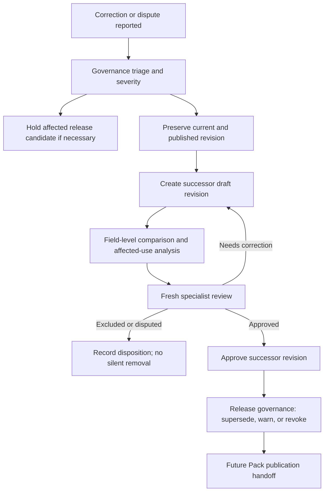
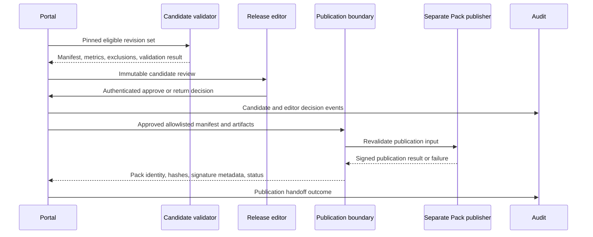

# Evidence Authoring Portal audit and governance

## Purpose

This document defines governance responsibilities, immutable audit requirements, correction controls, release-candidate oversight, and user/device revocation for the private AES Evidence Authoring Portal.

Governance must make it possible to reconstruct who knew, reviewed, changed, approved, published, superseded, disputed, retired, accessed, or revoked each governed object at any point in time.

## Governance bodies

### Product owner

- Approves intended use, user populations, regions, source-rights policies, and release-quality thresholds.
- Resolves product-policy decisions; does not approve medical evidence solely by product authority.

### Clinical evidence governance

- Defines evidence classifications, reviewer eligibility, review quorum, adjudication, conflicts of interest, re-review triggers, and correction severity.
- Owns interpretation of the Expert-Validated Evidence Standard.

### Source and licensing governance

- Defines acquisition, viewing, quotation, export, retention, archival, and takedown policy by source category and institution.

### Security and privacy governance

- Owns identity, geographic access, recovery, device, incident, audit-integrity, backup, and privacy policies.

### Release governance

- Defines release-candidate acceptance, editor eligibility, signing handoff, emergency hold, revocation, supersession, and Pack quality reporting.

### Independent audit

- Reviews controls and event integrity without operational update authority.

## Governance principles

- Least privilege and explicit accountability.
- Medical approval, release approval, and Pack signing are separate authorities.
- AI and service identities cannot hold human decision authority.
- Approved/published evidence is never edited in place.
- Historical actor identity and qualification snapshots survive account deactivation.
- Policy changes are versioned and prospective; prior decisions retain the policy version applied.
- Exceptions are rare, time-bounded, reasoned, approved, and audited.

## Audit event model

Every material event includes:

- immutable audit-event ID;
- event schema version;
- UTC timestamp from controlled time source;
- actor type and stable actor ID;
- authenticated subject, delegated/proxy context, and assurance level;
- role, institution, device/session, and approved-location policy result;
- action and outcome;
- target entity, stable ID, and exact revision;
- before/after object hashes or references to immutable snapshots;
- reason/comment where required;
- request, job, workflow, incident, and release correlation IDs;
- server authorization decision and policy version;
- client IP/region risk metadata under privacy policy;
- success, failure, rejection, or cancellation state.

Sensitive values, credentials, private paths, PDF contents, and unnecessary source text must not be copied into general audit logs.

## Audited actions

At minimum:

- login, failure, MFA, recovery, session refresh/logout, and alert;
- account, authenticator, role, institution, device, geographic policy, and revocation changes;
- source registration, identity confirmation, duplicate resolution, metadata correction, and rights change;
- upload start/chunk/finalization/cancel/quarantine/delete/archive and file access;
- extraction job creation, inputs, tool/model version, output, retry, cancellation, and failure;
- evidence draft/revision creation, location/hash update, classification, assignment, submission, and comparison;
- every specialist decision and inspection flag;
- every reference-chain resolution and support verification;
- correction report, triage, revision, dispute, adjudication, supersession, retirement, and affected-use analysis;
- release-candidate selection, validation, exclusion, metric, editor decision, handoff, publication result, and revocation;
- audit query/export/integrity check;
- backup, restore, disaster-recovery test, incident action, and legal hold.

Read access to highly restricted PDFs and reviewer identity is audited according to approved privacy granularity; routine page-tile access may be aggregated if detailed logs would create disproportionate privacy or operational risk.

## Integrity and retention

- Application roles have no audit update/delete interface.
- Events are append-only and replicated or checkpointed into an independently controlled integrity boundary.
- Hash chains, Merkle/checkpoint structures, signed digests, immutable retention controls, or an equivalent vendor-neutral mechanism detect alteration and gaps.
- Integrity checkpoints are verified on schedule and during incident/restore/audit review.
- Clock drift, sequence gaps, delivery backlog, rejected events, and unauthorized reads generate alerts.
- Retention schedules are approved per event class, jurisdiction, contractual duty, clinical governance need, and legal hold.
- Expiration deletes only when policy permits; deletion itself is audited and must not break required historical reconstruction.

## Specialist-review governance

- Reviewer eligibility is effective-dated by specialty, role, training, institution, source rights, and conflict-of-interest policy.
- Assignments define exact evidence revisions and source access.
- Review decisions are append-only and bind to the exact source-file and supporting-text hashes.
- Bulk reviewer identity/date entry is allowed; bulk decisions and bulk original-source confirmation are prohibited.
- Self-review policy is unresolved; recommended default separates author and reviewer.
- Disagreement creates adjudication or dispute, never silent replacement of one review.
- Account revocation does not invalidate historical review automatically; governance records whether re-review is needed.

## Correction and evidence-revision governance

Corrections may originate from authors, reviewers, auditors, commercial users, publishers, regulators, security incidents, or automated integrity checks. Automated detection creates a case, never a medical decision.

### Severity considerations

- transcription/location-only with no meaning change;
- source identity/version error;
- numerical or denominator error;
- population, timing, endpoint, causal, or authority-classification error;
- citation mismatch or inaccessible primary source;
- rights/privacy/security exposure;
- change affecting a published synthesis, question mapping, or Pack answer.

Severity affects urgency and release handling, not whether history is preserved.

### Correction safeguards

- No approval transfer to successor.
- New source-file bytes or changed exact text require new hashes and location verification.
- Affected question links, syntheses, translations, reference chains, release candidates, and Pack versions are enumerated.
- Historical Packs remain reconstructable; revocation/supersession records are additive.
- Emergency disablement may prevent use while review proceeds but cannot rewrite evidence.

## Reference-chain governance

- Chain verification assignments require access to each source version inspected.
- Metadata resolution, retrieval, location, and support are separate milestones.
- Unable-to-retrieve and mismatch states remain visible in quality metrics.
- A reviewer cannot mark a multi-hop chain fully verified without required edge decisions.
- Changes to inherited claim wording or target version trigger reverification.

## Release-candidate governance

Release preparation is a reproducible selection and validation process. It is not a database export.

### Required controls

- Pinned evidence, translation, question, and schema revisions.
- Eligibility computed under a recorded policy version.
- Field allowlist excludes PDFs, paths, credentials, reviewer-only comments, and authoring-only data.
- Deterministic manifest and artifact hashes.
- Quality metrics and unresolved-chain counts.
- Complete list of additions, changes, supersessions, retirements, and exclusions.
- Open correction, incident, legal, licensing, and revocation checks.
- Independent release-editor review and authenticated decision.
- Separate publication/signing revalidation.

## Release-candidate handoff

The release editor cannot modify evidence from the candidate screen. Any change returns the candidate to authoring and produces a new candidate ID.

## AI governance

- Approved AI use cases, models/tools, data boundaries, retention, and human-review expectations are versioned policy.
- AI input/output records include source/evidence hashes and tool provenance without leaking restricted content to unauthorized services.
- AI drafts start Pending and display their origin.
- AI cannot approve/exclude evidence, confirm original source, impersonate reviewer, transfer approval, resolve conflict, approve release, or publish/sign a Pack.
- Tool/model changes do not alter earlier evidence silently.
- Prompt injection or malicious PDF content is treated as untrusted input; tools receive least privilege.

## Audit review workflow

### Routine

- Scheduled access, role, recovery, PDF-access, review, correction, release, and audit-integrity reports.
- Sampling against immutable source/evidence snapshots.
- Reconcile role eligibility and terminated/changed staff.
- Review unresolved exceptions, chain mismatches, and stale access.

### Event-driven

- Unusual login/location/device activity.
- High-volume PDF access or exports.
- Reviewer decisions outside assignment/specialty.
- Repeated correction after approval.
- Release candidate changes after editor review.
- Audit delivery or integrity anomalies.
- Rights expiration, takedown, regulator/publisher correction, or incident.

### Audit access

- Auditors receive read-only, need-to-know access.
- Sensitive reviewer and source information may require elevated audit scope.
- Audit exports have purpose, recipient, classification, expiration, and access logs.

## User and device lifecycle governance

- Joiner: verified identity, institution, role eligibility, training, MFA, and rights acknowledgment.
- Mover: prompt reassessment of role, assignments, institution, specialty, source access, and device trust.
- Leaver: immediate or scheduled suspension, session/device revocation, reassignment, and preservation of historical attribution.
- Dormant accounts are disabled under policy.
- Periodic access certification by role owners.
- Service accounts have owner, purpose, least privilege, rotation, and expiration; no human decision authority.

## Institutional and global reviewer governance

- Institutional data/source access is enforced independently from global reviewer eligibility.
- Cross-institution review requires documented source rights and assignment.
- Global review does not grant broad library browsing.
- Reviewer identity may be globally visible to governance but restricted in commercial Packs.
- Canonical evidence identity is global; access to source files and comments can remain institution-scoped.

## Disaster-recovery governance

- Product owner approves RPO/RTO by data class.
- Restore authority is separate from routine application administration where feasible.
- Regular component restore and full disaster exercises.
- Validate object hashes, evidence/review links, event continuity, identities/roles, rights, and release-candidate state.
- Reconciliation prevents restore from resurrecting revoked access or overwriting later immutable decisions.
- Exercise results, exceptions, remediation, and acceptance are audited.

## Governance metrics

- overdue access certifications;
- privileged accounts and recovery events;
- device/session revocation latency;
- private source access anomalies;
- Pending/correction/disputed evidence aging;
- reviewer workload and adjudication time;
- correction frequency and time to successor/release;
- reference-chain verification and mismatch rates;
- release validation failures and post-editor changes;
- audit delivery/integrity health;
- backup restore success and achieved RPO/RTO.

Metrics support governance; they must not incentivize superficial approvals.

## Unresolved product-owner decisions

1. Governance membership, voting, escalation, and emergency authority.
2. Self-review and dual-review policies by evidence risk.
3. Reviewer qualification and conflict-of-interest requirements.
4. Audit retention and reviewer-identity privacy periods.
5. Correction severity thresholds for Pack warning versus revocation.
6. Release cadence, quality gates, and emergency release process.
7. Rights-based PDF access logging granularity.
8. Institutional/global adjudication authority.
9. Exact RPO/RTO, exercise frequency, and restore approvers.
10. Whether commercial-user correction reports enter this portal directly.

## Governance acceptance criteria

- Every material workflow action produces a complete append-only event.
- Event alteration or omission is detectable.
- Auditor can reconstruct an evidence revision from source registration through Pack handoff.
- Published evidence can only be corrected through a successor revision.
- AI cannot perform a governed human decision.
- Role and device revocation preserves history while ending active access within target.
- Release-candidate changes after editor approval create a new candidate and review.
- Disaster restore preserves hashes, decisions, revocations, and audit continuity.
- Institutional/global source access is demonstrably independent of canonical identity.
