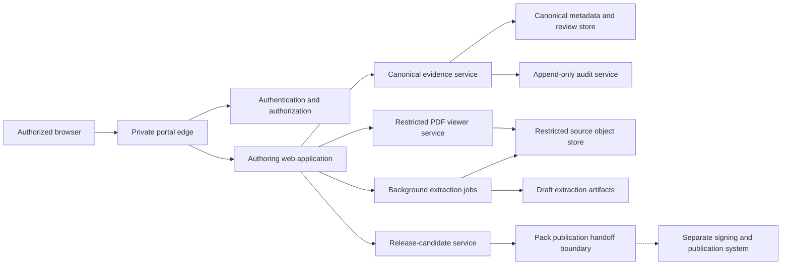
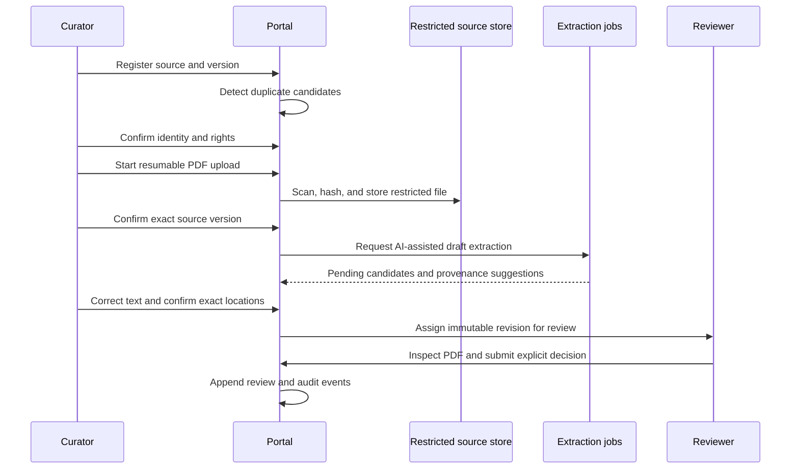

# Evidence Authoring Portal product requirements

## Purpose

The AES Evidence Authoring Portal is a private, browser-based workspace for registering sources, reviewing original documents, creating canonical evidence, performing specialist and reference-chain review, managing corrections, and preparing approved evidence for Evidence Pack publication.

The portal must be usable by authorized users in the United States, Japan, and other approved locations. Daily evidence-authoring work must eventually require no Terminal or Git commands. Command-line and repository workflows remain transitional administration and migration tools only.

## Product goals

- Review a source and each distinct evidence item once, then reuse it across unlimited questions.
- Keep the original source visible beside every evidence decision.
- Make provenance completeness and review state obvious.
- Prevent AI, metadata import, migration, or bulk operations from creating approval.
- Support bilingual English/Japanese authoring and specialist review.
- Preserve immutable approved and published history through explicit revisions.
- Hand off deterministic release candidates without exposing private source files.

## Non-goals

- Public PDF library or commercial-user access to private authoring data.
- Automatic specialist approval, approval transfer, or Pack publication.
- Replacement of institutional source licensing, clinical judgment, or original-source review.
- Patient records, clinical care documentation, or identifiable patient data.
- Selection of a cloud, identity, database, storage, or AI vendor.

## Portal components

The browser receives time-limited rendered source content or protected streams, never storage credentials, private storage paths, or unrestricted file URLs.

## Core information architecture

The portal should provide:

- **Dashboard:** assigned reviews, corrections, expiring access, release tasks, alerts, and system status.
- **Source Library:** canonical source identity, versions, duplicates, rights, files, and linked questions.
- **Evidence Workspace:** extraction candidates, exact locations, evidence revisions, classifications, and translations.
- **Specialist Review Queue:** assigned items, provenance completeness, original-source viewer, and decisions.
- **Reference Chains:** citing and cited sources, verification depth, mismatches, retrieval status, and unresolved chains.
- **Corrections:** disputes, revision comparisons, affected questions/Packs, and resolution state.
- **Releases:** eligible evidence, validation failures, release-candidate manifests, editor approval, and handoff state.
- **Governance:** users, roles, institutions, devices, audit review, access policy, incidents, and revocations.

## Required workflows

### 1. User authentication and account recovery

1. User opens the private portal over encrypted transport.
2. Identity service authenticates the user with multi-factor authentication.
3. Portal evaluates account status, role assignments, institution, device/session risk, and geographic policy.
4. User receives only authorized workspaces and records.
5. Failed or risky login attempts generate appropriate alerts and audit events.
6. Recovery uses verified, policy-approved channels and must not bypass MFA or administrator oversight for privileged roles.
7. Recovery revokes or rebinds affected sessions and authenticators and creates an immutable audit trail.

### 2. Source registration

1. Source curator selects source type and enters DOI, PMID, official identifier/URL, citation, edition/version, language, issuer, and rights classification.
2. System searches canonical sources and aliases before allowing a new candidate.
3. Metadata assistance may propose fields but clearly labels imported and unverified values.
4. Conflicting core identity fields block identity confirmation.
5. Curator confirms one source identity or records an unresolved candidate; no evidence is approved at registration.

### 3. PDF upload and source-version confirmation

1. Authorized curator selects a lawful local file and confirms access/rights category.
2. Client performs resumable upload with progress, pause, retry, cancellation, and integrity confirmation.
3. Server scans file type and malware, computes raw-byte hash, validates page structure, and stores it in the restricted boundary.
4. Portal compares embedded/visible metadata with the registered source/version.
5. Curator visually confirms title, issuer/journal, edition/year, DOI/PMID/official identifier where present, completeness, appendices, and corrections.
6. A mismatch quarantines the file; it is never attached silently.

### 4. Duplicate-source detection

1. System compares official identifiers, normalized citation, title, issuer/journal, year, edition, authorship, file hash, and bibliographic fingerprint.
2. Candidate duplicates display field-level agreements and conflicts.
3. Curator may link aliases, identify separate versions, defer, or request governance resolution.
4. No automated merge is permitted.
5. Every resolution preserves both candidate histories and an audit event.

### 5. AI-assisted evidence extraction

1. Authorized user starts extraction against an exact source-file version and defines scope.
2. Background job produces draft claims, outcomes, recommendations, locations, and possible reference links.
3. Every draft is labeled AI-assisted, records model/tool provenance and input hashes, and starts Pending.
4. AI output cannot approve evidence, set original-source confirmation, transfer approval, create reviewer identity, or publish a Pack.
5. Human author corrects transcription, scope, classification, location, limitations, and structured fields before review submission.

### 6. Exact location confirmation

1. Author opens PDF and evidence candidate side by side.
2. Portal records printed/PDF page plus paragraph/stable text anchor.
3. For tables, author confirms table, row, column, spanning headers, and footnotes.
4. For figures, author confirms figure, panel, axes, units, series, and time point.
5. Text and file hashes are recomputed under versioned profiles.
6. Page-only provenance fails submission to specialist review.

### 7. Specialist review

1. Reviewer accepts an assignment within authorized specialty and institution/global scope.
2. Portal locks the reviewed evidence revision and displays the exact source rendition.
3. Reviewer confirms identity, source text, locations, classification, scope, numerical values, uncertainty, and applicable materials.
4. Reviewer selects Pending, Approved, Excluded, or Needs correction and adds required comments.
5. Approved requires reviewer identity/date, original-source confirmation, complete provenance, and required inspection flags.
6. Decision is an immutable event bound to the exact revision.
7. No “Approve All” control exists.

### 8. Reference-chain verification

1. Reviewer opens the inherited claim and citation as printed.
2. Portal resolves or registers the target source/version without claiming content support.
3. Reviewer inspects the target original source, location, table/figure/supplement as applicable.
4. Reviewer records direct/indirect citation, retrieval, identity match, exact/partial/indirect/no support, mismatch, or unable-to-retrieve state.
5. Each edge is reviewed independently; no transitive approval is inferred.

### 9. Correction and new-revision workflow

1. User reports a transcription, location, classification, interpretation, citation, numerical, rights, or publication problem.
2. Portal preserves the approved/published revision and opens a correction case.
3. Authorized author creates a successor draft with field-level comparison and impact list.
4. New revision starts unapproved and requires complete review.
5. Approval never transfers from the predecessor.
6. Release governance determines supersession, warning, or revocation for affected Packs.

### 10. Release-candidate preparation

1. Release editor selects a scope and proposed evidence revisions.
2. Portal computes eligibility; users cannot toggle eligibility directly.
3. Validation checks review quorum, provenance, authority, rights, reference chains, translations, restricted-field exclusion, and schema compatibility.
4. Failures remain visible and cannot be overridden without a governed policy exception.
5. Portal creates a deterministic candidate manifest and quality metrics.

### 11. Release-editor approval

1. Release editor reviews manifest, changes, exclusions, metrics, corrections, compatibility, and affected domains.
2. Editor confirms that the candidate contains only permitted approved evidence and no restricted source data.
3. Editor signs an authenticated release decision, separate from evidence approval.
4. Editor cannot edit evidence during release approval.

### 12. Evidence Pack publication handoff

1. Portal transfers only the approved candidate manifest and permitted artifacts across the publication boundary.
2. Separate publication system revalidates integrity and editor authorization.
3. Signing keys remain outside portal application runtime and ordinary administrator access.
4. Publication result, Pack hash/version, signature identity, date, and failures return as audit events.
5. Portal itself cannot silently publish or sign a Pack.

### 13. Audit review

1. Auditor selects time, actor, source, evidence, review, release, institution, device, or incident filters.
2. Portal presents append-only events and linked immutable snapshots.
3. Export is access-controlled, watermarked/classified where appropriate, and audited.
4. Integrity verification detects missing, reordered, or modified events.
5. Auditor cannot modify evidence or audit records.

### 14. User and device revocation

1. Administrator or automated risk policy suspends account, role, session, authenticator, or device.
2. Active sessions and refresh credentials are invalidated within a defined target.
3. Pending privileged actions require reauthorization or reassignment.
4. Historical reviews retain the original actor identity and qualification snapshot.
5. Revocation and restoration require reason, authority, and audit events.

## Source upload to specialist approval

## Specialist-review screen

The default desktop layout places the original PDF and evidence candidate side by side. Tablet layout may use synchronized panes; mobile supports audit and lightweight decisions only if source comparison remains safe and usable.

The screen must show:

- exact original PDF rendition;
- canonical source and source-version identity;
- printed page and PDF page;
- exact supporting text;
- section, subsection, recommendation, paragraph, or stable anchor;
- Table number, row, column, headers, and footnote;
- Figure number, panel, axes, units, legend, and time point;
- supplement/appendix location;
- source-file hash and algorithm;
- supporting-text hash, normalization profile, and recompute state;
- evidence-authority and original-source verification state;
- reference-chain state and unresolved edges;
- reviewer identity, specialty/role, and review date;
- Pending, Approved, Excluded, and Needs correction controls;
- reviewer comments and correction rationale;
- predecessor/current revision comparison and affected use when applicable.

Decision controls remain per item. Bulk entry may populate reviewer identity and review date across a selected assignment batch, but must:

- require the authenticated user to be that reviewer or an explicitly authorized proxy workflow;
- never populate original-source confirmation or decisions;
- remain editable before each item submission;
- create audit events showing bulk metadata entry;
- provide no Approve All or equivalent keyboard/API shortcut.

## Bilingual requirements

- Navigation, instructions, safety notices, validation errors, statuses, and audit labels support English and natural specialist-level Japanese.
- Authoritative source-language text is visually distinct from translations.
- Japanese translations are labeled as translations and retain translator/reviewer provenance.
- Switching language does not change evidence values, decision state, or source anchors.
- Search supports English/Japanese terminology, controlled synonyms, and original-language exact text without conflating distinct medical terms.
- Dates, names, units, and identifiers retain unambiguous canonical forms.

## Accessibility

- Target WCAG 2.2 AA for portal UI, excluding unavoidable limitations of inaccessible third-party PDF content while providing alternative navigation.
- Full keyboard navigation, visible focus, semantic labels, high contrast, zoom/reflow, screen-reader status announcements, and non-color-only decision cues.
- PDF/evidence synchronized navigation must not trap focus.
- Hashes and long identifiers need copy controls and accessible labels.
- Timeouts warn users and permit safe extension where policy allows.
- Japanese text supports appropriate fonts, line breaking, and reading order.

## Browser and device support

- Current and previous major versions of managed Chrome, Edge, Safari, and Firefox, subject to security support.
- Desktop is the primary authoring and specialist-review experience.
- iPad-class tablets support full review where side-by-side or synchronized comparison is usable.
- Phones support alerts, assignments, audit lookup, and revocation; approving evidence on phones is a product-owner decision and should default off initially.
- Unsupported or compromised browsers fail safely and explain remediation.
- Device trust is risk input, not a substitute for user authentication.

## International and slow-connection behavior

- Region-aware delivery of static application assets without replicating restricted data outside approved boundaries.
- Progressive loading: metadata and page thumbnails before full-resolution page tiles.
- Server-side pagination and compact payloads for large evidence sets.
- Draft text autosaves with revision tokens; decision submission is explicit and idempotent.
- Clear offline/degraded state; no approval is queued invisibly while disconnected.
- Reconnect revalidates session, authorization, evidence revision, and file hash before accepting a decision.
- Latency budgets and monitoring distinguish US, Japan, and other approved regions.

## Upload interruption and resume

- Chunked, resumable, integrity-checked uploads with stable upload session IDs.
- Retry only missing chunks; final server hash must match completed upload bytes.
- Expired or revoked sessions cannot resume without reauthorization.
- Partially uploaded data is quarantined, encrypted, access-restricted, and deleted after a defined expiration.
- Users see progress, retry state, estimated remaining work, cancellation, and final validation.
- Upload completion does not confirm source identity or rights.

## Copyright and access safeguards

- Curator records acquisition and rights category before upload.
- Portal displays access/use restrictions and prohibits unauthorized redistribution.
- PDF viewer uses authenticated, short-lived access and disables direct persistent URLs; UI deterrents do not replace legal controls.
- Downloads, printing, clipboard, and page-image export are controlled by role and rights policy.
- Exact quotations and table/figure artifacts crossing into a Pack require rights-policy validation.
- Access to a PDF is logged at an appropriate privacy-preserving granularity.
- Takedown, license expiration, and legal hold workflows do not erase historical evidence provenance silently.

## Institutional and global access

- Users may be assigned to one or more institutions and/or a governed global reviewer pool.
- Institutional curators see sources and drafts permitted to their institution.
- Global reviewers see only assigned evidence and source renditions authorized for cross-institution review.
- Reviewer identity visibility follows governance policy and need-to-know.
- Institution boundaries never change canonical evidence identity.
- Cross-institution transfer, adjudication, and release require explicit authorization and audit.

## Product acceptance criteria

- All 14 workflows can be completed in supported browsers without Terminal or Git.
- An AI-generated candidate is unmistakably Pending and cannot invoke approval or publication APIs.
- No Approve All control or equivalent batch approval path exists.
- Bulk reviewer/date entry does not set confirmation or decision.
- Reviewer can verify text, page, paragraph, table cell, figure panel, file hash, and text hash in one coherent screen.
- Approval fails on stale revision, incomplete provenance, missing required metadata, or authorization failure.
- US and Japan users can complete representative upload/review workflows under defined latency and interruption tests.
- Interrupted uploads resume without duplicate files or lost integrity validation.
- Published revisions cannot be edited; correction creates a successor.
- Release editor cannot change evidence while approving a candidate.
- Portal cannot access Pack signing keys.
- Private paths, credentials, and unrestricted PDFs never reach browser payloads or release candidates.
- English/Japanese switching preserves evidence and decision state.
- Accessibility tests meet the approved WCAG target.

## Unresolved product-owner decisions

1. Initial countries, institutions, and authorized-location policy.
2. Whether phone-based specialist approval is permitted.
3. Exact browser support and managed-device requirements.
4. Reviewer assignment, quorum, and adjudication rules.
5. Translation approval workflow and commercial visibility.
6. PDF download/print/clipboard rights by source category.
7. Global reviewer access to institution-licensed content.
8. Which AI-assisted extraction capabilities and models are allowed.
9. Whether expert interpretation is reviewed in the same portal module.
10. Required release-editor separation from evidence reviewers.
