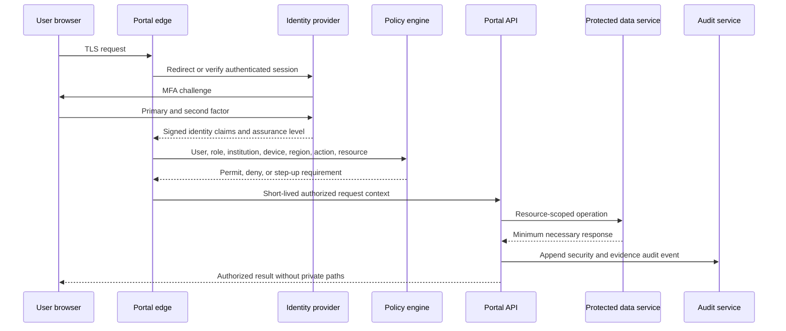
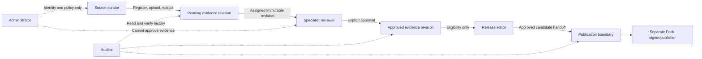

# Evidence Authoring Portal security and access architecture

## Security objectives

The private portal must protect evidence integrity, copyrighted source files, reviewer identity, publication authority, and audit history while supporting authorized browser access from the United States, Japan, and other approved locations.

Security is layered. Geographic controls, device trust, network location, and institutional affiliation supplement—but never replace—strong user authentication and authorization.

## Trust zones

1. **Untrusted browser/network:** No storage credentials, private paths, signing keys, or broad data exports.
2. **Portal edge:** Transport security, request filtering, rate limits, session binding, and regional policy enforcement.
3. **Application zone:** User-facing workflows and policy-enforced APIs.
4. **Canonical data zone:** Evidence, identity, review, chain, and release-candidate records.
5. **Restricted file zone:** Private PDFs, derived text, and protected renderings.
6. **Audit zone:** Append-only/tamper-evident events with independent access controls.
7. **Publication/signing zone:** Separate service and keys; portal sends candidates but cannot sign Packs.
8. **Administrative control plane:** User, role, policy, recovery, incident, and device administration under heightened assurance.

## Authentication and authorization flow

Authorization is evaluated on every privileged operation and resource, not only at login.

## Authentication requirements

### Multi-factor authentication

- MFA is mandatory for all authoring users.
- Phishing-resistant factors should be the default for administrators, specialist reviewers, release editors, and auditors.
- SMS should not be the preferred factor and must not be the sole recovery method for privileged accounts.
- Step-up authentication is required for account recovery, role changes, source-file export where permitted, specialist approval under risk conditions, release approval, and revocation reversal.

### Sessions

- Short-lived access tokens and bounded refresh sessions.
- Idle and absolute expiration vary by role and risk; privileged sessions are shorter.
- Token rotation and replay detection.
- Reauthentication after material role, device, region, or evidence-revision change.
- Explicit logout and administrator/device revocation invalidate active sessions within a defined objective.
- Unsaved drafts warn before expiration; decisions are never auto-submitted.

### Account recovery

- Verified recovery enrollment before account activation.
- Strong proofing and dual control for privileged account recovery.
- Recovery cannot grant a role not already authorized.
- Recovery rotates credentials/authenticators, revokes existing sessions, alerts the user, and creates immutable events.
- Break-glass accounts, if permitted, are hardware-protected, monitored, time-bounded, and excluded from medical approval unless separately eligible.

### Login alerts

- Notify users of new authenticator, recovery, password reset, new device, unusual region, repeated failures, and privileged access.
- Alerts contain no sensitive evidence or private source details.
- Users can report unexpected activity and trigger revocation.

## Remote access from the US, Japan, and approved locations

- Access policy uses an approved-location list managed by governance; it is not hard-coded in application logic.
- Country/IP geolocation is a risk signal with known error, VPN, travel, and mobile-network limitations.
- Policy evaluates user institution, role, contractual/source rights, device posture, network risk, and requested resource.
- Travel and temporary-location exceptions are preauthorized or explicitly approved, time-limited, and audited.
- Restricted source licensing may be narrower than general portal access; metadata access does not imply PDF access.
- No automatic replication of private PDFs into a country merely to improve latency.
- Static assets may use global delivery; restricted data placement follows approved residency and rights decisions.
- High-risk or impossible-travel events trigger step-up, deny, or security review according to policy.

## Role and separation-of-duty model

### Roles

- **Administrator:** Manages identities, roles, institutions, devices, policies, and incidents; no inherent evidence approval or Pack publication right.
- **Source curator:** Registers sources/versions, uploads permitted files, resolves metadata and duplicate candidates, and authors extraction drafts.
- **Specialist reviewer:** Reviews assigned evidence/references within specialty and source-access scope; cannot publish Packs or alter approved revisions.
- **Release editor:** Prepares and approves release candidates; cannot change evidence or substitute for specialist review.
- **Auditor:** Reads authorized audit/provenance records and verifies integrity; cannot alter evidence, users, or releases.
- **Commercial user:** Uses published Pack data through the commercial application; no private portal or PDF access by default.

### Permissions matrix

`Allow` means the role may be eligible; resource, institution, rights, and assignment policies still apply. `No` means a separate role is required.

| Permission | Administrator | Source curator | Specialist reviewer | Release editor | Auditor | Commercial user |
|---|---:|---:|---:|---:|---:|---:|
| Upload source | No | Allow | No | No | No | No |
| Edit source metadata | No | Allow | Propose correction | No | No | No |
| Extract evidence | No | Allow | Propose correction | No | No | No |
| Approve evidence | No | No | Allow | No | No | No |
| Revise approved evidence | No | Create successor draft only | Review successor only | No | No | No |
| Verify underlying primary sources | No | Draft links only | Allow when assigned | No | No | No |
| Prepare release | No | No | No | Allow | Read | No |
| Approve release candidate | No | No | No | Allow | Read | No |
| Publish/sign Pack | No | No | No | Handoff only | Read | No |
| Manage users/roles | Allow under dual control | No | No | No | Read audit | No |
| View private PDFs | No by default | Allow by rights | Allow when assigned | No by default | Exceptional read-only | No |
| View reviewer identity | Security scope | Limited | Own/assigned policy | Allow for release governance | Allow | Product-policy subset |
| View audit history | Security subset | Own actions | Own/assigned evidence | Release subset | Allow | No |

No role listed can sign/publish a Pack from the portal. Publication occurs in the separate signing system under task-3 design.

### Role and approval boundaries

### Separation-of-duty rules

- Administrator privilege cannot confer medical approval.
- Source author cannot approve the same revision unless a documented policy explicitly permits it; recommended default is separation.
- Release editor cannot modify candidate evidence and release approval does not create evidence approval.
- Signing keys and final Pack publication are separated from portal administrators and release editors.
- No AI/service identity can hold specialist-review or release-editor decision authority.
- Temporary role elevation is time-bounded, approved, and audited; it cannot retroactively authorize an action.

## Authorization model

Use role-based access control plus attributes:

- institution and project/domain membership;
- reviewer specialty and qualification;
- assignment;
- source rights/license scope;
- source/evidence lifecycle state;
- geographic policy;
- device/session assurance;
- action risk;
- conflict-of-interest/recusal state;
- legal hold or incident restriction.

Default deny. Policy decisions return a reason code and policy version for audit. The server is authoritative; hidden UI controls are not security.

## Encryption and secrets

- Modern TLS for all network paths, including service-to-service connections.
- Encryption at rest for databases, private files, backups, queues, logs, and temporary upload parts.
- Managed or equivalently controlled key lifecycle with rotation, access logging, and separation by environment/data class.
- Secrets are never committed, placed in browser bundles, or stored in evidence records.
- Short-lived workload identity is preferred over static credentials.
- Signing keys are isolated from portal runtime, general secrets management, database administrators, and routine backup sets.

## Administrative actions

High-risk actions require step-up authentication, explicit reason, immutable event, and where stated dual control:

- assigning administrator, reviewer, or release-editor roles;
- recovery of privileged accounts;
- changing geographic or source-rights policy;
- granting bulk PDF export or exceptional auditor PDF access;
- disabling audit delivery or retention controls;
- restoring data into production;
- reversing revocation;
- initiating emergency release/publish exceptions.

Administrators cannot edit audit events, specialist decisions, or published evidence.

## Device revocation

- Track registered authenticators, active sessions, refresh credentials, and optional managed-device identity.
- User and administrator can revoke a device/session.
- Security system can revoke automatically for compromise signals.
- Revocation propagates to portal edge and APIs within a defined target.
- Cached restricted content follows browser cache-control and managed-device policy; remote wipe is not assumed unless explicitly supported.

## Backup, restore, and disaster recovery security

- Encrypted, versioned, access-restricted backups with separate credentials and tested restoration.
- Backups include canonical records, review/audit linkage, policy configuration, and source files according to rights and retention.
- Audit integrity anchors and Pack release records have independent recovery paths.
- Restore occurs into an isolated environment first; hashes, referential integrity, malware state, authorization, and audit continuity are verified before promotion.
- Recovery does not roll back or erase known later review decisions silently; reconciliation is required.
- Define RPO/RTO by data class and test at least annually, with more frequent component restores.

## Incident response

- Detect, classify, contain, preserve evidence, eradicate, recover, notify, and review.
- Scenarios include account takeover, unauthorized PDF access, evidence tampering, audit-log interruption, malicious upload, credential leakage, signing-boundary compromise, and incorrect release candidate.
- Ability to suspend source access, user sessions, extraction jobs, release handoff, or publication independently.
- Preserve forensic logs with controlled access and legal retention.
- Medical/evidence integrity incident response includes affected evidence revisions, question mappings, and Pack versions.
- Post-incident corrections use new revisions and release governance; never edit published evidence.

## Audit-log integrity

- Append-only event interface with no update/delete operation for application roles.
- Event sequence, timestamps, actor/resource IDs, policy decisions, and before/after hashes.
- Tamper evidence through hash chaining, signed checkpoints, immutable retention, or an equivalent vendor-neutral control.
- Independent monitoring for delivery gaps, sequence gaps, clock anomalies, and unauthorized access.
- Separate auditor read access from operational administrators.

## Candidate implementation categories

No vendor is selected. The recommended default is the lowest-operational-burden managed category that satisfies portability and control requirements.

| Category | Required capabilities | Security requirements | Portability requirements | Lock-in risks | Recommended default | Deferrable decisions |
|---|---|---|---|---|---|---|
| Managed web hosting | Private app delivery, regional performance, deployment rollback, WAF/rate limits, runtime isolation | TLS, workload identity, network controls, immutable deployment logs | Standard build artifacts, documented environment contract, exportable config | Proprietary routing, edge functions, runtime APIs | Managed container or standards-based server runtime | Exact region topology and autoscaling |
| Managed relational database | Transactions, constraints, revisions, joins, backups, point-in-time recovery | Encryption, private connectivity, row/resource policy support, audited admin access | Standard SQL, schema migrations, logical export, no provider IDs in domain model | Proprietary extensions, identity coupling | Managed PostgreSQL-compatible relational service or equivalent | Read replicas, sharding, advanced search |
| Object storage | Multipart/resumable upload, versioning, retention, lifecycle, checksum, regional control | Encryption, private buckets, short-lived service access, access logs, legal hold options | Standard object semantics, manifest export, independent hashes | Proprietary eventing, archive tiers, egress | Private managed object store behind application services | Archive class, cross-region replication |
| Identity provider | MFA, phishing-resistant factors, federation, recovery, session/revocation, groups/claims | Strong admin controls, audit export, step-up, lifecycle APIs | Standards such as OIDC/SAML/SCIM and exportable identity mapping | Proprietary policy language, user lock-in | Managed standards-based workforce identity | Institutional federation sequence and social identity |
| Background jobs | Durable queues, retries, idempotency, cancellation, progress, dead-letter handling | Least-privilege workers, encrypted payloads, no approval authority | Portable job contract and queue abstraction | Proprietary workflow DSL and event formats | Managed queue plus stateless workers; workflow engine only if needed | Exact orchestration product and concurrency |
| Secrets management | Versioned secrets, workload access, rotation, audit, environment isolation | No browser exposure, least privilege, break-glass controls | Export/rotation procedures and adapter boundary | Provider-specific identity/key APIs | Managed secret store with workload identity | Rotation frequency by secret type |
| Monitoring and audit logging | Metrics, traces, alerts, security events, immutable audit export | Restricted access, integrity monitoring, retention, redaction | Open telemetry/log formats and bulk export | Query language, agent, retention, dashboard coupling | Managed observability plus independent audit archive | SIEM choice and long-term analytics |

Signing key management is deliberately outside this category table's portal secrets scope and will be defined with Pack publication architecture.

## Security acceptance criteria

- MFA and server-side authorization protect every authoring role.
- Privileged recovery and role assignment meet dual-control policy.
- Revocation invalidates sessions within the approved objective.
- US/Japan access tests cover authorized, travel, VPN, impossible-travel, and restricted-source cases.
- No role can both silently change published evidence and preserve its approval.
- AI/service accounts cannot call evidence-approval, release-approval, or publication authority paths.
- Portal administrators cannot sign Packs or alter audit events.
- Private PDF access requires both role and resource-rights authorization.
- Signing keys are unavailable to portal runtime.
- Backup restore proves hashes, audit continuity, and permissions before production promotion.
- Security tests cover IDOR/resource isolation, path traversal, upload attacks, session fixation/replay, CSRF, XSS, privilege escalation, and audit gaps.

## Unresolved product-owner decisions

1. Exact authorized countries, residency requirements, and travel exception process.
2. Institutional federation versus portal-managed accounts.
3. Required managed-device posture and phone/tablet approval policy.
4. Review author/reviewer separation and quorum.
5. Dual-control scope for administration and release handoff.
6. Session durations and revocation objectives.
7. RPO/RTO and backup geography by data class.
8. Reviewer identity visibility and auditor PDF access.
9. Incident notification obligations and regulated-product boundary.
10. Final vendor/category selection after threat, cost, and residency assessment.
