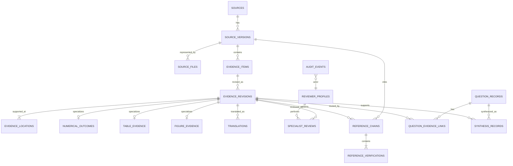
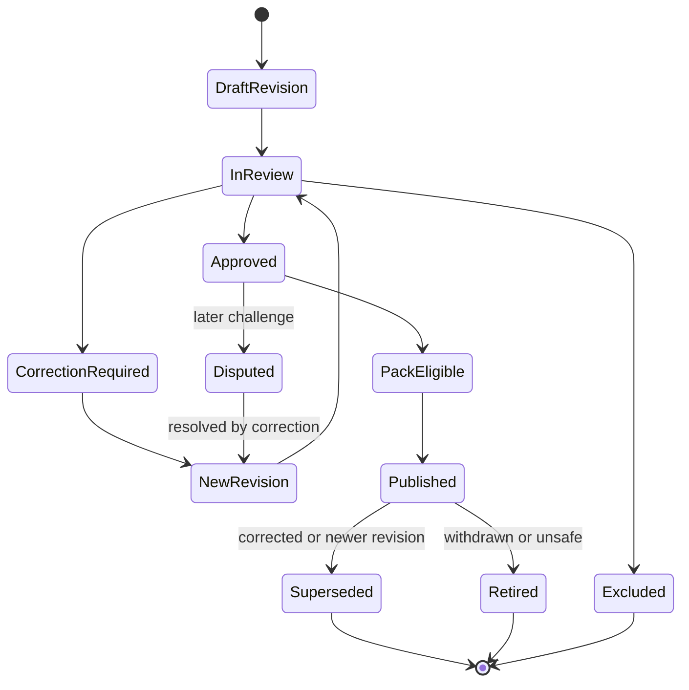

# Canonical evidence data model

## Status and scope

This document defines the vendor-neutral logical data model for the canonical Aortic Evidence Studio (AES) Evidence Library. It is subordinate to `AES_MASTER_ARCHITECTURE_REQUIREMENTS.md` and does not prescribe a database engine, serialization format, cloud provider, or API implementation.

The model separates stable identity from revision content. Questions refer to canonical evidence revisions; they do not own or copy source-level evidence or specialist decisions.

## Design invariants

1. One `source` represents one intellectual work or official document identity.
2. Every edition, correction, report, publication version, IFU revision, or regulatory revision is a `source_version`.
3. One `evidence_item` represents one distinct claim, recommendation, numerical result, table-derived result, figure-derived result, or definition.
4. Corrections create `evidence_revisions` without changing the stable evidence ID.
5. Published revisions are immutable. Supersession, dispute, and retirement are explicit relationships, never destructive updates.
6. A page number alone is never sufficient provenance.
7. Specialist decisions apply to a specific evidence revision and cannot be inherited silently by another revision or question.
8. Question mappings reference stable IDs and pinned revisions; they do not duplicate evidence text.
9. Audit history is append-only.
10. Private source-file storage references never cross the publication boundary.

## Identifier structure

Identifiers are opaque, stable, ASCII, case-normalized, and independent of filenames, titles, vendors, locations, reviewers, and mutable classifications.

| Entity | Proposed format | Example |
|---|---|---|
| Source | `SRC-<26-char sortable random ID>` | `SRC-01J00000000000000000000001` |
| Source version | `SRV-<26-char sortable random ID>` | `SRV-01J00000000000000000000002` |
| Source file | `SFL-<26-char sortable random ID>` | `SFL-01J00000000000000000000003` |
| Evidence item | `EVI-<26-char sortable random ID>` | `EVI-01J00000000000000000000004` |
| Evidence revision | `<evidence_id>@r<positive integer>` | `EVI-01J00000000000000000000004@r1` |
| Evidence location | `LOC-<26-char sortable random ID>` | `LOC-01J00000000000000000000005` |
| Specialist review | `REV-<26-char sortable random ID>` | `REV-01J00000000000000000000006` |
| Reference chain | `RFC-<26-char sortable random ID>` | `RFC-01J00000000000000000000007` |
| Reference verification | `RFV-<26-char sortable random ID>` | `RFV-01J00000000000000000000008` |
| Question | Existing public form or opaque ID | `Q03` |
| Question version | `<question_id>@v<positive integer>` | `Q03@v1` |
| Synthesis | `SYN-<question-version>-<positive integer>` | `SYN-Q03-v1-1` |
| Audit event | `AUD-<26-char sortable random ID>` | `AUD-01J00000000000000000000009` |

The 26-character component denotes a ULID-like sortable random identifier as a logical requirement, not a mandated library. Systems may use UUIDv7 or another collision-resistant equivalent if one representation is selected and documented before implementation.

Existing IDs such as `AES-RCT-003` remain aliases for migration and human navigation. They are not the canonical primary key because they encode a mutable local classification.

## Canonical entity relationships



## Common conventions

All versioned entities include `created_at`, `created_by`, and a schema version. Nullable fields are omitted from publication artifacts unless their absence is semantically meaningful. Dates use ISO 8601. Enumerations are versioned controlled vocabularies. Bilingual labels do not replace authoritative source-language text.

Publication eligibility is computed from immutable evidence content, locations, specialist reviews, evidence authority, source rights, reference-verification policy, and release policy. It is never a freely editable Boolean.

## Entity specifications

### `sources`

- **Purpose:** Canonical identity of an original paper, guideline, IFU, regulatory document, trial report, or official source.
- **Stable identifier:** `source_id` (`SRC-*`).
- **Required fields:** source type; normalized title; authoritative title; responsible author/group/issuer; identity status; created audit reference.
- **Optional fields:** DOI, PMID, official identifier, official URL, journal/publisher, trial registration, jurisdiction, legacy aliases.
- **Relationships:** One-to-many source versions; may be resolved targets of reference chains.
- **Version behavior:** Identity metadata corrections create audited metadata revisions; a genuinely different intellectual work creates a new source.
- **Immutability:** `source_id` and merge history are immutable. Duplicate resolution never deletes either source.
- **Publication eligibility:** Identity must be verified and free of unresolved core-identifier conflict.

### `source_versions`

- **Purpose:** Exact edition, publication version, correction, supplement, IFU revision, regulatory version, or trial report.
- **Stable identifier:** `source_version_id` (`SRV-*`).
- **Required fields:** source ID; version type; edition/version label; publication status; publication year/date when verified; authoritative language; identity-verification state.
- **Optional fields:** volume, issue, pages/article number, erratum relationship, superseded version, verification warning, effective jurisdiction/date.
- **Relationships:** Belongs to source; has files and evidence items; participates in citation chains.
- **Version behavior:** A materially different publisher version or official correction is a new source version.
- **Immutability:** Published version identity and relationships are append-only.
- **Publication eligibility:** Exact version must be verified; warnings may be allowed only by explicit policy.

### `source_files`

- **Purpose:** Restricted metadata for a reviewed file rendition.
- **Stable identifier:** `source_file_id` (`SFL-*`).
- **Required fields:** source-version ID; content hash; hash algorithm; byte length; MIME type; acquisition class; access classification; ingestion timestamp.
- **Optional fields:** lawful-access record, acquisition URL, OCR/text-layer status, page count, renderer profile, storage adapter reference.
- **Relationships:** Belongs to one source version; locations identify the reviewed file.
- **Version behavior:** Any byte change creates a new source-file record, even when bibliographic identity is unchanged.
- **Immutability:** Hash, byte length, and restricted storage reference are immutable. Files are never silently replaced.
- **Publication eligibility:** The source-file hash may be published; private path, storage reference, file bytes, and credentials may not.

### `evidence_items`

- **Purpose:** Stable identity for one distinct claim, recommendation, numerical result, table-derived result, figure-derived result, or definition.
- **Stable identifier:** `evidence_id` (`EVI-*`).
- **Required fields:** source-version ID; evidence kind; creation reason; lifecycle state.
- **Optional fields:** semantic fingerprint, legacy claim/outcome aliases, domain tags.
- **Relationships:** Has ordered evidence revisions; may have related/supersedes/disputed/retired relationships to other items.
- **Version behavior:** Wording or location correction creates a revision. A materially different proposition or result creates another evidence item.
- **Immutability:** Stable ID, source-version parent, and creation event are immutable.
- **Publication eligibility:** At least one approved, current, publication-eligible revision is required.

### `evidence_revisions`

- **Purpose:** Immutable content and meaning of an evidence item at a point in time.
- **Stable identifier:** evidence ID plus revision number.
- **Required fields:** evidence ID; revision number; authority classification; source-language assertion; exact supporting quotation; supporting-text hash; location IDs; provenance status; change reason; predecessor when revision >1.
- **Optional fields:** structured population/intervention/comparator/outcome/time; recommendation class/level; limitations; uncertainty; conflict note; semantic normalization.
- **Relationships:** Belongs to evidence item; links to locations, specialist reviews, translations, reference chains, questions, and syntheses.
- **Version behavior:** Revision numbers are monotonically increasing with no reuse or gaps silently filled.
- **Immutability:** A saved revision cannot be overwritten. Correction creates the next revision.
- **Publication eligibility:** Current revision must satisfy the Expert-Validated Evidence Standard and have required approval; disputed, retired, mismatch, or unverified classifications are ineligible unless a narrowly defined Pack policy says otherwise.

### `evidence_locations`

- **Purpose:** Precise, relocatable original-source provenance.
- **Stable identifier:** `location_id` (`LOC-*`).
- **Required fields:** source-file ID; location type; printed/PDF page when available; at least one stable structural or text anchor beyond page; anchor normalization version.
- **Optional fields:** chapter, section, subsection, recommendation number, paragraph index, quoted prefix/suffix, bounding box, supplement/appendix, table/figure coordinates.
- **Relationships:** Supports one or more evidence revisions; references a specific source file.
- **Version behavior:** Relocation against a new source file creates a new location; the old location remains.
- **Immutability:** Reviewed coordinates and anchors are immutable.
- **Publication eligibility:** A page-only location is ineligible. Location must resolve against the reviewed source-file hash.

### `numerical_outcomes`

- **Purpose:** Structured clinical, surrogate, safety, utilization, or descriptive result attached to an evidence revision.
- **Stable identifier:** Evidence ID; subtype has no independent identity unless independently reviewed.
- **Required fields:** outcome name/type; analysis population; time point; numerator/denominator or reported statistic; units; exact reported result; location.
- **Optional fields:** intervention/comparator, estimand, effect measure, confidence interval, p-value, missing-data rule, adjusted/unadjusted status, model covariates.
- **Relationships:** One-to-one specialization of an evidence revision; may link to table/figure evidence.
- **Version behavior:** Any corrected value, denominator, time point, or interpretation creates a new evidence revision.
- **Immutability:** Reported and derived numbers are distinct fields; derivation never overwrites reported data.
- **Publication eligibility:** Requires direct source support and specialist verification of numbers, denominators, units, and location.

### `table_evidence`

- **Purpose:** Provenance for evidence taken from a table.
- **Stable identifier:** Evidence ID plus location.
- **Required fields:** table number/title; row label/path; column label/path; exact cell text; table location.
- **Optional fields:** footnote markers/text, spanning headers, analysis population, derived-cell formula.
- **Relationships:** Specializes evidence revision and location; may support numerical outcome.
- **Version behavior:** Corrected coordinates or content create a new evidence revision/location.
- **Immutability:** Cell, headers, and footnote context are preserved as reviewed.
- **Publication eligibility:** Row and column context and applicable footnotes must be verified; table number alone is insufficient.

### `figure_evidence`

- **Purpose:** Provenance for evidence read from a figure.
- **Stable identifier:** Evidence ID plus location.
- **Required fields:** figure number/title; panel; axes and units when applicable; series/legend; time point; exact caption or supporting text; figure location.
- **Optional fields:** plotted estimate, uncertainty display, digitization method, bounding box, image hash.
- **Relationships:** Specializes evidence revision and location; may support numerical outcome.
- **Version behavior:** Re-reading or corrected digitization creates a new evidence revision.
- **Immutability:** Reported values and values digitized from graphics remain distinguishable.
- **Publication eligibility:** Panel, axes, units, time point, and extraction method must be verified.

### `translations`

- **Purpose:** Versioned translation of evidence text without replacing authoritative source-language wording.
- **Stable identifier:** `translation_id` (`TRN-*`).
- **Required fields:** evidence revision; source and target language; translated text; translation status; translator/reviewer provenance.
- **Optional fields:** terminology notes, machine-assistance disclosure, regional variant.
- **Relationships:** Belongs to exact evidence revision; may have translation review.
- **Version behavior:** Changed translation creates a new translation revision.
- **Immutability:** Approved translations are immutable and remain pinned to the source evidence revision.
- **Publication eligibility:** Requires translation approval under product policy and explicit non-original wording labeling.

### `specialist_reviews`

- **Purpose:** Explicit human decision on an exact evidence revision.
- **Stable identifier:** `review_id` (`REV-*`).
- **Required fields:** evidence revision; reviewer profile; role at review; specialty snapshot; decision; review timestamp; original-source confirmation; inspected-material flags; comments field; authenticated audit event.
- **Optional fields:** correction instructions, conflict-of-interest disclosure, second-review group, adjudication link.
- **Relationships:** Belongs to reviewer and evidence revision; may supersede an earlier review only by a new event.
- **Version behavior:** Decisions are append-only. Reconsideration creates another review record.
- **Immutability:** Actor, timestamp, decision, inspected flags, and reviewed revision cannot be edited.
- **Publication eligibility:** Required review quorum and decision policy must pass; Pending or correction-required reviews never qualify.

### `reviewer_profiles`

- **Purpose:** Governed reviewer identity and qualifications.
- **Stable identifier:** `reviewer_id` (`RVR-*`).
- **Required fields:** authenticated subject mapping; display identity; active status; specialty; role eligibility.
- **Optional fields:** credentials, jurisdiction, organization, language proficiency, conflict disclosures.
- **Relationships:** Performs specialist reviews and audit events.
- **Version behavior:** Qualification and affiliation changes are effective-dated; historical review snapshots remain unchanged.
- **Immutability:** Identity merge/split is audited; historical actor references remain resolvable.
- **Publication eligibility:** Reviewer must have been eligible at review time.

### `reference_chains`

- **Purpose:** Stable chain or edge describing a citation from a source/evidence assertion toward another source or evidence item.
- **Stable identifier:** `reference_chain_id` (`RFC-*`).
- **Required fields:** citing source version or evidence revision; citation text as printed; direct/indirect type; target resolution status.
- **Optional fields:** cited source/version/evidence target; bibliography number; inherited claim; parent chain; notes.
- **Relationships:** Connects source versions/evidence revisions; has verification events.
- **Version behavior:** Newly resolved targets or changed inherited claims create a new chain revision or verification, not destructive edits.
- **Immutability:** Printed citation and originating revision remain immutable.
- **Publication eligibility:** Depends on authority classification and latest verification policy.

### `reference_verifications`

- **Purpose:** Human verification of whether a citation target supports the inherited claim.
- **Stable identifier:** `reference_verification_id` (`RFV-*`).
- **Required fields:** chain ID; reviewer; date; retrieval status; support status; citation-match status; original-source inspection flags; comments.
- **Optional fields:** target source/version/evidence, mismatch category, retrieval attempts, adjudication.
- **Relationships:** Belongs to chain and reviewer; may point to verified evidence revision.
- **Version behavior:** Reverification creates a new append-only record.
- **Immutability:** Verification facts and decision are immutable.
- **Publication eligibility:** `citation mismatch`, `unable to retrieve`, and unverified primary targets cannot be labeled primary-source verified.

### `question_records`

- **Purpose:** Bilingual, versioned clinical or evaluation question identity and scope.
- **Stable identifier:** Existing `Q##` where governance guarantees stability, plus version.
- **Required fields:** question ID/version; English and Japanese wording; clinical domain; scope; status.
- **Optional fields:** population/intervention/comparator/outcome framing, priority, intended user.
- **Relationships:** Has question-evidence links and synthesis records.
- **Version behavior:** Material wording/scope change creates a question version.
- **Immutability:** Published question versions are immutable.
- **Publication eligibility:** Must be registered and active.

### `question_evidence_links`

- **Purpose:** Reusable mapping from question version to a pinned evidence revision.
- **Stable identifier:** `QEL-*` opaque ID.
- **Required fields:** question version; evidence revision; role; relevance; inclusion state; mapping provenance.
- **Optional fields:** PICO facet, display priority, interpretation note ID, exclusion rationale.
- **Relationships:** Joins questions and evidence revisions.
- **Version behavior:** Changed relevance or pinned revision creates a new link revision.
- **Immutability:** Published mappings are immutable and reconstructable.
- **Publication eligibility:** Linked evidence must be Pack-eligible; mapping may require separate approval under unresolved policy.

### `synthesis_records`

- **Purpose:** Question-level synthesis that references, but does not copy authority from, canonical evidence.
- **Stable identifier:** `SYN-*` with synthesis revision.
- **Required fields:** question version; input evidence revision IDs; synthesis type; text; generation/authorship provenance; review status.
- **Optional fields:** structured findings, limitations, translation, model metadata, specialist synthesis review.
- **Relationships:** Belongs to question; references evidence revisions; may reference expert interpretation records.
- **Version behavior:** Any text or input change creates a new synthesis revision.
- **Immutability:** Approved synthesis revisions are immutable.
- **Publication eligibility:** Requires all input and synthesis-level policy checks; AI synthesis is never reclassified as published evidence.

### `audit_events`

- **Purpose:** Append-only history of evidence, identity, review, mapping, release, access-policy, and correction actions.
- **Stable identifier:** `audit_event_id` (`AUD-*`).
- **Required fields:** event type; actor/service identity; timestamp; target type/ID/revision; action; before/after references or content hashes; request/correlation ID.
- **Optional fields:** reason, authenticated session assurance, region, policy result, signature, related event.
- **Relationships:** References any governed entity and actor.
- **Version behavior:** Events never change; corrections append compensating events.
- **Immutability:** Append-only with tamper-evidence and retention policy.
- **Publication eligibility:** Audit events are authoring records; selected non-sensitive provenance may be represented in Pack metadata.

## Lifecycle and relationship states

Evidence-item relationships are typed and effective-dated:

- `supersedes` / `superseded_by`: a successor should be used prospectively; prior Pack history remains validly reconstructable.
- `disputed`: qualified experts disagree about transcription, applicability, classification, or interpretation; dispute records identify scope and participants.
- `retired`: no longer eligible for new publication, with reason; retirement does not delete history.
- `related`: non-authoritative relationship requiring a subtype and rationale.



## Hashing model

### Algorithms and canonicalization

- Use a versioned, collision-resistant cryptographic algorithm; initial recommendation is SHA-256, recorded as `sha256`.
- Hash raw source-file bytes without newline, metadata, or OCR normalization.
- Hash supporting text from a deterministic UTF-8 canonicalization profile that normalizes Unicode to NFC and line endings to LF while preserving characters, punctuation, spacing semantics, case, and wording.
- Store both the verbatim quotation and its canonicalization version. Never retain only a hash.
- Derived OCR text, rendered images, table crops, and figure crops receive separate artifact hashes.

### Changed PDFs

- Any byte change creates a new `source_file` and file hash.
- If bibliographic identity and evidence text are unchanged, retain the source version, create new locations bound to the new file, and require relocation verification before publication from that rendition.
- If an official correction changes source content, create a source version and new evidence revisions as applicable.
- If identity is uncertain, quarantine the file; do not attach it silently to the existing version.

### Corrected OCR or extraction

- OCR correction changes the derived-text artifact hash, not the raw file hash.
- Correcting an extraction that changes the stored quotation, structured result, or meaning creates an evidence revision and a new supporting-text hash.
- Correcting only an internal OCR artifact that was never authoritative still produces an audit event and new artifact version.

### Duplicate detection

Candidates are detected using exact DOI/PMID/official identifiers, source-file hashes, normalized title, journal/issuer, year, edition/version, authorship, and bibliographic fingerprint. Detection creates a `possible_duplicate` relationship and comparison report. It never merges records automatically. Conflicting DOI, PMID, title, journal/issuer, year, or official version blocks merging until manual resolution.

## Synthetic canonical record examples

The examples below are non-medical placeholders and are not valid evidence.

```json
{
  "source": {
    "source_id": "SRC-01J00000000000000000000001",
    "source_type": "journal_article",
    "authoritative_title": "Synthetic Material Durability Study",
    "doi": "10.0000/example.synthetic.001",
    "identity_status": "verified"
  },
  "source_version": {
    "source_version_id": "SRV-01J00000000000000000000002",
    "source_id": "SRC-01J00000000000000000000001",
    "version_type": "version_of_record",
    "publication_year": 2099,
    "authoritative_language": "en"
  },
  "evidence_item": {
    "evidence_id": "EVI-01J00000000000000000000004",
    "source_version_id": "SRV-01J00000000000000000000002",
    "evidence_kind": "numerical_result"
  },
  "evidence_revision": {
    "revision_id": "EVI-01J00000000000000000000004@r1",
    "authority_classification": "primary_evidence_directly_verified",
    "exact_supporting_quotation": "Synthetic specimens retained 90 units at day 30.",
    "supporting_text_hash": "sha256:synthetic-placeholder-not-a-real-hash",
    "location_ids": ["LOC-01J00000000000000000000005"]
  },
  "location": {
    "location_id": "LOC-01J00000000000000000000005",
    "printed_page": "12",
    "pdf_page": 14,
    "section": "Results",
    "table_number": "2",
    "row_path": ["Day 30"],
    "column_path": ["Group A", "Value"],
    "footnote": "Synthetic units"
  }
}
```

## Current repository reuse assessment

### Candidates for reuse

- `database/source_catalog.csv`: migration input and source identity seed.
- `database/evaluation_questions.json` and `lib/evaluation-questions.ts`: question registry concepts and safe registered lookup.
- `lib/review-source-validation.ts`: safe question/source ID parsing and path-traversal rejection patterns.
- `lib/content-review-model.ts`: status vocabulary, date validation, source-location presence concepts, and explicit decision validation.
- `lib/content-reviews.ts`: server-only access and atomic temporary-write/rename pattern.
- `lib/review-workflow.ts`: fail-closed finalization concepts, registered lookup, and unrelated-change protection.
- `lib/approval-completeness.ts`: authoritative aggregation and incomplete-approval distinction.
- Validation scripts: offline schema/consistency-check pattern and regression-test entry points.

Reuse means adapting the safety behavior, not preserving question-specific storage as canonical.

### Transitional or eventually replaced

- `database/content_reviews/Q##_*.json`: migration sources; duplicated question-level evidence must become links.
- Embedded `validation_decision`, `reviewer`, and `verified_by_reviewer` fields: replaced by append-only specialist-review records, with compatibility adapters during migration.
- `specialist_validation` maps keyed by copied claim IDs: replaced by reviews of canonical evidence revisions.
- `outcome-<index>` fallback IDs: replaced by stable evidence IDs.
- `suitable_for_generated_answer`: replaced by computed, policy-versioned publication eligibility and Pack inclusion.
- `database/content_review_schema.json`: retained for legacy validation, then replaced by versioned canonical schemas.
- `database/synthesis_drafts/*.json`: synthesis content remains question-level but must reference canonical evidence revisions and have immutable synthesis revisions.

## Unresolved product-owner decisions

1. Choose ULID, UUIDv7, or another exact opaque-ID standard.
2. Decide whether a source correction is always a new source version or may be modeled as a related correction document plus affected revisions.
3. Define the semantic boundary between a corrected revision and a new evidence item.
4. Decide whether question mappings require independent specialist approval.
5. Define required review quorum by evidence type and risk.
6. Decide whether secondary-citation-only evidence can enter a Pack.
7. Define retention and publication policy for reviewer identity and comments.
8. Select initial hash algorithms and canonicalization profiles, including upgrade behavior.
9. Define whether figure digitization is permitted and its validation standard.
10. Define source-rights constraints on storing exact quotations and cropped table/figure artifacts in Packs.

## Acceptance criteria for implementation

- Creating a question link does not copy evidence text or specialist decisions.
- One approved evidence revision can support Q02, Q03, and a synthetic third question without another source-level review.
- Changing evidence wording creates a new revision and preserves the stable evidence ID and old revision.
- Materially different evidence cannot share an evidence ID.
- A page-only location fails validation.
- Table evidence fails without row/column context and applicable footnotes.
- Figure evidence fails without panel, axes/units, and time point where applicable.
- Specialist approval is bound to the exact evidence revision and cannot flow to a new revision automatically.
- File and text hashes are reproducible under their documented profiles.
- Replacing a PDF creates a new file record and requires location re-verification.
- Duplicate detection produces candidates but never silently merges them.
- Superseded, disputed, retired, and historical published revisions remain reconstructable.
- Private paths and source-file bytes are absent from publication objects.
- All material changes create append-only audit events.
