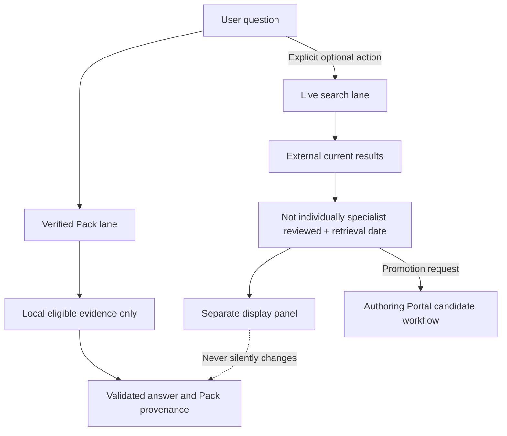

# Commercial application evidence query model

## Purpose

This document defines the commercial application's normal evidence-query path. The application searches the locally active, cryptographically verified Evidence Pack and does not query the private Authoring Portal or canonical authoring database for normal answers.

## Query invariants

1. Only evidence revisions included in the active verified Pack can receive the `Expert-Validated` label.
2. Pack ID/version and exact evidence revision remain attached through retrieval, synthesis, citation, display, and export.
3. Eligibility, authority, applicability, retirement, conflict, and jurisdiction are hard constraints or explicit labels; relevance scoring cannot erase them.
4. Grounded synthesis receives only the eligible retrieved set.
5. No source outside the retrieved set may be cited.
6. Evidence gaps remain gaps; model knowledge cannot fill them silently.
7. Live search is a separate, visibly unreviewed lane.

## Commercial query pipeline

```mermaid
flowchart LR
    Q["User question"] --> L["Language and intent analysis"]
    L --> P["Load active verified Pack context"]
    P --> R["Local candidate retrieval"]
    R --> K["Eligibility and applicability gates"]
    K --> N["Candidate ranking"]
    N --> A["Authority classification"]
    A --> C["Coverage, conflict, and jurisdiction checks"]
    C --> S["Grounded synthesis"]
    S --> V["Citation and provenance assembly"]
    V --> G["Safety validation"]
    G --> D["Bilingual Results display"]
```



Every stage returns structured diagnostics. A stage cannot upgrade evidence authority.

## Question analysis

The query analyzer produces a versioned, inspectable representation:

- input language and requested output language;
- question type and user intent;
- clinical domain and disease;
- population and exclusions;
- disease phase/timing;
- intervention/exposure and comparator;
- outcome and time point;
- risk/anatomical/device feature;
- jurisdiction and guideline organization;
- source/evidence type preference;
- request for recommendation, comparative evidence, regulatory/IFU status, mechanism, prognosis, safety, or limitation;
- ambiguity and missing context;
- safety flags and whether user entered potentially identifiable data.

Analysis may be deterministic, model-assisted, or hybrid. It does not retrieve private data, decide treatment, or create evidence.

## Active Pack context

Before retrieval the application confirms:

- active Pack ID, version, profile, and verification receipt;
- signature/trust and local integrity state;
- schema/search-index compatibility;
- Pack publication date and freshness;
- last signed status sequence/time and offline state;
- jurisdiction/domain/language coverage;
- minimum-safe-version and revocation state under current known policy.

If no safe verified Pack is active, the application must not present results as Expert-Validated Evidence.

## Evidence retrieval result contract

Every candidate preserves:

- evidence ID and exact revision;
- source ID and source version;
- Pack ID/version/profile;
- evidence kind and authority classification;
- exact supporting location and permitted quotation;
- specialist-review metadata intended for display;
- original-source verification state;
- reference-chain state;
- population, disease, phase, intervention/exposure, comparator, outcome, time, jurisdiction, and applicability metadata;
- supersession/retirement/dispute/conflict state;
- raw retrieval features, eligibility outcome, ranking score/components, and exclusion reasons.

## Authority and display classifications

The display must distinguish:

| Display class | Meaning |
|---|---|
| Specialist-validated evidence | Evidence revision approved and included in active verified Pack |
| Guideline recommendation | Exact recommendation verified in identified guideline version; underlying evidence status shown separately |
| Primary research | Original study evidence, with randomized/observational/other design and verification status |
| Regulatory information | Official regulatory evidence with jurisdiction and verification date |
| IFU information | Exact IFU version/jurisdiction and verification date |
| Expert interpretation | Human contextual interpretation; not published evidence |
| AI inference | Model-produced synthesis/inference grounded in listed inputs; not published evidence |
| Live evidence—not individually specialist reviewed | Separately retrieved current material outside the active Pack |
| Evidence gap | Pack lacks eligible evidence sufficient for the requested claim |

One item may need layered labels, for example “Guideline recommendation directly verified; underlying primary evidence not verified.” Labels cannot be shortened into a misleading generic validation badge.

## Coverage assessment

Coverage is evaluated against the parsed question dimensions, not merely candidate count:

- direct population match;
- disease and phase match;
- intervention/comparator match;
- requested outcome/time match;
- jurisdiction match;
- requested authority/source type present;
- direct versus indirect evidence;
- primary-source verification depth;
- required guideline/regulatory/IFU version freshness;
- conflicts and uncertainty;
- question dimensions with no eligible evidence.

Output states may include `sufficient_for_direct_answer`, `partial_coverage`, `indirect_only`, `conflicting`, `jurisdiction_mismatch`, and `no_validated_match`. Thresholds remain product-policy decisions and are visible in diagnostics.

## Conflict assessment

Conflicts are grouped without forced reconciliation:

- guideline recommendations differ by organization, jurisdiction, edition, population, definitions, timing, class, or evidence level;
- studies differ by design, population, treatment timing, endpoint, follow-up, estimate direction, uncertainty, or bias;
- primary source and secondary summary disagree;
- translation or terminology mappings are uncertain;
- superseded and current revisions differ materially.

Synthesis must preserve each source's terms and explain whether differences are true contradiction, scope difference, or unresolved ambiguity.

## Required answer behavior by evidence state

### No matching validated evidence

State that the active Pack contains no matching eligible evidence. Do not create a direct answer from model knowledge. Offer provenance-safe related evidence only if clearly indirect and optionally offer a separate live search when available.

### Insufficient coverage

Answer only covered dimensions, list uncovered dimensions, and lower confidence/strength explicitly. Candidate count alone cannot imply sufficiency.

### Conflicting guidelines or studies

Present each position with jurisdiction, version, population, design, evidence grade/uncertainty, and exact citations. Do not average recommendations or hide disagreement.

### Indirect evidence

Identify the mismatch dimension and prohibit direct extrapolation language unless clearly labeled expert/AI inference.

### Secondary-source-only evidence

Display “secondary citation only” and primary-source-not-verified state. Never inherit primary verification.

### Superseded evidence

Exclude from normal current retrieval when a current eligible successor exists; expose historical provenance on request. If retained for comparison, label prominently and never rank as current.

### Retired evidence

Exclude from answerable results. Show only governed retirement/history views if product policy permits.

### Disputed evidence

Do not use as unqualified support. Present dispute only if Pack policy includes it as warning content and the question requires conflict analysis.

### Different jurisdictions

Filter or label by requested/user jurisdiction. Never generalize regulatory or IFU status across regions. Guideline differences remain explicit.

### Outside population

Exclude from direct answer or label indirect with exact population mismatch. Eligibility criteria are not validated predictors, and prognostic factors are not treatment-effect modifiers without direct support.

### Uncertain translation

Show original authoritative text, labeled translation, ambiguity note, and terminology-version reference. Do not select a more convenient interpretation silently.

### Unsupported numerical precision

Use numbers exactly as reported and supported. Do not add decimal precision, calculate unstated percentages/thresholds, merge denominators, or convert estimates without visible, governed derivation.

## Answer structure

Adaptive display should support:

1. Direct answer
2. Expert-Validated Evidence
3. Guideline recommendations
4. Primary research
5. Regulatory and IFU information when relevant
6. Differences and conflicts
7. Clinical interpretation
8. Limitations
9. Evidence gaps
10. Source and validation details

Sections with no content may be hidden, but evidence gaps and material conflicts cannot be hidden. Expert interpretation and AI inference have distinct labels and citations to their evidence inputs.

## Provenance view

Every displayed evidence item opens a view containing:

- exact source and full citation;
- edition/version;
- DOI, PMID, official identifier, or official URL;
- printed and PDF page;
- section/subsection/recommendation/paragraph anchor;
- exact permitted supporting quotation;
- Table number, row, column, headers, footnote;
- Figure number, panel, axes, units, legend, time point;
- reviewer identity according to publication policy;
- specialty/role, review date, and original-source verification;
- reference-chain state and stopping point;
- evidence ID/revision and source ID/version;
- Pack ID/version/profile/publication date;
- supersession, retirement, dispute, correction, and translation state.

The commercial provenance view never links to a private PDF path.

## Verified Pack versus live search



Live results never inherit Pack validation, are not merged into the validated evidence set, and cannot silently alter a validated answer. Promotion to Authoring creates Pending candidates only.

## Offline behavior

- Local Pack retrieval and deterministic Results rendering continue offline while the Pack remains usable under last signed status policy.
- Live search is unavailable and clearly marked unavailable.
- If synthesis requires unavailable server AI, the app must either use an approved on-device synthesis capability or present structured retrieved evidence without free-form synthesis.
- It must never substitute unstated built-in knowledge.
- Display Pack publication date, last verified status time, and offline/freshness state.
- Do not claim evidence is current beyond Pack date/status.

## Synthetic non-medical query example

```json
{
  "question": "Which synthetic coating has verified day-30 retention evidence?",
  "language": "en",
  "active_pack": "AES-SYNTHETIC-CORE@1.2.0",
  "retrieved": [
    {
      "evidence_revision": "EVI-01J00000000000000000000004@r2",
      "authority": "primary_evidence_directly_verified",
      "applicability": "direct",
      "source_version": "SRV-01J00000000000000000000002",
      "location": "Table 1, Day 30 row, Retention column",
      "pack": "AES-SYNTHETIC-CORE@1.2.0"
    }
  ],
  "coverage": "partial_coverage",
  "gap": "No validated comparison with synthetic coating B."
}
```

## Unresolved product-owner decisions

1. On-device versus server-side synthesis.
2. Permitted offline synthesis and degraded Results behavior.
3. Reviewer-name display.
4. Response/query retention.
5. Live-search availability/providers.
6. Coverage thresholds and answer-withholding behavior.
7. Institutional overlays and jurisdiction defaults.
8. Commercial user authentication and entitlements.
9. Safety disclaimers and regulatory positioning.
10. Minimum Pack freshness and offline grace.

## Acceptance criteria

- Normal answers perform no Authoring Portal/database request.
- Only active-Pack revisions receive Expert-Validated labels.
- Every displayed assertion maps to retrieved eligible evidence or is labeled interpretation/inference.
- Evidence authority and applicability cannot be overridden by relevance rank.
- No-match and partial coverage remain visible.
- Retired/Pending/Excluded/unpacked evidence cannot leak into validated answers.
- Live search remains separate and dated.
- Provenance resolves exact evidence/source/Pack revisions and locations.
- Offline behavior never invents or overstates currentness.
