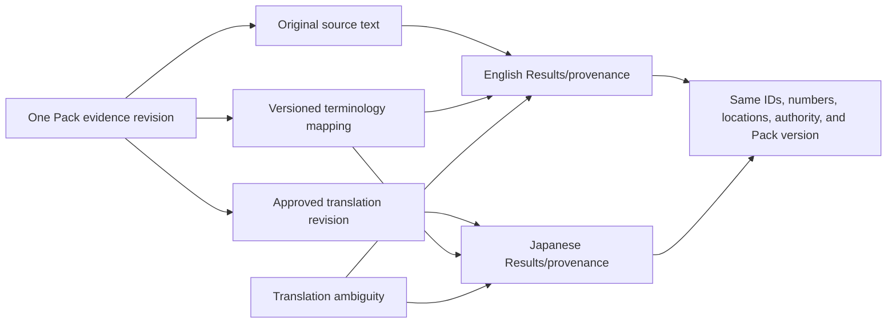

# Commercial application safety, bilingual, and regression requirements

## Purpose

This document defines commercial-app safety behavior, bilingual evidence fidelity, offline/live-search boundaries, and Q02/Q03 transition gates.

## Medical-safety boundaries

- The app supports specialist decision-making and academic work; it does not replace clinical judgment, original-source review, multidisciplinary discussion, regulatory confirmation, or IFU review.
- It requires no patient-identifiable information and warns users not to enter names, record numbers, birth dates, addresses, contact details, identifiable images, or other protected information.
- It does not provide automatic diagnosis, autonomous medical decisions, or unsupported personalized treatment directives.
- It does not hide incomplete coverage, indirectness, uncertainty, conflict, jurisdiction limits, Pack age, or live-search status.
- Emergency symptoms/questions receive appropriate direction to emergency/local clinical pathways without attempting autonomous triage beyond approved product scope.

## Evidence safety labels

Every answer and evidence card uses persistent, accessible, bilingual labels for:

- Specialist-validated evidence
- Guideline recommendation
- Primary research and study design
- Regulatory information and jurisdiction
- IFU information and jurisdiction/version
- Expert interpretation
- AI inference
- Live evidence—not individually specialist reviewed
- Evidence gap
- Indirect/outside-population evidence
- Secondary citation only/primary source not verified
- Conflict/dispute/supersession/retirement where displayed

Color is not the only signal.

## Question-input safety

- Prominent privacy warning near input.
- Input length and content handling limits.
- Optional local detection warns about likely identifiers without storing or transmitting them unnecessarily.
- Do not require patient data to retrieve general evidence.
- If user supplies individual details, answer remains general evidence support unless a separately approved regulated workflow exists.
- Prompt injection or requests to ignore evidence constraints cannot change Pack, policy, or retrieval authority.

## Applicability and personalized language

- State source population and match/mismatch.
- Avoid “you should” treatment directives unless product/regulatory policy explicitly supports a clinician-facing recommendation format and evidence applies.
- Use conditional language for applicability and identify need for clinical assessment.
- Do not infer contraindications, regulatory approval, device suitability, or IFU compliance from absence of evidence.
- Regional regulatory/IFU claims require region and verification date.

## Bilingual requirements

### Language-independent evidence set

Equivalent English/Japanese intent must operate on the same Pack and materially equivalent evidence set. Language switching cannot add/remove evidence, change ranking authority, alter numbers, or change medical meaning.

### Original text and translations

- Original authoritative quotation remains unchanged.
- Translation is separately labeled `Japanese translation` / `英訳` as applicable and references translation revision.
- A generated translation never replaces original quotation or inherits source status.
- Unapproved translation cannot be displayed as validated translation.
- Unresolved ambiguity is shown near affected text and in limitations.

### Terminology

- Versioned mappings for clinical terms, anatomy, phase, device/regulatory, outcomes, organizations, evidence classes, and safety labels.
- Source-specific terms remain distinct; mappings can express related/not-equivalent.
- Japanese output uses natural specialist terminology, not literal machine substitution.
- Original abbreviations and units remain available.

### Bilingual provenance display



## Accessibility

- WCAG 2.2 AA target for commercial UI.
- Keyboard navigation, screen-reader semantics, focus management, zoom/reflow, high contrast, and non-color-only states.
- Tables and evidence comparisons have accessible headers/captions and responsive alternatives.
- Provenance drawers/dialogs remain navigable and announce Pack/evidence status.
- Japanese typography, line breaking, fonts, reading order, and ruby only where helpful.
- Safety, conflict, gap, offline, and live labels are announced.

## Pack freshness and offline safety

- Display Pack version, publication date, active profile, and last signed-status verification.
- Validated retrieval continues offline only under signed status policy.
- App never claims “latest/current” beyond known Pack/status date.
- Live search is unavailable offline.
- If server synthesis is unavailable, use only approved on-device or structured local Results mode.
- Offline expiration/revocation uncertainty follows approved warning/restriction policy.
- A cached response is valid only with its original Pack/retrieval provenance and retention policy.

## Live-search safety

- Explicit user action or separately visible mode.
- Retrieval date/time and providers/sources shown.
- No individual specialist-review badge or Pack authority.
- No silent mixing into validated Pack answer or ranking.
- Separate citations and provenance.
- Promotion to Authoring Portal creates Pending candidates only.
- Live service failure does not affect local Pack retrieval.
- Provider output cannot instruct app to bypass privacy, safety, citation, or display controls.

## Response retention

Product policy must decide local/server retention. Recommended baseline:

- minimize storage of raw questions and answers;
- never include patient identifiers intentionally;
- bind saved/exported answer to Pack ID/version, retrieval receipt, synthesis policy/model version, and timestamp;
- make deletion/retention transparent;
- do not use commercial questions to alter canonical evidence or train systems without explicit approved policy/consent;
- update/revocation does not rewrite historical answer but may display current warning when reopened.

## Safety validation layers

1. Input privacy/scope checks.
2. Active Pack verification/freshness check.
3. Retrieval eligibility and applicability.
4. Coverage/conflict/gap analysis.
5. Grounding/citation/numerical checks.
6. Medical-language checks: causation, equivalence, remodeling, predictor/modifier, phase/population, regulatory/IFU.
7. Bilingual semantic checks.
8. Output labels, disclaimer, provenance, and Pack identity.

Failure may withhold free-form answer and show structured evidence; it must not loosen evidence constraints.

## Q02/Q03 regression strategy

### Baseline preservation

Before canonical/Pack transition, freeze approved regression artifacts for:

- source sets and explicit exclusions;
- exact approved findings/synthesis text;
- specialist decisions and approval metadata;
- Results sections, labels, warnings, and citations;
- English/Japanese behavior;
- native radio-button synthesis approval workflow where still applicable;
- Pending/Excluded/Needs correction non-use;
- current evidence-completeness/status behavior.

No evidence or decision is modified to create fixtures.

### Legacy versus canonical/Pack comparison

For each Q02/Q03 test query compare:

- evidence IDs through explicit migration map;
- source versions and evidence counts;
- included, missing, additional, superseded, and excluded items;
- exact quotations/locations/numbers;
- authority/reference-chain/applicability labels;
- synthesis assertions and citations;
- conflict, limitation, and gap statements;
- EN/JA evidence-set and semantic equivalence;
- Pack provenance and freshness display.

Any additional evidence must be explained by an approved canonical mapping/release, not ranking leakage.

### Acceptance gates before legacy retirement

- All legacy source/item/synthesis references resolve or are explicitly deferred.
- Same or stronger provenance; page-only legacy citations cannot be silently upgraded.
- No Pending, Excluded, correction-required, incomplete, disputed, retired, or unpacked evidence leaks.
- Approved Q02 content remains unchanged unless separately re-reviewed and released.
- Q03 states remain unchanged through migration.
- Canonical retrieval reproduces expected source set and exclusions.
- Bilingual numeric, citation, and meaning checks pass.
- Native synthesis approval remains available until replacement governance is explicitly accepted.
- Rollback to legacy read path is tested.
- Product owner and clinical evidence governance approve cutover report.

### Regression test categories

- Q02 direct Results golden tests.
- Q03 multi-source retrieval and high-risk terminology tests after approved migration.
- approval aggregation/metadata completeness.
- source ID/path traversal/private PDF exposure.
- evidence authority and chain labels.
- numerical fidelity and no unsupported precision.
- conflict/gap/indirectness.
- EN/JA switching and terminology versions.
- offline Pack search and unavailable synthesis fallback.
- live-search isolation.

## Current-state compatibility cautions

- Current `localStorage` question/mode/language preferences are not medical validation state, but response-retention architecture must be redesigned explicitly.
- Current Results contains Q02-specialized presentation and generic approved Results paths; both are regression inputs, not final Pack query architecture.
- Existing synthesis approval is human and native-radio based; do not remove during transition.
- Private local PDF workflow remains authoring-only and must never become commercial provenance links.

## Synthetic bilingual safety example

```json
{
  "evidence_revision": "EVI-SYNTHETIC@r1",
  "pack": "AES-SYNTHETIC-CORE@1.2.0",
  "original_text": "Synthetic retention was reported at day 30.",
  "translation_ja": {
    "label": "Japanese translation—not original-source wording",
    "text": "合成保持率は30日目に報告されました。",
    "translation_revision": "TRN-SYNTHETIC@r1"
  },
  "ambiguity": null,
  "same_evidence_set": true
}
```

## Unresolved product-owner decisions

1. On-device/server synthesis and offline permissions.
2. Reviewer-name display.
3. Question/answer/receipt retention.
4. Live-search providers and availability.
5. Institutional overlays and local policy wording.
6. Commercial authentication/entitlements.
7. Regulatory positioning and intended use.
8. Safety/emergency/clinical-judgment disclaimer wording.
9. Minimum Pack freshness/offline grace.
10. Translation-review quorum and ambiguity UX.

## Acceptance criteria

- EN/JA switching preserves evidence IDs, numbers, authority, applicability, citations, and meaning.
- Original text remains visible and translations labeled.
- Safety validator catches required evidence-integrity anti-patterns.
- No PII is required or intentionally persisted.
- Offline/live states are truthful and separate.
- Q02/Q03 gates pass before any legacy path retirement.
