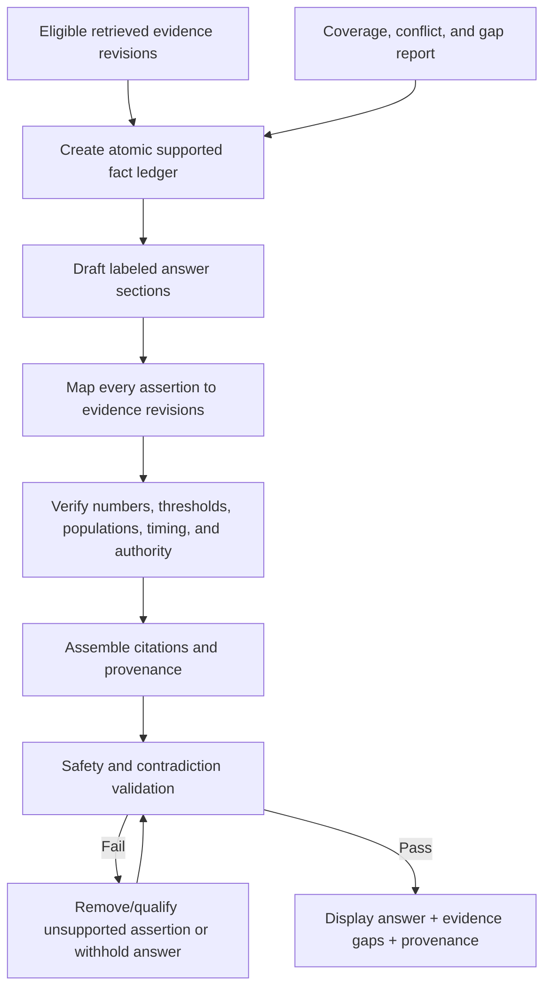

# Evidence-grounded synthesis and citation standard

## Purpose

This standard governs free-form and structured synthesis in the commercial application. Grounded synthesis may use only the eligible evidence revisions delivered by the retrieval receipt. It may summarize or compare them, but cannot expand the evidence set, change authority, or fill gaps from unstated model knowledge.

## Grounding contract

The synthesis engine receives:

- normalized question/intent and requested language;
- active Pack ID/version/profile and freshness state;
- immutable retrieval receipt;
- selected evidence records with exact revisions, structured facts, permitted quotations, locations, authority, review, chain, jurisdiction, applicability, conflict, and limitation metadata;
- explicit coverage/gap/conflict report;
- answer schema and safety policy version;
- approved terminology/translation mapping version.

It receives no private PDF, authoring record, Pending item, hidden excluded candidate, or unrestricted model retrieval context.

## Grounded synthesis and citation assembly



## Atomic fact ledger

Before prose generation, transform retrieved evidence into facts that retain:

- exact evidence/source/Pack revisions;
- proposition/result and evidence type;
- population/disease/phase/intervention/comparator/outcome/time;
- numerical value, units, denominator, uncertainty, and reported/derived status;
- recommendation wording/class/level/organization/jurisdiction;
- exact location and permitted quotation;
- authority/reference-chain/original-source state;
- applicability and conflict group;
- limitations and prohibited extrapolations.

Facts are not merged across sources unless the answer states the synthesis operation and preserves individual citations.

## Allowed synthesis operations

- faithful summary of one or more supported facts;
- comparison by population, phase, intervention, endpoint, design, organization, jurisdiction, edition, or evidence authority;
- explicitly labeled inference constrained by facts;
- enumeration of agreement, disagreement, uncertainty, limitations, and gaps;
- exact or safely rounded restatement only where source/reporting policy permits and original value remains available;
- bilingual rendering using approved translations/terminology while retaining original quotations.

## Prohibited operations

The synthesis engine must not:

- invent, autocomplete, or substitute citations;
- cite a source/evidence revision not in the retrieval receipt;
- alter source numbers, thresholds, units, denominators, time points, estimates, confidence intervals, p-values, recommendation class, or evidence level;
- add unsupported numerical precision;
- imply primary-source verification when absent;
- represent association as causation;
- interpret nonsignificance as equivalence;
- treat remodeling as proof of mortality benefit;
- present eligibility criteria or baseline descriptors as validated predictors;
- present prognostic factors as treatment-effect modifiers without direct support;
- collapse acute/subacute/chronic or uncomplicated/high-risk/complicated definitions across sources;
- hide disagreement or select one side without explaining applicability/authority;
- generalize regulatory/IFU evidence across jurisdictions;
- fill Pack gaps from pretrained/model knowledge;
- turn expert interpretation or AI inference into published evidence;
- provide an unsupported personalized treatment directive, diagnosis, or autonomous medical decision.

## Assertion-to-citation requirements

Every factual assertion must map to one or more fact-ledger entries. The validation layer checks:

- all cited evidence IDs are in selected retrieval set;
- cited revision exactly matches Pack record;
- assertion scope does not exceed supported population/phase/outcome/time;
- numerical tokens match approved values or documented allowed transformations;
- authority label matches evidence classification;
- conflicting evidence is represented when material;
- indirect/secondary-only/applicability limitations appear near the assertion;
- citation location is complete;
- Pack/version provenance is available.

An answer-wide bibliography without assertion-level mapping is insufficient.

## Citation display

Compact citation may show source short name, year, evidence type, and numbered link. The expanded provenance view contains the complete data required by the commercial query model.

When several sources support one statement:

- cite each supporting revision;
- avoid implying identical populations/endpoints;
- split statement if support scopes differ;
- preserve conflicts and hierarchy labels.

When evidence is indirect, label it before or within the claim—not only in a distant limitations section.

## Answer sections

Recommended adaptive sections:

### Direct answer

Concise answer limited to directly covered question dimensions. If coverage is insufficient, say so immediately.

### Expert-Validated Evidence

Pack-approved evidence grouped by authority and applicability.

### Guideline recommendations

Exact organization/version/jurisdiction, recommendation wording or faithful summary, class/level, and underlying-primary status.

### Primary research

Study design, population, timing, endpoints, results, uncertainty, and limitations. Separate randomized and observational evidence.

### Differences and conflicts

Materially different definitions, jurisdictions, recommendations, study results, and interpretations.

### Clinical interpretation

Explicitly labeled expert interpretation or AI inference. It cites inputs and cannot create authority.

### Limitations

Design, power, bias, indirectness, freshness, chain, translation, and applicability limitations.

### Evidence gaps

Missing populations, comparisons, outcomes, timing, jurisdictions, source verification, or current evidence.

### Source and validation details

Pack and item provenance plus links to expanded views.

## Conflict synthesis

- Identify conflict unit: wording, population, timing, endpoint, direction, grade, jurisdiction, or interpretation.
- Present each eligible position symmetrically enough to evaluate.
- Explain scope differences before calling findings contradictory.
- Do not calculate a consensus vote across guidelines.
- Do not pool studies unless a Pack-approved pooled evidence item exists or a separately governed calculation standard permits it.
- If conflict cannot be resolved from Pack evidence, state that explicitly.

## Numerical fidelity

- Preserve reported precision and units.
- Preserve numerator/denominator and analysis population.
- Do not infer missing denominators.
- Do not combine follow-up time points.
- Keep adjusted/unadjusted, ITT/per-protocol, clinical/surrogate/remodeling results separate.
- Any allowed conversion/rounding is deterministic, visible, and links to original value.
- Thresholds remain thresholds, not outcomes or validated predictors without support.

## Authority fidelity

Generated wording must use labels consistent with source:

- “recommends” only for an actual recommendation;
- “reported” for source findings;
- “associated” for observational association;
- “suggests” only with explicit uncertainty;
- “did not demonstrate” rather than “equivalent” for nonsignificant results;
- “primary source not verified” for secondary-only chains;
- “AI inference” for model combination not directly stated.

## Safety validation

Validation may combine deterministic rules, constrained model review, and templates. Deterministic checks are authoritative for IDs, numbers, source membership, classifications, and required sections.

Failure actions:

- correct formatting without changing meaning;
- remove unsupported sentence;
- split/qualify overbroad statement;
- add missing conflict/gap/authority label;
- regenerate only from same evidence set;
- withhold free-form synthesis and show structured evidence when safe generation cannot be demonstrated.

Never solve validation failure by retrieving unstated model knowledge automatically.

## Bilingual synthesis

- Evidence selection is language-independent after intent normalization.
- Original quotation remains unchanged and visible.
- Approved translation is labeled and pinned to evidence/translation revision.
- Generated interpretation follows versioned terminology mappings.
- Switching EN/JA regenerates or displays the same semantic fact ledger and citations.
- Translation uncertainty remains visible in both languages.
- Japanese output uses specialist-level terminology and preserves source-specific definitions.

## Live evidence

Live results are not inputs to the Pack-grounded synthesis. If product offers a combined comparison view:

- validated Pack synthesis remains unchanged and identifiable;
- live content appears in separate section with retrieval date and provider/source;
- live-derived synthesis is labeled unreviewed;
- no Pack Expert-Validated badge or reference-chain status transfers;
- promotion to Authoring creates Pending candidates.

## Offline synthesis

Permitted modes require product approval:

- deterministic structured Results assembled locally;
- approved on-device model constrained to Pack fact ledger;
- previously cached response tied to same question, Pack, receipt, and retention policy.

If no approved offline synthesizer exists, show retrieved evidence, coverage/conflicts, and citations without free-form generated answer. Do not claim server AI is required to access validated evidence itself.

## Synthetic non-medical example

```json
{
  "direct_answer": {
    "text": "Synthetic coating A has a verified day-30 retention result, but the active Pack contains no validated direct comparison with coating B.",
    "assertions": [
      {
        "text_span": "coating A has a verified day-30 retention result",
        "evidence_revisions": ["EVI-01J00000000000000000000004@r2"]
      }
    ]
  },
  "evidence_gap": "No validated direct comparison with coating B.",
  "pack": "AES-SYNTHETIC-CORE@1.2.0",
  "ai_inference": false
}
```

## Tests

- Citation-set containment and exact revision pinning.
- Hallucinated/mutated source ID rejection.
- Numerical token, threshold, unit, denominator, time, and precision fidelity.
- Authority verb/classification checks.
- Association/causation, eligibility/predictor, prognostic/treatment-modifier adversarial cases.
- Conflict and evidence-gap preservation.
- Outside-population/jurisdiction/phase restrictions.
- Bilingual semantic/citation equivalence.
- Live-result isolation.
- Offline structured fallback.
- Deterministic revalidation against fixed synthetic Pack/retrieval receipt.

## Unresolved product-owner decisions

1. On-device versus server synthesis and permitted models.
2. Whether free-form synthesis is allowed offline.
3. Required deterministic versus model-based safety checks.
4. Answer/receipt retention and caching.
5. Expert interpretation authorship/review.
6. Permitted numerical conversion/rounding.
7. Whether users can request historical/superseded synthesis.
8. Safety disclaimer language and regulatory positioning.

## Acceptance criteria

- Every factual assertion has an eligible retrieved citation or is explicitly labeled interpretation/inference.
- Citation IDs and numbers are mechanically validated against the Pack.
- No gap is filled by unstated knowledge.
- Material conflict, indirectness, authority, and jurisdiction remain visible.
- Structured evidence remains available when free-form synthesis is unavailable or unsafe.
