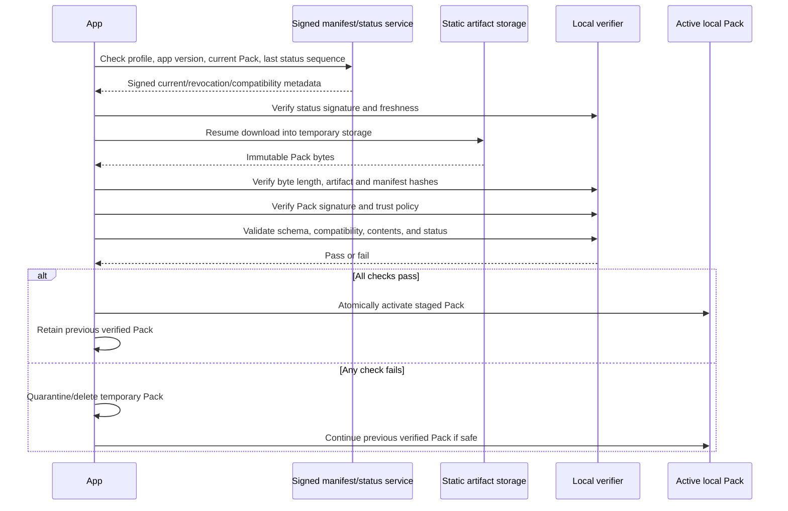
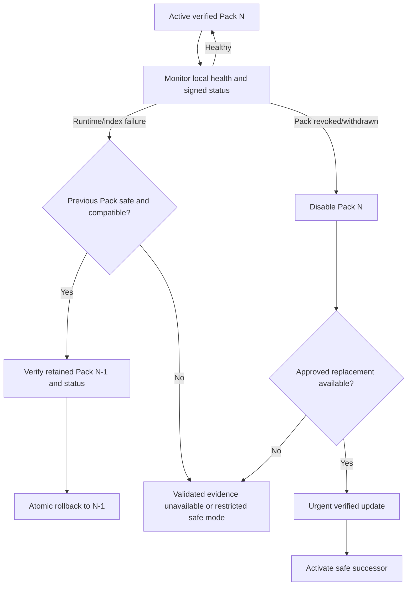

# Evidence Pack distribution, update, and rollback

## Purpose

This document defines how commercial applications discover, download, verify, activate, retain, roll back, and revoke signed Evidence Packs. Normal evidence search uses the locally active verified Pack and does not require private authoring access.

## Distribution principles

- Distribution is static-artifact delivery plus small signed status/manifest documents.
- Artifact hosting is not a trust root; bytes are trusted only after local verification.
- A failed update never replaces the active verified Pack.
- Activation is atomic and crash-safe.
- The previous verified Pack is retained for rollback unless policy marks it unsafe.
- Offline operation is bounded by signed status freshness and minimum-safe-version policy.
- Commercial app carries no private authoring credentials.

## Candidate interfaces

### Static artifact storage

- Immutable, version-addressed Pack, manifest, signature, notes, and metrics.
- Resumable byte-range or chunk delivery.
- No overwrite of published version keys.
- Geographic delivery may be optimized without changing bytes or trust.

### Manifest/status service

- Signed current/recommended versions by Pack profile/channel.
- Compatibility, artifact location, byte length/hash, revocation, minimum-safe version, and status freshness.
- Small cacheable documents with replay-resistant sequence.
- Service compromise cannot create a valid Pack signature.

### App update client

- Maintains trusted keys/status policy, installed Pack inventory, active/previous pointers, temporary downloads, verification results, and update history.
- Uses versioned portable protocols; vendor SDKs remain adapters.

## Update state machine

1. `idle`
2. `checking_status`
3. `update_available`
4. `downloading`
5. `download_paused` or `retry_wait`
6. `download_complete`
7. `verifying_artifact`
8. `verifying_signature`
9. `validating_schema_compatibility`
10. `staging`
11. `activating`
12. `active`
13. `failed_quarantined`
14. `rollback_pending`
15. `rolled_back`
16. `blocked_minimum_safe_version`

State changes are locally durable and idempotent.

## Commercial-app download and activation



## Version check

App sends no user question or medical content. It may provide:

- app version/platform and supported Pack/schema/trust capabilities;
- installed Pack IDs/versions/profiles;
- update channel;
- last accepted signed status sequence;
- coarse locale/region if required for profile selection and privacy-approved.

App verifies signed status before trusting version or artifact location. It rejects rollback to an older status sequence except through an explicit trusted recovery policy.

## Resumable download

- Download into per-Pack temporary storage, never active location.
- Record expected artifact length/hash and verified chunk/range state.
- Resume only against same immutable version/entity and expected hash/validator.
- If server bytes/version marker changes, discard incompatible partial data.
- Bound total bytes, decompression ratio, file count, path length, and parser resources.
- Expired download credentials may be renewed without discarding verified chunks when immutable identity matches.
- User can pause/cancel where product policy permits.

## Verification order

1. Signed status/current document and replay/freshness.
2. Expected version/profile and artifact metadata.
3. Download completeness and final artifact hash.
4. Safe container parse and declared-file inventory.
5. Manifest canonicalization and signature.
6. Signing key trust, purpose, scope, algorithm, time, and revocation.
7. Every logical file hash and byte length.
8. Pack/schema/index/app compatibility.
9. Required records, references, exclusions, and resource limits.
10. Minimum-safe-version and Pack withdrawal status.

Failure at any step prevents staging/activation.

## Atomic activation

- Fully verified Pack is staged in a versioned immutable local directory/store.
- Build/open local search index and run smoke queries before pointer switch.
- Persist verification receipt with Pack/artifact/manifest hashes, key ID, status sequence, and app version.
- Update one atomic active-Pack pointer/transaction.
- Crash before pointer switch leaves predecessor active.
- Crash after switch can recover active pointer and verify receipt/Pack before use.
- Never mutate active Pack files in place.

## Previous-Pack retention

Recommended default retains at least:

- active verified Pack;
- immediately previous verified compatible Pack;
- verification receipts and release notes for installed history.

Storage limits, number of archived local Packs, and institutional policy are unresolved. A revoked/unsafe Pack may remain quarantined for diagnostics only and must not be reactivated.

## Failed update behavior

- Keep previous active Pack if it remains above minimum safe version and not revoked.
- Clearly state update failed and whether current evidence remains available.
- Do not describe failed/new content as available.
- Retry transient network/incomplete download failures with bounded backoff.
- Cryptographic, schema, compatibility, or content failures require a fresh trusted check and may generate incident telemetry.
- Never bypass signature or compatibility through user confirmation.

### Synthetic update failure/rollback example

```json
{
  "event": "pack_update_failed",
  "pack_id": "AES-SYNTHETIC-CORE",
  "attempted_version": "1.2.0",
  "failure_stage": "artifact_hash_verification",
  "reason_code": "hash_mismatch",
  "activation_performed": false,
  "active_version_after_failure": "1.1.0",
  "active_version_safe": true,
  "temporary_artifact_action": "quarantined_then_deleted",
  "retry_allowed": "after_fresh_signed_status"
}
```

## Rollback

Rollback may occur because of local activation/runtime failure, product correction, Pack withdrawal, or compatibility regression.



### Rollback safeguards

- Target Pack must still verify and be compatible.
- Target cannot be revoked, withdrawn, or below minimum safe version.
- Rollback reason and source (automatic/user/admin/status) are logged locally.
- Rollback does not alter Pack bytes.
- App displays actual active version and freshness.
- Rollback is not allowed merely to regain evidence withdrawn for safety.

## Revocation and correction

### Revoked Pack manifest/status

Signed status identifies Pack ID/version, effective time, reason category, severity, minimum safe version, replacement when known, offline instructions, and status sequence/expiry. Sensitive incident details remain outside public status.

### Evidence-level retirement

An evidence item is retired through canonical governance and omitted or marked non-answerable in a successor Pack. Existing Pack remains immutable. If continued use is unsafe, affected Pack versions are revoked/withdrawn or minimum-safe-version policy forces successor adoption.

### Pack-level withdrawal

Used for widespread content, privacy, copyright, packaging, trust, or compatibility failures. App disables or rolls back affected Pack under signed policy. Historical artifact may remain archived for audit but unavailable for normal download/use.

### Emergency correction release

- Signed status may warn/revoke immediately.
- Replacement follows specialist, editor, validation, build, and signing controls.
- App prioritizes download and clearly reports restricted availability.
- Accelerated release never transfers evidence approval.

### Minimum safe Pack version

Signed status may specify minimum safe version by Pack profile and optionally minimum app/trust version. App below minimum:

- cannot silently continue validated evidence search;
- attempts urgent update;
- if unavailable, enters policy-defined restricted mode with clear warning;
- does not substitute live search as validated evidence.

Exact restricted-mode and grace policy require product-owner approval.

### Compromised signing key

- App obtains revocation via unaffected trusted status/root path.
- Reject new Packs signed by compromised key according to effective time/policy.
- Evaluate installed Packs against compromise window.
- Accept re-signed known-good artifact only under replacement trusted key and valid status.
- If trust recovery is unavailable, require commercial-app/trust update or institutional action; never trust replacement key solely from compromised source.

## Offline operation

App stores last verified signed status, its sequence, issue/expiry, active Pack verification receipt, and policy.

When distribution service cannot be contacted:

- Continue active Pack only within approved offline grace and if last status did not revoke it.
- Show Pack version and freshness/offline state.
- Do not claim currentness beyond known status.
- After grace expiration, follow product policy: warning-only, restricted validated search, or disable Pack; this is unresolved.
- Never activate an unverified downloaded Pack offline.
- Live search remains separately labeled and cannot cure expired Pack validation.

Institution-managed fully offline deployments require a separately approved signed-status distribution and revocation process.

## Copyright and privacy

- Distribution includes only minimal approved quotations and source links.
- Restricted-source flags inform display/export rules without exposing storage details.
- No PDF or unrestricted copyrighted full text is downloaded as Pack content.
- No private reviewer information or internal comments unless explicitly publication-approved.
- Update telemetry excludes user questions, generated answers, patient data, source-file access, and evidence reading history.

## Update security and medical-safety acceptance criteria

- App never activates Pack before complete local verification.
- Network/storage compromise cannot forge a trusted Pack.
- Partial/interrupted download cannot affect active Pack.
- Failed update leaves prior safe Pack active.
- Revoked/below-minimum Pack cannot be restored through rollback.
- Offline UI never overstates freshness or validation.
- Actual active Pack ID/version is visible and auditable.
- Update process does not send user questions or medical content.
- Live search and generated answers are not Pack update content.

## Later implementation tests

- Interrupted/resumed download across app restart and credential renewal.
- Corrupt/truncated/oversized/decompression-bomb/path-traversal archives.
- Altered manifest/file/signature/key/status rejection.
- Schema/index/app incompatibility.
- Atomic activation crash at every write/switch point.
- Previous-Pack retention and rollback.
- Revoked predecessor, minimum safe version, and no-safe-Pack behavior.
- Offline grace, stale/replayed status, and clock changes.
- Compromised key and trust-root recovery.
- Concurrent update checks and idempotency.
- Slow/high-latency US/Japan representative networks.
- Privacy inspection of update requests and telemetry.

## Must not be implemented before approval

- Forced update, grace period, and restricted-mode UX.
- Minimum safe version authority and criteria.
- Automatic rollback policy.
- Installed Pack retention count and storage budget.
- Distribution channels, staged rollout, institutional controls, and telemetry.
- Offline deployment and revocation delivery.
- Artifact/status hosting vendor and regional topology.

## Unresolved product-owner decisions

1. Automatic versus user/institution-approved updates.
2. Offline grace and post-expiry behavior.
3. Minimum-safe-version and forced-update authority.
4. Rollback triggers and whether users can initiate rollback.
5. Local Pack retention/storage limits.
6. Staged channels and institutional pinning.
7. Revocation/withdrawal user communication.
8. Fully offline deployment support.
9. Update telemetry and privacy policy.
10. Required availability/latency for Japan and other regions.
