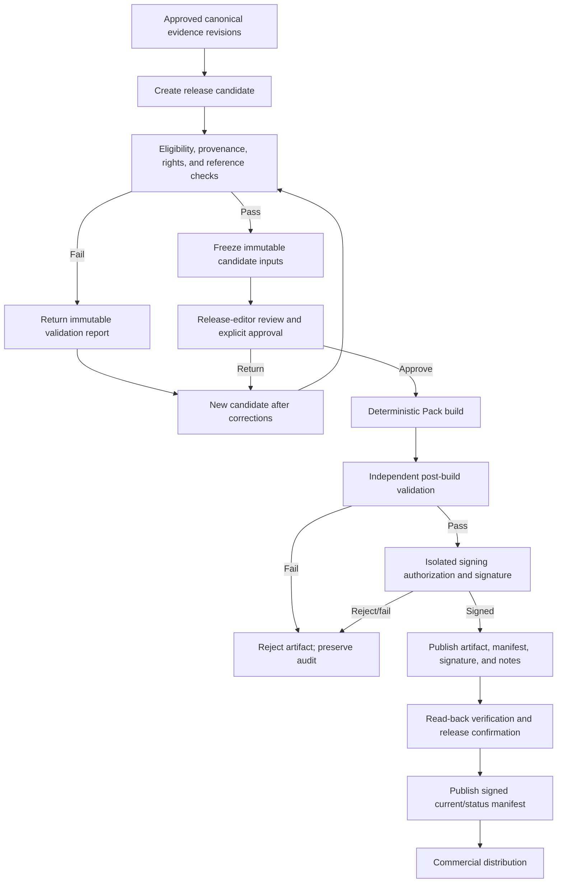

# Evidence Pack publication and release process

## Purpose

This document defines the controlled process that transforms approved canonical evidence into an immutable signed Evidence Pack. Publication is a governed pipeline with independent medical approval, release approval, validation, and signing authorities.

## Separation of duties

- **Specialist reviewers** approve exact evidence revisions against original sources.
- **Release editors** select scope, review validation results, and approve an immutable release candidate.
- **Pack builder** deterministically assembles approved inputs; it has no human decision or signing authority.
- **Validation service** checks eligibility, provenance, schema, rights, exclusions, reproducibility, and integrity; it cannot approve evidence or release.
- **Isolated signing service** signs only an independently authorized manifest/artifact hash.
- **Publisher/distribution operator** makes signed artifacts available but cannot modify them.
- **Auditor** observes all stages and verifies history without update authority.
- **AI** performs no evidence approval, release approval, publication, or signing action.

No portal user can silently alter or sign published content. A person holding multiple eligible roles is still subject to policy-enforced action separation and audit; recommended default is separate specialist, editor, and signing authorities.

## Release states

1. `planning`
2. `candidate_draft`
3. `candidate_frozen`
4. `validation_failed`
5. `editor_review`
6. `editor_returned`
7. `editor_approved`
8. `build_completed`
9. `signing_rejected`
10. `signed`
11. `published`
12. `release_confirmed`
13. `superseded`
14. `revoked` or `withdrawn`

State transitions are append-only events. Changed content after `candidate_frozen` creates a new candidate ID.

## Publication workflow



## 1. Release planning

Release editor defines:

- Pack ID/profile and proposed semantic version;
- domains, jurisdictions, languages, and app compatibility;
- evidence inclusion cutoff and policy versions;
- intended changes and urgency;
- release channel and rollout plan;
- predecessor and minimum safe version implications;
- required reviewers, approvers, and schedule.

Planning cannot change evidence status.

## 2. Release-candidate creation

The portal creates a candidate from an allowlisted query over canonical records. Every selection pins exact:

- source and source-version IDs;
- evidence IDs/revisions;
- locations, translations, and reference verifications;
- specialist-review decisions/quorum;
- question/domain mappings when profile includes them;
- schema, eligibility, rights, display, and compatibility policies;
- search-index builder and release-note metric definitions.

Candidate creation records exclusions and reasons. Pending, Excluded, Needs correction, incomplete, disputed, retired, mismatched, unverified, or rights-ineligible records cannot be selected as validated content.

## 3. Eligibility validation

Fail-closed checks include:

- exact approved evidence revision and required review quorum;
- original-source confirmation and reviewer eligibility at decision time;
- source identity/version and source-file/supporting-text hashes;
- provenance beyond page-only location;
- table/figure/supplement requirements;
- numerical units, denominators, time points, and uncertainty;
- authority classification and display label;
- translation approval;
- rights/publication policy;
- superseded, disputed, retired, correction, and incident holds;
- reference-chain policy and unresolved/mismatch counts;
- field allowlist and absence of private data;
- unique stable IDs and referential integrity;
- schema/Pack/app compatibility;
- release-version rules and predecessor continuity.

Validation exceptions require an approved policy-defined exception type. Exceptions cannot convert unapproved evidence into eligible evidence.

## 4. Unresolved-reference and provenance checks

The candidate report lists:

- fully verified primary chains;
- direct guideline recommendations without verified underlying primary evidence;
- secondary-only references;
- unresolved, unable-to-retrieve, partial, mismatch, or conflicting chains;
- missing table/figure/supplement verification;
- stale source/IFU/regulatory verification;
- source-file rendition changes requiring relocation.

Release policy determines blocking versus warning states. Labels and metrics must remain truthful even when warning-only inclusion is allowed.

## 5. Release-editor approval

Editor receives an immutable candidate showing:

- exact changes from predecessor;
- additions, corrections, supersessions, retirements, and exclusions;
- sources and evidence counts;
- unresolved chain and provenance report;
- reviewer and multi-reviewer status;
- source freshness and domain/jurisdiction coverage;
- rights and private-field validation;
- compatibility and semantic-version rationale;
- open correction, incident, revocation, and legal holds;
- reproducibility input hash.

Editor approves or returns with comments. Editor cannot edit evidence or candidate content. Approval includes identity, date, decision, candidate hash, policy versions, and authenticated audit event.

## 6. Immutable build input

After editor approval:

- candidate selection and policies are frozen;
- canonical records are materialized or addressed by immutable hashes;
- later authoring changes cannot enter the build;
- builder receives no private PDF bytes or authoring credentials;
- any unavailable/mismatched input rejects the build;
- re-run uses the same candidate ID and produces the same logical content.

## 7. Pack generation

Builder:

- validates input hash;
- serializes allowlisted records canonically;
- builds portable deterministic search files;
- calculates logical-file, evidence-revision, manifest, and artifact hashes;
- generates release notes and metrics from pinned data;
- emits unsigned artifact plus build report;
- cannot write to canonical evidence or signing systems.

## 8. Independent post-build validation

Validation occurs in a separate trust context and verifies:

- builder input and output hashes;
- manifest/file completeness and no undeclared files;
- schema and compatibility;
- absence of excluded/private fields and archive/path attacks;
- evidence and reference integrity;
- deterministic rebuild or reproducibility proof;
- release-editor approval matches exact artifact inputs;
- semantic version and predecessor rules.

Only a passing immutable validation report can be submitted for signing.

## 9. Independent signing

Signing service receives the minimum necessary:

- artifact and manifest hashes or immutable artifact;
- Pack ID/version/profile;
- candidate/release ID;
- release-editor authorization proof;
- independent validation proof;
- requested trust profile.

It does not receive private PDFs, reviewer-private comments, or broad database access. It verifies authorization, policy, freshness, key status, uniqueness, and hash consistency before signing.

## 10. Manifest publication

Publish immutable:

- Pack artifact;
- manifest;
- detached signature metadata;
- release notes;
- quality metrics;
- compatibility metadata;
- status/revocation endpoint document;
- archive reference.

Published version paths cannot be overwritten. Current pointers/status manifests are separately signed and versioned.

## 11. Release confirmation

An independent read-back process downloads from the distribution path and verifies:

- exact artifact bytes and hashes;
- manifest/signature/trust chain;
- compatibility/status documents;
- release notes and metrics;
- archive/current availability;
- synthetic update-client activation in supported compatibility profiles.

Only after confirmation does the release become recommended/current. Failure keeps predecessor current.

## 12. Audit recording

Audit events cover planning, candidate selection, exclusions, validations, editor decision, build input/output, signer authorization/result, upload, read-back, status/current change, rollout, correction, supersession, and revocation. Events reference immutable hashes rather than copying sensitive content.

## Release notes

Release notes are structured and bilingual where commercial display requires it. They report:

- new sources;
- new validated evidence revisions;
- newly primary-source-verified evidence;
- corrected source locations;
- new table/figure verification;
- superseded or retired evidence;
- evidence-level corrections and safety significance;
- reference-chain improvements/mismatches resolved;
- clinical-domain and jurisdiction coverage;
- source freshness;
- multi-reviewer verification;
- compatibility, update, rollback, and minimum-safe-version changes;
- known limitations and unresolved chain counts.

### Synthetic release-note example

```json
{
  "pack_id": "AES-SYNTHETIC-CORE",
  "pack_version": "1.2.0",
  "summary": {
    "en": "Adds synthetic durability evidence and improves source verification.",
    "ja": "合成耐久性エビデンスを追加し、原典検証を改善しました。"
  },
  "changes": {
    "new_sources": 2,
    "new_validated_evidence": 5,
    "new_primary_source_verified": 3,
    "corrected_locations": 1,
    "new_table_figure_verification": 2,
    "superseded": 1,
    "retired": 0,
    "resolved_reference_chains": 4,
    "multi_reviewer_verified": 2
  },
  "known_limitations": ["One synthetic secondary citation remains unresolved."],
  "minimum_safe_version": null
}
```

## Product growth and reliability metrics

Metrics use versioned definitions and compare against predecessor:

- total and added validated evidence;
- primary-source verification rate;
- table/figure verification coverage;
- multi-reviewer verification coverage;
- source freshness distribution;
- unresolved/reference-mismatch counts and age;
- domain, jurisdiction, language, source-type, and evidence-type coverage;
- corrections, supersessions, retirements, and withdrawals;
- evidence reuse across questions;
- records excluded by provenance, rights, review, or compatibility.

A metric regression may be correct—for example removal of invalid evidence—and requires explanation. Counts never substitute for medical quality.

## Emergency correction release

- Triage identifies affected evidence/Pack versions and medical/product risk.
- Distribution may publish signed warning/revocation/minimum-safe-version status before replacement Pack is ready.
- Successor evidence still requires specialist review; urgency does not permit approval transfer.
- Editor reviews an immutable emergency candidate.
- Builder, validator, signer, publication, and read-back controls remain; defined accelerated staffing may reduce elapsed time but not eliminate checks.
- Release notes identify affected evidence and required app behavior without exposing restricted data.

## Reuse of current repository components

- `validate:sources` concepts for identity completeness.
- `validate:reviews`, approval completeness, and mapped decision authority.
- Safe registered ID and filename/path-validation patterns.
- Atomic write behavior as a model for immutable candidate/activation staging.
- Review finalization preflight's fail-closed and unrelated-change principles.
- Synthesis validation's exclusion of unapproved content.
- Focused synthetic regression tests.

Git staging/commit/push are transitional local finalization mechanics and must not become Pack release authorization.

## Later implementation test requirements

- Eligibility matrix for every decision/authority/provenance/rights state.
- Private-field and copyrighted-content leakage tests.
- Candidate immutability and stale-input tests.
- Deterministic logical rebuild across clean environments.
- Malformed schema, duplicate ID, missing artifact, traversal, undeclared-file, and decompression-limit tests.
- Release-editor authorization and candidate-hash binding tests.
- Signer rejects missing/expired/wrong validation or editor proof.
- Read-back and current-pointer failure keeps predecessor current.
- Emergency correction preserves specialist/release/signing separation.
- Audit reconstruction from evidence revision through published artifact.
- Q02/Q03 golden fixtures only after separately approved canonical migration.

## Must not be implemented before product-owner approval

- Release cadence, channels, emergency authority, and editor quorum.
- Blocking/warning policy for secondary-only, unresolved, partial, or disputed chains.
- Copyright/publication projection and reviewer display.
- Pack segmentation and semantic-version interpretations.
- Minimum-safe-version and forced-update policy.
- Cryptographic suite, key custody, timestamp service, and signer governance.
- Artifact/distribution vendors and geographic topology.

## Unresolved product-owner decisions

1. Release editor quorum and separation from specialist reviewers.
2. Normal and emergency release cadence/authority.
3. Pack segmentation and dependency policy.
4. Secondary-only and unresolved-chain eligibility.
5. Copyright quotation and reviewer display policy.
6. Required metric thresholds and allowed regressions.
7. App compatibility window and support duration.
8. Minimum safe version and forced update behavior.
9. Publication channels and staged rollout.
10. Pack/archive retention and withdrawal obligations.

## Acceptance criteria

- No Pack is built from mutable or unapproved inputs.
- Editor approval binds to the exact candidate input hash.
- Builder and validator have no medical/release/signing authority.
- Signer operates independently and rejects unauthorized hashes.
- Published version bytes cannot be overwritten.
- Failed confirmation leaves prior recommended Pack unchanged.
- Release notes and metrics reconcile to exact Pack contents.
- AI cannot perform any governed publication step.
