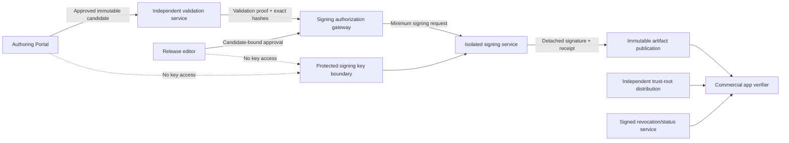

# Evidence Pack signing and trust model

## Purpose

This document defines the vendor-neutral trust, hashing, signing, verification, key-rotation, compromise, and timestamp requirements for AES Evidence Packs.

Digital signatures establish artifact integrity and authorized publication under a trust policy. They do not prove medical correctness; that comes from canonical provenance, specialist review, and release governance.

## Trust principles

- Trust roots are distributed independently of the Pack being verified.
- Portal users and services cannot access signing private keys.
- The signing service signs only exact hashes backed by current editor authorization and independent validation.
- Every cryptographic object identifies algorithm, profile, key, purpose, and validity context.
- Verification fails closed for unknown, malformed, revoked, expired-policy, or mismatched signatures.
- Algorithm and key upgrades preserve historical verification.
- AI has no signing, approval, or key-management authority.

## Trust and signing boundaries



## Objects signed

Recommended design signs a canonical manifest hash. The manifest enumerates and hashes every logical file and identifies the final artifact hash. Depending on container/build design, a detached artifact signature may also be produced.

Signed context must bind:

- Pack ID, version, profile, and schema;
- release/candidate ID;
- canonical manifest hash;
- artifact hash when final bytes are known;
- compatibility and predecessor;
- signing-key ID and trust profile;
- signature algorithm/profile;
- signing timestamp and optional trusted timestamp token;
- release authorization/validation proof hashes;
- domain separation string preventing signature reuse for another purpose.

## Hashing

### Hash purposes

- Evidence-revision hash binds exact published evidence fields.
- Logical-file hashes bind Pack files.
- Manifest hash binds inventory and metadata.
- Artifact hash binds downloadable bytes.
- Candidate input hash binds release-editor approval.
- Public-key fingerprint identifies trust material.

### Requirements

- Collision-resistant algorithm approved by current security policy.
- Algorithm/profile explicitly encoded.
- Canonical serialization/version recorded.
- Independent recomputation in builder, validator, signer, and app where applicable.
- Constant-time comparison where security-sensitive.
- Unknown/deprecated algorithms rejected under app trust policy.

### Candidate defaults

SHA-256 or a current equivalent is a reasonable initial content-hash candidate. Final selection requires platform, compliance, longevity, library, and interoperability review. The format must support newer algorithms and multiple hashes during migration.

## Digital signatures

### Candidate defaults

Modern, widely implemented signatures such as Ed25519 or ECDSA P-256 are candidates. RSA may be evaluated only where interoperability/compliance requires it with secure parameter policy. No algorithm is fixed as irreversible product policy in this design.

### Algorithm agility

- Signature envelope carries algorithm and format version.
- App trust policy lists accepted algorithms, minimum strengths, and deprecation dates.
- Pack may carry multiple signatures under distinct trusted keys/algorithms.
- Transition can require both old and new signatures or accept either according to signed policy.
- Historical verifier tooling and trust metadata remain archived.
- Algorithm downgrade is prohibited.

## Key hierarchy and roles

Recommended logical hierarchy:

- **Offline/strongly protected root trust key:** signs or authorizes intermediate publication keys and revocation/status authority; used rarely.
- **Pack signing key:** online or controlled-use key signs authorized Pack manifests/artifacts for a bounded profile/channel.
- **Status/revocation key:** signs small current, revocation, withdrawal, minimum-safe-version, and key-status documents; may be separate to support emergency response.
- **Timestamp authority:** optional independent proof that a signature existed at a time; vendor and necessity unresolved.

Keys have stable key IDs, public-key fingerprints, purpose, profile/channel scope, validity window, status, custody, activation/retirement events, and rotation predecessor/successor.

## Key custody

- Private keys are non-exportable where feasible and isolated from portal/runtime/database administrators.
- Signing requests are authenticated, authorized, rate-limited, idempotent, and audited.
- Key-use policy checks Pack/profile/channel, editor and validator proof, candidate freshness, version uniqueness, and incident holds.
- Human key administrators cannot alter evidence or bypass release authorization.
- Break-glass signing, if allowed, requires defined multi-party control and cannot bypass specialist evidence approval.
- Backups/recovery use separately governed secure procedures; signing keys are excluded from ordinary portal backups.

## Public-key trust distribution

Commercial apps ship or securely enroll one or more trust roots through application release/update channels independent from Evidence Packs. Pack-provided keys are not trusted solely because they appear inside a Pack.

Trust metadata supports:

- key ID and public key/fingerprint;
- permitted purpose, Pack profile, channel, and jurisdiction;
- activation/expiration/deprecation;
- issuer/parent authorization;
- revocation and successor;
- algorithm policy;
- offline grace behavior.

Updating trust roots may require commercial application update or separately authenticated trust-metadata update; product owner must choose the recovery model.

## Signing request validation

Signer rejects unless:

- request identity has signer-gateway authority;
- release-editor approval is valid and binds exact candidate hash;
- independent validation passed and binds exact manifest/artifact;
- candidate has not changed or expired;
- Pack ID/version/profile is unique and ordered correctly;
- requested key is active, scoped, and not revoked;
- requested algorithm is allowed;
- no release/security/legal hold applies;
- timestamp and replay/idempotency rules pass.

Signer records request hash, decision, key ID, signature, timestamp, caller, policy version, and audit receipt without ingesting private authoring data.

## Timestamping

At minimum, signer records a controlled UTC signing time. A trusted timestamp token from an independent timestamp authority may provide stronger long-term proof and should be evaluated for regulated or long-lived verification.

Timestamp verification must not make an otherwise unauthorized signature valid. App policy defines whether an expired signing key's historical signature remains acceptable when it was valid and not compromised at signing time.

## Key rotation

Planned rotation:

1. Generate new key under approved custody.
2. Publish trust metadata signed by an existing trusted authority.
3. Update apps/trust stores before mandatory use.
4. Optionally dual-sign Packs/status documents during overlap.
5. Monitor verification telemetry without exposing user questions.
6. Stop new signing with old key.
7. Mark old key retired, not compromised.
8. Preserve public key and historical validation records.

Rotation does not require changing evidence or logical Pack content. Re-signing may create new signature metadata while artifact/evidence hashes stay identical; publication records distinguish signature revision from Pack content version.

## Compromised-key response

1. Stop signing and isolate affected service/key.
2. Publish signed revocation/status through an unaffected trusted authority.
3. Identify every Pack/status document signed by the key.
4. Determine compromise window and whether historical signatures can remain trusted.
5. Establish replacement trust through preconfigured roots or commercial-app update.
6. Rebuild/revalidate if needed; re-sign known-good immutable artifacts with replacement key.
7. Set minimum safe app/Pack/trust version as policy requires.
8. Alert users/institutions without exposing private evidence data.
9. Preserve forensic and audit evidence.

If no unaffected trust path exists, the app must not trust a replacement key obtained solely from the compromised distribution service. Recovery may require a signed commercial-app update or institutional administrative action.

## Signature verification in commercial app

App verifies in this order before activation:

1. Parse bounded signature/manifest structures safely.
2. Identify trust profile and key ID from local trusted metadata.
3. Confirm key purpose, scope, validity, algorithm policy, and revocation status.
4. Canonicalize and hash manifest under declared supported profile.
5. Verify signature.
6. Verify every logical file and final artifact hash.
7. Verify Pack/schema/app compatibility and version/status policy.
8. Confirm Pack is not revoked/withdrawn and meets minimum safe version when current status is available.
9. Activate only after all checks pass.

The app never “clicks through” a signature failure.

## Signature failure behavior

- Do not activate failed Pack.
- Keep active verified predecessor if policy permits.
- Quarantine/delete failed temporary bytes under retention policy.
- Display clear non-medical update error without exposing sensitive internals.
- Log local diagnostic reason and permitted aggregate telemetry.
- Retry only for transient download/incomplete-data errors; cryptographic mismatch requires fresh trusted metadata/artifact and may trigger incident handling.
- Never fall back to using unsigned Pack content.

## Revocation/status trust

Revocation and current-version documents are signed and versioned. They include:

- document sequence/version and generated/expiry times;
- revoked/withdrawn Pack IDs/versions and reason category;
- revoked/retired/compromised key IDs and effective times;
- minimum safe Pack/app/trust version;
- current recommended versions by profile/channel;
- emergency messages and offline policy;
- signature under status authority.

Replay protection requires monotonic sequence and freshness policy. An attacker must not be able to restore an older “not revoked” document silently.

## Synthetic signature example

```json
{
  "signature_format_version": "1.0",
  "purpose": "aes-evidence-pack-manifest",
  "pack": { "id": "AES-SYNTHETIC-CORE", "version": "1.2.0" },
  "manifest_hash": {
    "algorithm": "sha256",
    "canonicalization": "aes-json-v1",
    "value": "synthetic-manifest-hash"
  },
  "artifact_hash": { "algorithm": "sha256", "value": "synthetic-artifact-hash" },
  "signature": {
    "algorithm": "candidate-ed25519",
    "key_id": "KEY-AES-PACK-2099-A",
    "value": "synthetic-signature-not-valid"
  },
  "signed_at": "2099-01-01T00:00:00Z",
  "trust_profile": "aes-pack-trust-v1",
  "authorization_hash": "sha256:synthetic-release-authorization",
  "validation_hash": "sha256:synthetic-validation-report"
}
```

## Copyright and privacy

Signing service sees only minimum publication inputs. It must not receive:

- private PDFs or source paths;
- unrestricted copyrighted full text;
- private reviewer comments or identity fields;
- user questions, generated answers, or patient data;
- portal credentials or broad audit logs.

Signature metadata contains publication-safe key/service identifiers, not human operator secrets.

## Security acceptance criteria

- Portal, builder, validator, and editor cannot extract signing private keys.
- Signer refuses artifacts without exact valid editor and validator proofs.
- Commercial app rejects altered manifest, file, artifact, signature, key scope, or algorithm.
- A Pack cannot introduce its own trust root.
- Rotation permits overlap without invalidating valid historical Packs.
- Revocation resists replay and supports compromised-key recovery.
- Signature failure never activates unsigned/unverified content.
- Audit reconstructs every signing request and result.

## Later implementation tests

- Known-answer signature/hash/canonicalization vectors across supported platforms.
- Mutate every signed field/file and assert rejection.
- Wrong key, purpose, profile, channel, algorithm, timestamp, and compatibility rejection.
- Duplicate/replayed signing request behavior.
- Planned rotation and dual-signature transition.
- Compromised key with online and offline apps.
- Stale/replayed revocation status.
- Root/intermediate/status key recovery drills.
- Large/malformed signature and manifest parser limits.
- Independent verifier implementation interoperability.

## Must not be implemented before approval

- Final algorithm suite and canonicalization standard.
- Root/intermediate/status key hierarchy and custody organization.
- Hardware/key service/vendor selection.
- Timestamp authority and historical-expiration policy.
- Dual-control/break-glass signing process.
- Trust-root update and catastrophic recovery path.
- Revocation freshness and offline grace rules.

## Unresolved product-owner decisions

1. Required cryptographic/compliance profiles and supported app platforms.
2. Key hierarchy, ownership, quorum, and custody locations.
3. Online versus offline root/status authority.
4. Trusted timestamp requirement.
5. Historical validity after key expiration or compromise.
6. Trust-root update mechanism.
7. Dual-signature transition duration.
8. Offline app response to stale revocation status.
9. Human/institution notification for key incidents.
