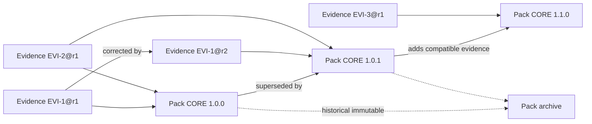

# Evidence Pack specification

## Purpose and scope

An AES Evidence Pack is a static, signed, versioned publication artifact containing only approved, release-eligible evidence and its permitted provenance. It is designed for local verification, indexing, and search by the commercial application without direct access to private authoring data.

This specification is vendor-neutral and algorithm-agile. It defines logical content and verification requirements, not a final archive encoding, compression format, cryptographic suite, or hosting service.

## Pack invariants

1. Every evidence reference pins one canonical evidence ID and exact revision.
2. Every included evidence revision passed specialist and release eligibility under recorded policy versions.
3. Pack contents are immutable after signing.
4. Corrections, retirement, or withdrawal create new Pack/revocation artifacts; no published Pack is edited.
5. Private PDFs, private paths, authoring credentials, and non-public review data are absent.
6. The manifest enumerates every logical artifact and cryptographic digest.
7. A commercial app must verify hash, signature, schema, compatibility, and status before activation.
8. AI cannot approve, select, release, or sign Pack content.

## Logical directory structure

The physical container remains an implementation decision. Its logical paths should be deterministic and traversal-safe:

```text
manifest.json
release-notes.json
sources.json
evidence.json
reference-chains.json
translations.json
questions.json                  optional by Pack profile
search/index.json               logical portable index
search/terms-en.json
search/terms-ja.json
metrics.json
signatures/manifest-signature.json
```

Paths must be relative, normalized, unique, and enumerated by the manifest. Absolute paths, `..`, symbolic links, device paths, and undeclared files are invalid.

## Required manifest fields

### Identity and version

- `pack_id`: stable identity of a Pack line/profile.
- `pack_version`: ordered semantic version.
- `pack_profile`: domain, jurisdiction, language, or product segmentation.
- `schema_version`: Pack content schema.
- `manifest_schema_version`.
- `release_id` and immutable release-candidate ID.
- `status`: published, superseded, revoked, or withdrawn in the status service; signed Pack itself remains published immutable content.

### Compatibility

- minimum and maximum compatible commercial-app versions or explicit compatible ranges;
- required app capabilities/features;
- search-index format version;
- canonical evidence schema version;
- required verification-policy version;
- minimum safe predecessor/upgrade rules when applicable.

### Content inventory

- relative path, media type, logical role, byte length, and artifact hash for every file;
- counts by source, evidence type, authority classification, language, domain, jurisdiction, and review depth;
- canonical evidence IDs and exact revision IDs;
- source-version IDs;
- release-note and metrics artifact references.

### Integrity and trust

- manifest hash algorithm/profile and value represented outside the self-hashed portion or in detached signature metadata;
- artifact hash algorithm/profile;
- evidence-revision content hashes;
- signature metadata reference;
- signing-key ID, trust-domain/profile, and signature format;
- signed timestamp and trusted timestamp evidence when adopted;
- builder/validator policy versions.

### Publication provenance

- release-editor decision ID and publication-approved display subset;
- validation report hash;
- immutable build-input hash;
- build recipe/version;
- publication date;
- predecessor Pack version and related emergency/supersession release IDs;
- rights-policy version.

## Evidence record in a Pack

Each included evidence record must contain only publication-approved fields:

- canonical evidence ID and exact revision;
- evidence kind and authority classification;
- source ID/version and citation reference;
- source-language assertion and minimal permitted exact quotation;
- structured location: printed/PDF page plus paragraph/recommendation/table/figure/supplement anchor;
- numerical result, population, endpoint, time, uncertainty, and limitations where applicable;
- recommendation wording/class/level where applicable;
- supporting-text hash and source-file hash as provenance values, without file location;
- approved translation references;
- publication-approved reviewer/validation metadata;
- reference-chain status and verified target references;
- supersedes/superseded-by/retired relationships as of the Pack snapshot;
- question/domain tags that do not duplicate medical content.

### Reviewer metadata

Only the product-approved projection is included, potentially:

- public reviewer display ID or name;
- specialty/role;
- review date;
- decision and original-source confirmation;
- verification depth/inspection flags appropriate for display;
- multi-reviewer/adjudication status.

Internal comments, conflicts, account identifiers, device/session details, recovery data, and private audit IDs are excluded unless explicitly approved as non-sensitive publication provenance.

### Reference-chain status

The Pack must distinguish:

- guideline recommendation directly verified;
- primary evidence directly verified;
- underlying primary evidence verified;
- secondary citation only;
- primary source not yet verified;
- unable to verify;
- citation mismatch;
- conflicting interpretation.

Policy determines which states may be Pack content. Ineligible states cannot appear as answerable validated evidence. If an allowed warning-only state is included, it must retain its exact label and never count as primary verified.

## Search index

The search index is derived entirely from Pack content and must not introduce new medical assertions. It may contain:

- stable evidence/source/question IDs;
- normalized English/Japanese terms;
- controlled synonyms and domain tags;
- citation/title fields;
- approved assertion and permitted quotation tokens;
- evidence type, authority, population, timing, outcome, jurisdiction, and status filters;
- deterministic ranking features documented by index version.

The app must be able to rebuild or validate the logical index from Pack evidence, or the index must be independently hashed and schema-validated. Search indexes contain no private source text beyond Pack-approved fields.

## Pack exclusions

Packs must not contain:

- private PDFs, supplements, page images, OCR artifacts, or private source files;
- filesystem/object paths, storage URLs, credentials, secrets, or upload metadata;
- Pending or Excluded evidence;
- Needs correction drafts or incomplete approvals;
- disputed, retired, mismatched, or unable-to-verify evidence as validated answerable content;
- internal reviewer comments not explicitly publication-approved;
- private reviewer identity or account information;
- detailed private audit/security data;
- unrestricted copyrighted full text, full tables, or full figures;
- raw AI prompts, extraction output, model traces, or unapproved AI synthesis;
- user questions, patient/case data, generated answers, conversation history, or analytics;
- mutable pointers that could change evidence content without a new Pack version.

## Versioning

### Pack identity and version

Recommended logical versioning is `MAJOR.MINOR.PATCH` with monotonically increasing publication sequence and immutable release ID.

- **Major:** Incompatible Pack/schema/trust/profile change; removal or semantic change requiring app behavior review; segmentation change that alters Pack identity; migration requiring explicit app support.
- **Minor:** Backward-compatible addition of sources, evidence, translations, domains, reference-chain verification, or index capabilities; routine supersession with supported schema.
- **Patch:** Backward-compatible urgent correction, metadata/location fix, retirement/revocation response, or packaging/index correction that does not add an incompatible schema.

Clinical severity does not map mechanically to semantic version size. An emergency medical correction may be a patch if compatible, but must carry emergency status and minimum-safe-version policy.

### Evidence revisions

- Pack pins exact `EVI-…@rN` values.
- A successor evidence revision appears only in a new Pack.
- Prior Pack continues to identify the predecessor revision.
- An approval on `rN` never authorizes `rN+1`.
- Pack release notes identify added, superseded, retired, corrected, and unchanged revisions.

### Pack/evidence relationships



### Current and archive Packs

- One current recommended Pack per Pack ID/profile/channel unless staged rollout policy says otherwise.
- Every published Pack remains addressable in the archive according to retention policy.
- Current status is a signed/status-manifest pointer, not mutation of the Pack.
- Commercial app retains provenance for its active and previous Pack.

### Segmentation

Packs may be segmented by clinical domain, jurisdiction, language, product tier, or regulatory profile only when:

- Pack ID/profile makes scope explicit;
- shared canonical evidence keeps the same IDs/revisions;
- segmentation does not conceal missing required context;
- dependencies are explicit and version-compatible;
- commercial UI does not imply coverage outside installed profiles.

Whether to ship one core Pack or segmented Packs is unresolved.

## Reproducibility

The same immutable build input, schema, policy, and build recipe must produce the same **logical Pack content** and content hashes.

Deterministic content requires:

- canonical field ordering/serialization profile;
- normalized encoding and line endings;
- deterministic record/path ordering;
- no ambient time, random IDs, host paths, locale, environment, or network data in logical files;
- pinned canonical evidence revisions, translations, chain verifications, policy versions, and search builder;
- deterministic compression if archive-byte reproducibility is required.

Build metadata that may vary—build invocation ID, worker identity, wall-clock duration, signing timestamp, storage upload metadata—must be outside the logical content hash or in separately signed publication metadata. The release records retain both logical-content and final-artifact hashes.

## Hash layers

- **Source-file hash:** Reviewed private rendition; value may be included, file is not.
- **Supporting-text hash:** Exact approved quotation under versioned normalization.
- **Evidence-revision hash:** Canonical serialization of publication fields for one revision.
- **Logical-file hash:** Each Pack file before container packaging.
- **Manifest hash:** Canonical manifest bytes excluding detached signature envelope.
- **Artifact hash:** Final downloadable Pack bytes.
- **Release-candidate input hash:** Ordered immutable selection and policy inputs.

Every hash declares algorithm and profile. Hash equality supports integrity/deduplication, not medical validity.

## Secure candidate defaults and agility

Initial implementation may evaluate SHA-256 or a current equivalent for content hashing and a modern widely supported digital-signature algorithm such as Ed25519 or ECDSA P-256, subject to platform, compliance, and cryptographic review. These are candidate defaults, not irreversible product policy.

Every cryptographic object includes algorithm/profile/version. The trust model supports:

- multiple accepted algorithms during migration;
- minimum algorithm policy by app version/date;
- dual signatures during transitions;
- re-signing identical immutable artifacts with a new trusted key without changing evidence content;
- rejection of unknown, deprecated, or disallowed algorithms;
- archived verification instructions for historical Packs.

## Synthetic manifest example

All values are non-medical placeholders.

```json
{
  "manifest_schema_version": "1.0",
  "pack_id": "AES-SYNTHETIC-CORE",
  "pack_version": "1.2.0",
  "pack_profile": { "domain": "synthetic-materials", "jurisdictions": ["EXAMPLE"] },
  "schema_version": "1.1",
  "release_id": "REL-01J00000000000000000000001",
  "release_candidate_id": "RLC-01J00000000000000000000002",
  "compatibility": { "minimum_app_version": "2.0.0", "maximum_app_version_exclusive": "3.0.0" },
  "predecessor": { "pack_version": "1.1.0" },
  "files": [
    {
      "path": "evidence.json",
      "role": "evidence",
      "media_type": "application/json",
      "bytes": 12345,
      "hash": { "algorithm": "sha256", "value": "synthetic-file-hash" }
    }
  ],
  "counts": { "sources": 3, "evidence_revisions": 12 },
  "build": {
    "input_hash": "sha256:synthetic-input-hash",
    "recipe_version": "pack-builder-1",
    "eligibility_policy": "eligibility-1"
  },
  "signature_metadata_path": "signatures/manifest-signature.json"
}
```

## Synthetic evidence item reference

```json
{
  "evidence_id": "EVI-01J00000000000000000000004",
  "revision_id": "EVI-01J00000000000000000000004@r2",
  "evidence_kind": "numerical_result",
  "authority_classification": "primary_evidence_directly_verified",
  "source_version_id": "SRV-01J00000000000000000000002",
  "citation": "Synthetic Materials Journal. 2099;1:1-9.",
  "location": {
    "printed_page": "4",
    "pdf_page": 6,
    "section": "Synthetic results",
    "table": "Table 1",
    "row": "Day 30",
    "column": "Retention",
    "footnote": "Synthetic units"
  },
  "supporting_text": "Synthetic specimens retained 90 units at day 30.",
  "supporting_text_hash": "sha256:synthetic-text-hash",
  "validation_display": {
    "decision": "Approved",
    "review_date": "2099-01-01",
    "specialty": "Synthetic evidence review",
    "original_source_confirmed": true
  },
  "reference_chain_status": "primary_evidence_directly_verified"
}
```

## Synthetic signature metadata

```json
{
  "signature_format_version": "1.0",
  "signed_object": "manifest.json",
  "manifest_hash": {
    "algorithm": "sha256",
    "canonicalization": "aes-json-v1",
    "value": "synthetic-manifest-hash"
  },
  "signature": {
    "algorithm": "candidate-ed25519",
    "key_id": "KEY-AES-PACK-2099-A",
    "value": "synthetic-signature-not-valid"
  },
  "signed_at": "2099-01-01T00:00:00Z",
  "trust_profile": "aes-pack-trust-v1"
}
```

## Candidate implementation interfaces

### Pack builder

Input: immutable release-candidate manifest, pinned records, schema/policy/build versions. Output: deterministic unsigned logical Pack and build report. No authoring writes or signing authority.

### Validation service

Input: candidate or built Pack. Output: signed/tamper-evident validation report with eligibility, schema, provenance, rights, exclusion, reproducibility, and integrity results. Cannot approve evidence or release.

### Signing service

Input: independently authorized artifact/manifest hash and release authorization. Output: detached signature metadata and signing audit receipt. No access to PDFs or authoring database.

### Static artifact storage

Stores immutable Pack bytes, manifests, signatures, release notes, and status/revocation documents. Prevents overwrite of published version keys and supports exact byte retrieval.

### Manifest service

Returns small signed current/version/status metadata, compatibility, revocation, and artifact locations. It cannot alter signed Pack contents.

### App update client

Fetches trusted status, resumes download, verifies bytes/signature/schema/compatibility, activates atomically, retains prior Pack, and records local state. It has no private authoring credentials.

Interfaces use versioned schemas and standard transport/storage semantics; implementations remain replaceable.

## Current repository reuse

- Source catalog identity-validation concepts.
- Question registry and generalized source/question lookup.
- Review decision validation and approval completeness.
- Fail-closed source/review validation scripts.
- Safe identifier/path validation and traversal rejection.
- Atomic temporary-write/rename pattern as a local analogy for activation.
- Synthesis gating and exclusion of unapproved content.
- Focused synthetic behavior tests.

Current JSON files are migration inputs, not Pack schemas. Git commits are not Pack signatures or publication authority.

## Must not be implemented before approval

- Exact Pack container/serialization and segmentation policy.
- Final algorithm suite, trust roots, key custody, rotation, and timestamp authority.
- Reviewer identity/comment publication projection.
- Copyright quotation/table/figure policy.
- Secondary-only/disputed evidence Pack policy.
- Minimum safe version, offline grace, forced update, and revocation behavior.
- Commercial compatibility ranges and update channels.
- Vendor services, regions, artifact endpoints, and signing infrastructure.

## Acceptance criteria

- Pack schema rejects all excluded/private fields and unknown undeclared files.
- Every evidence item pins an approved exact revision and complete location.
- Rebuilding identical immutable input produces identical logical hashes.
- App can verify Pack without authoring-system access.
- Signature metadata is detached and algorithm-agile.
- Prior Pack remains independently verifiable after successor publication.
- Search index cannot add assertions absent from approved Pack content.
- Q02/Q03 regression fixtures cannot enter a Pack unless canonical migration and release approval later authorize them.
