# Implementation phases and acceptance criteria

## Purpose

This document sequences the approved AES architecture from the current repository to production. It does not authorize implementation, migration, cloud configuration, AI connection, Pack signing, or medical-data changes.

Each phase requires deliverables, acceptance criteria, safety gates, tests, backward compatibility, manual approvals, rollback, and explicit out-of-scope boundaries.

## Phase sequence

```mermaid
flowchart LR
    P0["0 Approved documentation"] --> P1["1 Canonical schema + compatibility"]
    P1 --> P2["2 Controlled Q02/Q03 migration"]
    P2 --> P3["3 Cloud Authoring Portal"]
    P3 --> P4["4 Reference-chain verification"]
    P4 --> P5["5 Pack builder + signing"]
    P5 --> P6["6 Commercial download + local retrieval"]
    P6 --> P7["7 Grounded free-form synthesis"]
    P7 --> P8["8 Separate live evidence search"]
```

Phases may prototype in parallel only where no downstream authority is assumed. Production acceptance remains ordered.

## Global gates

- No automatic specialist approval or approval transfer.
- No private PDF/path exposure.
- No Pack inclusion of ineligible evidence.
- No authoring-database access for normal commercial answers.
- No current Q02/Q03 content or decision change without separate authorization.
- Every phase has reversible rollout and preserved audit/provenance.
- Security, privacy, source rights, bilingual, accessibility, and medical-safety review before production.

## Phase 0: Approved documentation

### Deliverables

- Master architecture and ADRs.
- Canonical evidence/provenance/reference standards.
- Authoring Portal requirements/security/governance/boundaries.
- Evidence Pack publication/signing/update specifications.
- Commercial query/retrieval/synthesis/safety standards.
- Product-owner decision register and dependency map.

### Acceptance criteria

- Documents are internally consistent, vendor-neutral, versioned, and approved by product, clinical, security, rights, and architecture owners.
- Unresolved decisions are explicit; documentation is not mistaken for implementation authorization.

### Safety gates and tests

- Trace every master requirement into at least one detailed specification.
- Terminology review for evidence authority, approval, Pack, live search, jurisdiction, translation, and AI.
- Documentation lint/link/Mermaid checks when tooling is approved.

### Backward compatibility

No runtime change.

### Manual approvals

Product owner, clinical evidence governance, security/privacy, source licensing, and architecture.

### Rollback

Revise documents/ADRs; no data rollback.

### Out of scope

Code, schema deployment, migration, cloud, keys, AI, production vendor selection.

## Phase 1: Canonical schema and compatibility layer

### Deliverables

- Versioned canonical schemas and controlled vocabularies.
- Stable ID and hash/canonicalization libraries.
- Immutable revision/review/audit contracts.
- Legacy read-only inventory and mapping interfaces.
- Compatibility projection from canonical synthetic fixtures to current `ContentReview`/Results expectations.
- Schema and invariant validators.

### Acceptance criteria

- Synthetic evidence can be reused across multiple questions without copied decisions.
- Page-only provenance fails; table/figure/chain/review rules pass/fail correctly.
- Compatibility projection reproduces current shapes without touching Q02/Q03 files.
- No private path field exists in canonical/public schemas.

### Safety gates and tests

- Property/schema tests, immutable-revision tests, ID/path traversal, hash vectors, duplicate-candidate no-auto-merge, approval binding, Pack-eligibility computation.
- Threat and privacy review of schemas.

### Backward compatibility

Legacy remains sole production read/write authority. Canonical layer uses synthetic/read-only inputs.

### Manual approvals

Clinical data standard, migration design, security/privacy, and architecture approval.

### Rollback

Disable compatibility feature; no legacy data changed.

### Out of scope

Real migration, cloud persistence, Portal UI, Pack publication, AI.

## Phase 2: Controlled Q02/Q03 migration

### Deliverables

- Frozen inventory and hashes.
- Source/evidence candidate, divergence, decision-provenance, and conflict reports.
- Manual resolution workflow.
- Canonical migration manifests and question-evidence links.
- Dual-read comparison and Q02/Q03 golden regression suite.
- Cutover/rollback runbook.

### Acceptance criteria

- Every legacy item/decision maps or is explicitly deferred.
- No silent merge and zero migration-created approvals.
- Q02 approved synthesis/Results and Q03 states remain unchanged.
- Canonical projection matches authoritative aggregation, inclusion/exclusion, text, locations, numbers, and EN/JA behavior.

### Safety gates and tests

- Field-level conflict fixtures; Approved/Pending/Excluded/correction combinations; private paths; synthesis refs; evidence leakage; additional/missing evidence; rollback rehearsal.

### Backward compatibility

Dual read; legacy write authority until explicit cutover. Native synthesis approval retained.

### Manual approvals

Evidence librarian/migration resolver, relevant specialists for conflicts, product/clinical owner for cutover.

### Rollback

Switch reads to legacy; preserve canonical and mapping history; no destructive reverse conversion.

### Out of scope

Medical re-review except explicit conflicts, new evidence extraction, Results redesign, Pack release.

## Phase 3: Cloud Authoring Portal

### Deliverables

- Browser authentication/MFA, roles, institutions, assignments, recovery, revocation.
- Source registration/upload/viewer, extraction drafts, exact-location review, specialist decisions, corrections, release-candidate UI, audit/governance.
- Restricted file, canonical data, audit, backup/restore, and incident boundaries.
- US/Japan approved-access performance and interruption support.

### Acceptance criteria

- Daily authoring workflows need no Terminal/Git.
- No Approve All; bulk identity/date cannot set decisions/confirmation.
- Published/approved revision update is impossible; successor workflow works.
- Private file access and international policy pass.

### Safety gates and tests

- MFA/RBAC/ABAC, IDOR, upload/malware, path traversal, session/recovery/revocation, audit integrity, backup restore, slow network/resume, bilingual/accessibility, AI authority denial.

### Backward compatibility

Legacy repository remains available read-only/controlled during transition; compare review decisions and exports.

### Manual approvals

Security/privacy, source rights, clinical workflow, regional/legal, disaster recovery, production readiness.

### Rollback

Disable Portal writes/return to approved transitional workflow; reconcile immutable events before resume.

### Out of scope

Commercial Pack query, Pack signing, live search, unrestricted AI provider connection.

## Phase 4: Reference-chain verification

### Deliverables

- Citation capture/resolution/verification UI and services.
- Direct/indirect, retrieval, match, support-scope, mismatch, conflict, unable-to-retrieve states.
- Chain metrics, assignments, adjudication, and Pack eligibility integration.

### Acceptance criteria

- Metadata resolution cannot imply primary verification.
- Every edge has exact inherited claim and independent review.
- Multi-hop chain requires all policy-required edges.
- Mismatch/unresolved states remain visible and measurable.

### Safety gates and tests

- Guideline→review→primary→table synthetic chains; wrong DOI/source; partial/indirect/no support; inaccessible source; changed target/inherited wording; transitive-assumption prevention.

### Backward compatibility

Existing authority labels remain conservative; no legacy evidence upgraded automatically.

### Manual approvals

Reference-verification policy, reviewer qualifications, chain conflicts, Pack eligibility rules.

### Rollback

Disable chain-derived enhanced labels; retain prior conservative classifications and all events.

### Out of scope

Automatic verification, live-search promotion approval, Pack signing.

## Phase 5: Evidence Pack builder and signing

### Deliverables

- Final Pack schema/container/index and version policy.
- Candidate selector, eligibility validator, deterministic builder, independent validator.
- Release-editor approval, isolated signer/trust/status model, immutable artifact publication, release notes/metrics.
- Key rotation, compromise, revocation, reproducibility, and recovery runbooks.

### Acceptance criteria

- Only approved eligible revisions cross allowlist.
- Identical inputs produce identical logical hashes.
- Editor/validator/signer bind exact candidate/artifact hashes.
- No portal access to signing private keys.
- Published versions cannot be overwritten.

### Safety gates and tests

- Leakage, malformed archive/schema, deterministic clean builds, signature vectors/mutations, wrong key/scope, rotation/compromise, emergency release, audit reconstruction.

### Backward compatibility

No commercial activation yet; compare Pack projection to approved canonical/legacy regression sets.

### Manual approvals

Pack schema/rights/display, release quorum, cryptographic/key custody, emergency/revocation, production signing ceremony.

### Rollback

Do not recommend/publish failed Pack; predecessor/status remains current. Revoke test/release artifacts through signed additive status.

### Out of scope

Commercial free-form synthesis, live search, authoring-data API to commercial app.

## Phase 6: Commercial Pack download and local retrieval

### Deliverables

- Signed status/version client, resumable download, local verification, atomic activation, prior-Pack retention, rollback/offline policy.
- Local lexical/facet/semantic interfaces, eligibility policy, ranker, coverage/conflict analyzer, provenance views.
- Structured bilingual Results without free-form AI requirement.

### Acceptance criteria

- Normal retrieval makes no Authoring Portal request.
- Only active-Pack revisions labeled Expert-Validated.
- Failed update preserves prior safe Pack.
- Eligibility precedes rank; conflicts/gaps/applicability persist.
- Offline structured evidence works under signed status policy.

### Safety gates and tests

- Corrupt/truncated/malicious Pack, signature/status replay, compatibility, crash activation, revocation/minimum safe, bilingual retrieval, rank ineligibility, privacy telemetry, slow US/Japan networks.

### Backward compatibility

Run Pack Results beside legacy Q02/Q03 Results behind controlled feature; compare golden outputs. Legacy remains rollback.

### Manual approvals

Commercial UX, ranking profile, Pack freshness/offline policy, Q02/Q03 regression/cutover.

### Rollback

Atomic prior-Pack rollback or legacy Results path if still supported; never rollback to revoked Pack.

### Out of scope

Free-form synthesis, live search, personalized treatment, private PDFs.

## Phase 7: Grounded free-form synthesis

### Deliverables

- Fact ledger, grounded synthesis interface, assertion-citation mapping, numerical/authority/safety validator.
- On-device/server mode selected by policy.
- Structured fallback, bilingual synthesis, response provenance/retention controls.

### Acceptance criteria

- Every assertion cites eligible retrieved revision or is labeled interpretation/inference.
- No citation/number mutation, hidden conflict, or gap filling.
- Server unavailable behavior is safe and truthful.
- EN/JA answers preserve evidence set, numbers, citations, and meaning.

### Safety gates and tests

- Hallucination/citation containment; causation/equivalence/remodeling/predictor/modifier cases; numerical fidelity; conflicts/gaps; jurisdictions; prompt injection; offline fallback; red-team medical language.

### Backward compatibility

Approved Q02 synthesis remains baseline/legacy until grounded output receives separate validation; native approval retained where applicable.

### Manual approvals

Model/provider/on-device decision, synthesis policy, clinical safety evaluation, bilingual review, intended-use/regulatory approval.

### Rollback

Disable free-form generation and show Phase-6 structured evidence. No evidence availability loss.

### Out of scope

Autonomous diagnosis/treatment, unstated model knowledge, automatic synthesis approval, live evidence mixing.

## Phase 8: Separate live evidence search

### Deliverables

- Explicit live-search mode/providers, retrieval date/provenance, unreviewed labels, separate display/citations.
- Offline-unavailable behavior and promotion-to-Authoring Pending workflow.
- Provider safety, privacy, retention, and failure isolation.

### Acceptance criteria

- Live results never inherit Pack validation or alter validated answer silently.
- Retrieval date/provider/source visible.
- Promotion creates Pending evidence only.
- Live failure leaves local validated retrieval available.

### Safety gates and tests

- Provider injection/malformed results, identity mismatch, unavailable source, Pack/live citation separation, offline state, retention/privacy, promotion authority, jurisdiction/currentness.

### Backward compatibility

Pack query remains default and unchanged; live mode can be disabled institutionally.

### Manual approvals

Providers, terms/licensing, privacy/retention, clinical display, regulatory and institutional policy.

### Rollback

Disable live-search feature/provider without changing Pack or validated Results.

### Out of scope

Automatic Pack inclusion, automatic specialist approval, silent combined answer.

## Current repository component assessment

| Component | Classification | Rationale and target treatment |
|---|---|---|
| Source catalog | Reuse with adaptation | Identity seed/legacy aliases; migrate to canonical sources/versions and governed metadata |
| Review JSON schema | Transitional compatibility only | Validate current records/migration inputs; canonical schemas replace question-owned evidence |
| Review UI | Reuse with adaptation | Preserve effective source comparison/decision UX; rebuild against canonical revisions and cloud access |
| Bulk reviewer metadata | Reuse with adaptation | Keep name/date convenience; never add bulk decision/confirmation |
| Approval validators | Reuse with adaptation | Preserve client/server completeness and effective decision authority; expand provenance/revision/quorum rules |
| Review finalization | Transitional compatibility only | Fail-closed preflight concepts reusable; Git commit/push finalization replaced by Portal audit/release workflow |
| Question registry | Reuse with adaptation | Stable bilingual question concepts; add versions, domains, canonical evidence links, Pack profile |
| Synthesis approval | Reuse with adaptation | Preserve native explicit human approval during transition; later bind synthesis revisions to canonical inputs/policy |
| Results UI | Reuse with adaptation | Preserve tabs, labels, warnings, EN/JA; generalize to Pack retrieval/provenance and adaptive sections |
| Validation scripts | Reuse with adaptation | Offline fail-closed checks and synthetic tests; add canonical/Pack/retrieval/synthesis validators |
| Tests | Reuse with adaptation | Preserve existing regression tests unchanged where valid; add new layers and update only mutable-state assumptions |
| Local PDF handling | Replace later | Private local files remain migration source; cloud restricted viewer/storage replaces daily authoring, never commercial distribution |
| Git publication workflow | Retire after migration | Git remains code/document history, not medical evidence release or Pack signing authority |
| Question-specific routes/filenames | Transitional compatibility only | Maintain Q02/Q03 rollback, then retire after migration and replace source-level duplication with canonical IDs/question links |

### Reuse unchanged clarification

Few production components can remain literally unchanged because the trust/data source changes. Safe utility behavior and tests may remain unchanged: registered-ID rejection, path-traversal protection, valid-date parsing, language primitives, and selected pure aggregation tests. Classification is confirmed during implementation inventory.

## Cross-phase test program

- Unit/property/schema/canonicalization.
- Integration across authoring→review→candidate→Pack→app→answer.
- Medical-safety adversarial and specialist review.
- Security/privacy/source rights/threat model.
- EN/JA translation, terminology, layout, accessibility.
- Performance/slow networks/offline/device classes.
- Disaster recovery/key compromise/revocation.
- Q02/Q03 golden migration and Results regression.
- Vendor portability/export/rebuild/independent verification.

## Unresolved product-owner decisions

1. On-device versus server-side synthesis and permitted offline synthesis.
2. Reviewer-name display.
3. Query/response/retrieval receipt retention.
4. Live-search providers and terms.
5. Ranking weights, profiles, and institutional overlays.
6. Regulatory positioning and intended use.
7. Commercial user authentication and entitlements.
8. Safety/emergency/clinical-judgment disclaimers.
9. Minimum Pack freshness, offline grace, and forced update.
10. Review/release quorum, Pack segmentation, cryptographic custody, residency, source rights, and vendors.

## Program acceptance criteria

- Every phase passes manual gate before downstream authority relies on it.
- Q02/Q03 remain reproducible until approved retirement.
- Rollback never deletes immutable evidence/audit or restores revoked content.
- Commercial answers remain local-Pack-first, provenance complete, bilingual, and safely grounded.
- Live evidence remains separate and unreviewed until Authoring workflow completes.
