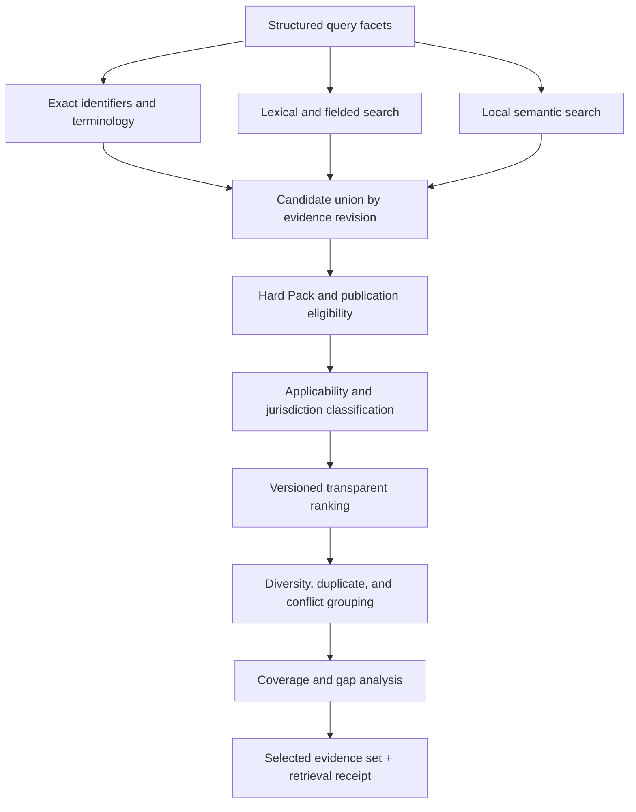

# Local evidence retrieval and ranking

## Purpose

This document defines vendor-neutral local retrieval and ranking over the active verified Evidence Pack. Retrieval finds candidates; policy determines eligibility; ranking orders eligible candidates. A high relevance score can never turn ineligible, indirect, stale, disputed, or jurisdiction-inapplicable content into direct validated evidence.

## Interfaces

### `PackContextProvider`

Returns active Pack identity, verification receipt, schema/index versions, profile coverage, freshness/status, and local artifact handles.

### `QueryAnalyzer`

Produces versioned structured intent, terminology, population/disease/phase/intervention/comparator/outcome/risk/jurisdiction facets, language, ambiguity, and safety flags.

### `CandidateRetriever`

Runs exact-term, controlled-vocabulary, identifier, fielded, lexical, and semantic retrieval over local Pack indexes. Returns stable evidence revisions and raw feature values only.

### `EligibilityPolicy`

Applies active-Pack membership, publication status, authority, supersession/retirement/dispute, rights/display, jurisdiction, population/applicability, and safety constraints. Returns allow/direct, allow-indirect-with-label, warning-only, or exclude plus reasons.

### `Ranker`

Orders eligible candidates using a versioned, inspectable scoring profile. It cannot change eligibility or labels.

### `CoverageConflictAnalyzer`

Measures question-dimension coverage, evidence diversity, conflicts, indirectness, chain depth, and gaps.

### `RetrievalReceipt`

Records query-analysis version, Pack/index/ranking/policy versions, candidates considered, exclusions, scores, selected set, and coverage/conflict outputs without requiring retention of user text beyond policy.

## Retrieval and ranking flow



## Index fields

The local index may include only Pack-approved content:

- evidence/source/revision/Pack IDs;
- titles, citations, official identifiers;
- approved assertions and minimal quotations;
- English/Japanese controlled terms and versioned mappings;
- population, disease, phase, intervention/exposure, comparator, outcome, time;
- risk/anatomical/device feature;
- jurisdiction, guideline organization, regulatory/IFU region;
- publication/evidence type and study design;
- authority and reference-chain classifications;
- review depth and source freshness;
- applicability and limitation tags;
- supersession, retirement, dispute, and conflict markers;
- question/domain mappings;
- exact source-location facets.

Semantic embeddings, if used, are derived from Pack content, versioned, locally stored, and treated as search features—not evidence.

## Query terminology

- Preserve original user wording and detected language.
- Map terms through versioned bilingual clinical vocabulary.
- Keep source-specific phase/risk/definition terms distinct.
- Record expansions and confidence.
- Exact identifiers and quoted phrases receive dedicated matching.
- Ambiguous Japanese/English mapping produces multiple candidates and a visible ambiguity, not silent normalization.
- Terminology changes require index/ranking version and regression tests.

## Hard eligibility before rank

A candidate is excluded from direct validated retrieval when:

- not included in the active verified Pack;
- Pack verification/status is invalid;
- evidence status is not publication-eligible;
- revision is retired, withdrawn, or superseded for current use;
- correction/dispute/mismatch policy blocks use;
- required authority/primary verification is absent for the requested claim;
- requested jurisdiction/regulatory/IFU scope conflicts;
- source/evidence rights prohibit display/use;
- required app/profile capability is unavailable.

Indirect evidence may pass only with an immutable indirect/applicability label and cannot satisfy direct-coverage requirements.

## Ranking features

Ranking may consider:

- semantic relevance;
- exact terminology/identifier match;
- population;
- disease;
- disease phase and timing;
- intervention/exposure;
- comparator;
- outcome and time point;
- risk/anatomical/device feature;
- jurisdiction;
- guideline organization;
- publication type and study design;
- evidence authority;
- source freshness;
- reference-chain verification;
- applicability/directness;
- conflict status;
- source/evidence diversity and duplicate suppression.

## Ranking safeguards

- Eligibility result is immutable input to ranking.
- Authority is an explicit feature/stratum, not a hidden proxy.
- Rank cannot relabel secondary-only evidence as primary verified.
- Rank cannot make an outside-population study directly applicable.
- Freshness cannot automatically outrank a stronger/authoritative older source without display of evidence type and scope.
- Guideline and primary research are grouped/compared rather than collapsed into one scalar authority.
- Regulatory/IFU evidence is filtered by jurisdiction/version before ranking.
- Conflicts are surfaced; rank does not suppress dissenting eligible evidence merely because one side scores higher.
- Numerical thresholds do not receive extra authority because of exact-term match.
- Ranking weights/profile are versioned, testable, and auditable.

## Recommended ranking architecture

Use staged ranking rather than one opaque score:

1. **Eligibility stratum:** direct, indirect-labeled, warning-only, excluded.
2. **Intent/source-type stratum:** recommendation, primary research, regulatory, IFU, definition, outcome, limitation.
3. **Applicability group:** exact population/phase/jurisdiction first; mismatches separate.
4. **Relevance score:** lexical/semantic/facet features.
5. **Authority/verification ordering:** within comparable groups under explicit policy.
6. **Diversity/conflict pass:** retain materially different organizations, jurisdictions, designs, outcomes, and directions.

Do not produce a universal “best evidence” number that obscures these dimensions.

## Feature receipt

For each selected/excluded candidate, retain explainable fields:

```json
{
  "evidence_revision": "EVI-SYNTHETIC@r1",
  "pack": "AES-SYNTHETIC-CORE@1.2.0",
  "eligibility": "allow_indirect_with_label",
  "reasons": ["population_mismatch"],
  "features": {
    "exact_term": 1.0,
    "semantic_relevance": 0.86,
    "population_match": 0.0,
    "outcome_match": 1.0,
    "authority": "primary_evidence_directly_verified",
    "reference_chain": "not_applicable"
  },
  "rank_group": "indirect_population",
  "selected": true
}
```

Scores are synthetic and not medical evidence.

## Candidate-set handling

### Duplicate/near-duplicate evidence

Keep canonical IDs; group multiple question links/translations without multiplying authority. Separate genuinely different source versions/results.

### Conflicts

Cluster by claim/outcome and direction/position. Preserve eligible conflicting candidates in the synthesis set with conflict reasons.

### Superseded/retired

Default current search excludes them. Historical mode is separate, prominently labeled, and cannot feed current synthesis unless explicitly requested and safe.

### Secondary-only

May appear only according to Pack policy with exact label. It cannot satisfy a primary-verified request or metric.

### Jurisdiction

Use explicit user/question jurisdiction when present; otherwise show jurisdiction ambiguity and avoid a region-specific direct conclusion.

### Unsupported precision

Index stores exact approved reported values/tokens. Retrieval does not calculate or normalize new values. Unit conversion, if later allowed, must preserve original and display derivation separately.

## Coverage and stopping

Retrieval stops based on evidence diversity and question-dimension coverage, not only top-K. Configurable safeguards include:

- minimum direct matches by requested evidence category;
- maximum candidates per near-duplicate source/result;
- retain all materially conflicting positions within bounds;
- require guideline-organization diversity for comparison intent;
- record truncated candidate groups;
- declare insufficient coverage when required facets remain unmatched.

Large result sets are bounded for safety/performance, with transparent truncation and ability to inspect more Pack evidence.

## Offline and performance

- All indexes needed for validated retrieval reside locally.
- No network dependency for query analysis unless an optional server analyzer is used; offline fallback must be defined.
- Deterministic lexical/facet retrieval remains available when semantic model is unavailable.
- Index load/verification is bound to active Pack receipt.
- Resource limits prevent malicious or malformed queries/indexes from exhausting the app.
- Ranking behavior is consistent across English/Japanese equivalent queries within approved tolerances.

## Privacy

- Local retrieval need not transmit question text.
- Retention of query, receipt, answer, or telemetry is product policy and defaults to minimum necessary.
- No patient-identifiable information is required; UI warns against entry.
- Telemetry, if enabled, excludes raw medical questions by default and never includes private authoring data.

## Testing requirements

- Exact ID/title/term retrieval.
- English/Japanese equivalent intent and evidence-set consistency.
- Population, phase, jurisdiction, organization, outcome, and authority filters.
- Pending/Excluded/retired/superseded/disputed/mismatched leakage prevention.
- High semantic relevance cannot override ineligibility.
- Secondary-only cannot satisfy primary verification.
- Conflict retention and duplicate suppression.
- Unsupported precision and threshold handling.
- Deterministic ranking receipts for fixed Pack/query/profile.
- Offline lexical fallback and missing semantic capability.
- Adversarial prompt/query text cannot alter Pack or policy.

## Unresolved product-owner decisions

1. Ranking weights and profiles by user intent.
2. On-device semantic model and hardware requirements.
3. Coverage/stopping thresholds.
4. Institutional ranking overlays and whether they may change ordering only or eligibility.
5. User jurisdiction defaults.
6. Historical/superseded search availability.
7. Query/receipt retention and telemetry.
8. Expert configuration visibility to commercial users.

## Acceptance criteria

- Retrieval reads only active verified local Pack data for validated answers.
- Hard eligibility runs before relevance ranking.
- Every selected candidate has explainable applicability/authority and Pack provenance.
- Ranking cannot hide material conflict or evidence gaps.
- Equivalent bilingual queries select materially equivalent evidence sets.
- Fixed synthetic fixtures reproduce ranking and exclusion decisions.
