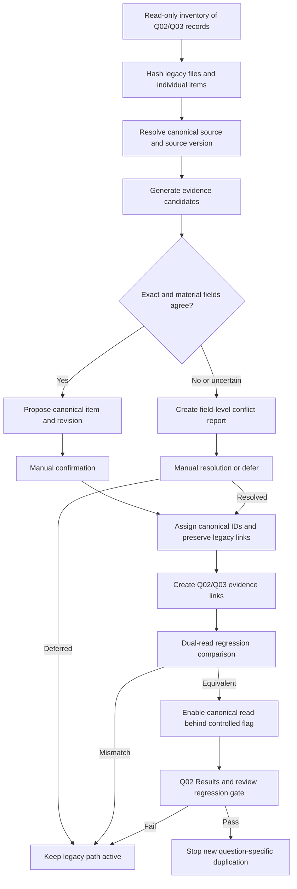

# Q02/Q03 canonical migration design

## Purpose and constraints

This document designs—but does not perform—the migration of existing Q02 and Q03 question-specific review records into the canonical evidence model.

The migration must preserve all current evidence text, source locations, numerical outcomes, specialist decisions, reviewer metadata, synthesis approvals, and Results behavior. It must not restore or inspect stash contents, modify private PDFs, create approvals, or silently merge evidence.

Q02 and Q03 remain example and regression questions. Their source-level evidence becomes canonical and reusable; question-specific interpretation and synthesis remain separate.

## Approved Phase 1 identity and revision rules

ADR-006 establishes the following constraints for compatibility and any later migration:

- Canonical IDs are opaque, immutable, typed (`SRC_`, `SRV_`, `SFL_`, `EVI_`, `REV_`, `LOC_`, `RFC_`, and `RVR_`) and use a UUIDv7-compatible domain abstraction without permanent library coupling.
- Evidence revision display is `EVI_<id>@r<positive integer>`.
- Existing `AES-*`, Q02/Q03, and question-owned identifiers remain immutable aliases and provenance references; none is silently replaced.
- Authority/type, specialist review decision, and source/reference verification status remain independent.
- Source, evidence review, publication, dispute, and Evidence Pack lifecycles remain independent.
- A correction creates a new immutable Evidence Revision. Approval applies only to the exact revision reviewed and never transfers automatically.
- A new Evidence Item is required when medical meaning, population, intervention, comparator, outcome, threshold, or distinct result materially changes.
- Source, Source Version, and Source File remain separate. Errata/corrigenda link explicitly to affected sources/versions; affected evidence requires a new revision and re-review.

Phase 1 only reads Q02/Q03 for compatibility. It does not assign these identifiers to real records or perform any migration.

## Current-state observations

- Sources are registered in `database/source_catalog.csv` using human-readable `AES-*` IDs.
- Questions are registered in `database/evaluation_questions.json`.
- Review files are named `database/content_reviews/Q##_AES-*.json`.
- Similar source evidence may be extracted separately for Q02 and Q03.
- Claims have question-specific IDs; some outcomes use stable-looking IDs while compatibility code can fall back to positional `outcome-<index>` IDs.
- Specialist decisions may exist both as legacy embedded fields and as authoritative `specialist_validation` maps.
- Q02 has an approved synthesis and working Results integration that must remain unchanged during transition.

These records are authoritative migration inputs. They are not assumed to be internally identical merely because they share a source ID.

## Migration principles

1. Inventory before transformation.
2. Read-only analysis before candidate creation.
3. Candidate matching is deterministic and explainable.
4. Similarity never equals identity automatically.
5. Every legacy field retains a traceable origin.
6. Specialist decisions attach only to the exact content they reviewed.
7. Conflicts require explicit manual resolution.
8. Dual-read compatibility precedes any write-path cutover.
9. Q02 Results equivalence is a release gate.
10. Rollback never requires reconstructing deleted legacy data.

## Migration artifacts

The migration implementation should produce versioned, reviewable artifacts:

- legacy inventory with file and record hashes;
- source/source-version resolution report;
- evidence-candidate report;
- exact-match and similarity features;
- field-level divergence report;
- specialist-decision provenance report;
- manual-resolution queue;
- canonical-ID assignment manifest;
- legacy-to-canonical mapping manifest;
- question-evidence-link manifest;
- synthesis-reference translation report;
- Q02/Q03 regression report;
- cutover and rollback report.

Artifacts contain repository-relative record identifiers, never private PDF paths.

## Candidate identity detection

Evidence from Q02 and Q03 is a candidate for one canonical evidence item only when it comes from the same verified source version and represents the same distinct proposition or result.

### Hard prerequisites

- Same resolved canonical source.
- Same source edition/version/report.
- No conflicting DOI, PMID, title, journal/issuer, publication year, edition, or official identifier.
- Same evidence kind, or a manually approved kind reconciliation.
- Source locations are compatible with the same original passage, table cell, figure panel, or result.

### Comparison features

- exact supporting-text hash under canonical normalization;
- exact and normalized quotation;
- printed/PDF page and structural anchor;
- recommendation number and exact wording;
- table number, row, column, headers, and footnotes;
- figure number, panel, axes, legend, and time point;
- structured population, intervention/exposure, comparator, outcome, and time;
- numerical value, units, denominator, uncertainty, and analysis set;
- claim meaning and limitations;
- evidence authority/type and verification status;
- source-file hash or verified rendition relationship.

### Candidate classes

- `exact_candidate`: same source version, quotation hash, location, kind, and structured meaning.
- `probable_candidate`: same proposition/location with non-material formatting or wording differences.
- `related_not_identical`: same passage supports distinct propositions or results.
- `conflict`: incompatible wording, location, value, interpretation, limitation, status, or source version.
- `unique`: no candidate in the other question.

Only `exact_candidate` may be proposed for streamlined confirmation. No class is merged without a recorded migration resolution.

## Differences that must be flagged

The migration report must show field-level differences for:

- claim or outcome wording;
- exact supporting text;
- printed page, PDF page, section, recommendation, table, figure, or note;
- population, phase, intervention, comparator, endpoint, time point, denominator, units, estimate, or uncertainty;
- direct/indirect classification;
- evidence authority/type and source/reference verification status;
- limitation, ambiguity, contradiction, or inference language;
- reviewer identity, date, comments, original-source confirmation, and inspection scope;
- embedded versus mapped decision source;
- Pending, Approved, Needs correction, Excluded, incomplete approval, disputed, or retired status;
- `suitable_for_generated_answer` and synthesis-use history;
- translation or source-language treatment.

Legacy representations such as `Disputed` or `Retired` must be projected into the approved independent dispute or publication lifecycle, never into the four-value specialist review decision vocabulary.

Differences must not be resolved by choosing the latest file, most permissive status, longest text, or Approved state automatically.

## Specialist-decision preservation

- Each legacy decision is imported as a historical review event with its legacy record ID, record hash, item ID, decision representation, reviewer metadata, and date.
- Authoritative mapped decisions take precedence for current display only where current application logic already establishes that rule; both mapped and embedded histories remain in migration provenance.
- A decision is attached to a canonical revision only when the canonical content and location are materially identical to the reviewed legacy item.
- If Q02 and Q03 decisions differ, preserve both and create a conflict requiring adjudication.
- Approved plus Pending does not become Approved automatically.
- Approved plus Excluded or Needs correction requires manual resolution.
- Incomplete approval metadata remains incomplete.
- No migration process sets original-source confirmation, reviewer identity, review date, or approval.

## Manual resolution

Resolvers must be shown:

- both complete legacy records side by side;
- field-level differences;
- source and source-version identity;
- original source locations and hashes;
- all specialist decisions and review provenance;
- existing question/synthesis/Results use;
- proposed canonical item/revision and mappings;
- downstream effect of each resolution.

Allowed resolutions:

- confirm one canonical item and one revision;
- confirm one evidence item with multiple revisions;
- create separate evidence items;
- correct a candidate through the normal specialist workflow;
- mark disputed, retired, or excluded;
- defer without cutover.

Every resolution creates an authenticated audit event. Bulk silent acceptance is prohibited.

## Migration flow



## Phased migration

### Phase 1: Frozen inventory

- Record branch/commit baseline and repository-relative legacy paths.
- Hash every source catalog row, question record, review JSON, and synthesis file.
- Enumerate all claims, outcomes, decisions, reviewer fields, and references.
- Do not change legacy files.

### Phase 2: Source resolution

- Create canonical source and source-version candidates from the catalog and review identity blocks.
- Retain `AES-*` IDs as aliases.
- Detect duplicate and conflicting source identities; require manual resolution.

### Phase 3: Evidence candidates

- Canonicalize comparison-only text with a versioned profile while retaining exact text.
- Generate candidate groups by source version, evidence kind, location, text hash, and structured meaning.
- Produce divergence reports and manual queues.

### Phase 4: Canonical creation

- After manual decisions, assign source, version, evidence, revision, location, and review IDs.
- Preserve legacy item and file hashes on every migrated record.
- Create separate items/revisions where identity is not certain.

### Phase 5: Question mappings

- Create Q02/Q03 question versions and `question_evidence_links` pinned to evidence revisions.
- Preserve question-specific relevance, scope, and interpretation outside canonical evidence.
- Translate synthesis `claim_refs` and outcome references through an explicit mapping manifest without editing the current approved synthesis during the design/migration-validation phase.

### Phase 6: Dual-read compatibility

- Legacy remains the write authority initially.
- A compatibility adapter projects canonical records into the current `ContentReview` shape.
- Compare item counts, text, locations, decision aggregation, source status, synthesis inputs, and Results output.
- Differences fail closed and keep legacy behavior active.

### Phase 7: Controlled cutover

- Freeze affected legacy writes during final reconciliation.
- Switch review and question reads to canonical IDs behind a reversible release control.
- Preserve legacy records as immutable migration evidence.
- Stop generating new `Q##_SOURCE.json` source-level duplicates.
- New questions create question links to existing evidence or initiate one canonical source-review workflow for genuinely new evidence.

## Preserving Q02 Results and regression behavior

Before cutover, tests must prove:

- approved Q02 synthesis text and decision are byte-for-byte unchanged;
- every Q02 source and evidence reference resolves to the intended canonical revision;
- approved/Pending/correction/excluded aggregation matches current authoritative behavior;
- source-review routes display equivalent evidence and decisions;
- Results sections, labels, warnings, citations, and source exclusions are unchanged;
- no Pending or excluded evidence becomes answer-eligible;
- no private path or source file is exposed;
- English/Japanese output remains equivalent;
- rollback restores legacy reads without data conversion.

Golden regression fixtures should be produced from approved repository state and reviewed before implementation.

## Preventing future duplicate review

- Source registration resolves or creates a canonical source/version before extraction.
- Authors search existing canonical evidence by source, location, text fingerprint, and evidence kind.
- A question attaches existing approved revisions through `question_evidence_links`.
- New question-specific context is stored as relevance or interpretation, not copied evidence.
- A genuinely new claim/result from an already reviewed source creates a canonical evidence item and one review.
- The system rejects new question-owned source-level evidence after cutover, except through a controlled legacy-import path.
- UI and APIs display reuse status and all linked questions.

## Legacy-to-canonical mapping example

Synthetic, non-medical example:

```json
{
  "migration_batch": "MIG-SYNTHETIC-001",
  "legacy_items": [
    {
      "path": "database/content_reviews/Q02_AES-SYN-001.json",
      "item_id": "Q02-SYN-C01",
      "record_hash": "sha256:synthetic-q02"
    },
    {
      "path": "database/content_reviews/Q03_AES-SYN-001.json",
      "item_id": "Q03-SYN-C04",
      "record_hash": "sha256:synthetic-q03"
    }
  ],
  "candidate_class": "exact_candidate",
  "manual_resolution": "confirmed_same_evidence",
  "canonical_revision_id": "EVI_<synthetic-id>@r1",
  "question_links": ["Q02@v1", "Q03@v1"],
  "approval_created_by_migration": false
}
```

## Current components to reuse

- Registered question and source lookup.
- Safe ID patterns and path traversal rejection.
- Server-only review storage boundary.
- Atomic write approach.
- Explicit mapped decision authority and legacy fallback logic.
- Approval-completeness validation and aggregation.
- Source/review validation scripts and focused synthetic tests.
- Question-generalized routes and synthesis loading.

## Transitional components

- Question-prefixed review JSON files and claim IDs.
- Embedded and mapped duplicate decision representations.
- Positional outcome IDs.
- Question-specific source review finalization and Git-based publication.
- Copied synthesis reference arrays using legacy claim IDs.
- Direct Results consumption of question-specific synthesis JSON.

They remain supported until regression equivalence and rollback criteria are met.

## Unresolved product-owner decisions

1. Whether migration confirmation requires a specialist, evidence librarian, or dual approval.
2. Treatment of identical text reviewed by different specialists on different dates.
3. Whether differing question-specific claim paraphrases become interpretations or evidence revisions.
4. Whether a legacy Approved item with incomplete modern provenance may remain usable during transition.
5. Cutover granularity: per source, per question, or all Q02/Q03 together.
6. Duration and retention class for legacy compatibility records.
7. Whether synthesis references pin evidence revisions forever or follow approved successors after explicit re-review.
8. How current Git commit provenance maps into future append-only audit events.
9. Exact rollback duration and release-control ownership.

## Migration acceptance criteria

- No legacy file is modified during inventory or candidate generation.
- Every migrated entity links to legacy path, item ID, file hash, and decision provenance.
- No candidate is merged automatically.
- Every material difference is surfaced and manually resolved or deferred.
- Migration creates zero new specialist approvals.
- All incomplete approvals remain incomplete.
- Q02 approved synthesis and Results are unchanged through dual-read validation.
- Q03 current evidence states remain unchanged.
- Canonical projections reproduce authoritative UI/CLI aggregation.
- Every synthesis reference resolves or blocks cutover.
- No Pending, correction-required, excluded, disputed, or mismatched item gains Pack eligibility.
- Rollback is tested without deleting canonical or legacy history.
- After cutover, a new question reuses canonical evidence without creating duplicate source-review records.
