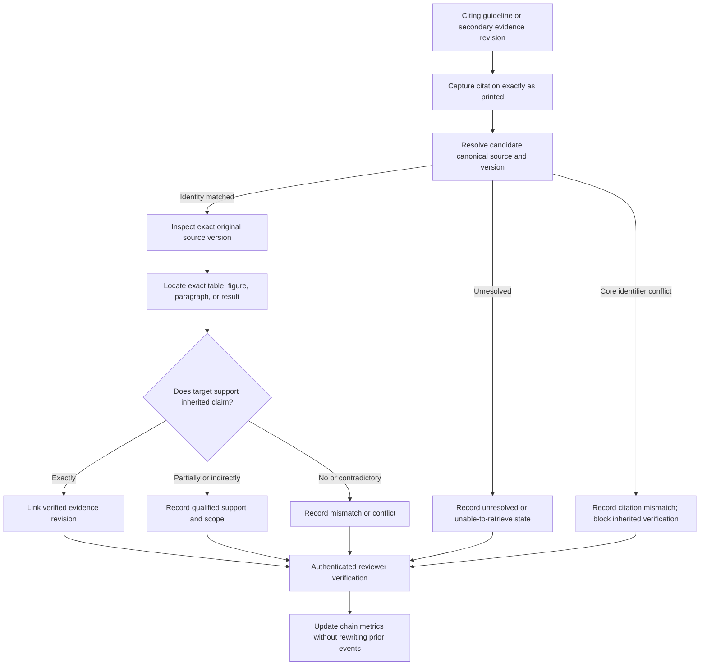

# Reference-chain verification standard

## Purpose

This standard defines how AES records and verifies citation chains from guidelines, reviews, and other secondary sources to original primary evidence. It prevents a cited source from inheriting verification merely because another document cites it.

Example chain:

`guideline recommendation → cited systematic review → cited primary study → original table, figure, or result`

Every node and edge has independent identity, version, provenance, verification, authority/type, review decision, dispute, and publication state. These dimensions must never be collapsed into a generic `Validated` state.

## Core safeguards

1. Citation existence is not evidence support.
2. Bibliographic resolution is not content verification.
3. Verification of a guideline recommendation is not verification of its cited studies.
4. Verification of a systematic review is not verification of every included study.
5. Verification of a primary paper is not verification of every endpoint, table, or figure in it.
6. Support is scoped to one inherited claim and cannot be generalized silently.
7. Missing, inaccessible, conflicting, or mismatched citations remain visible and measurable.
8. Machine-assisted citation matching may propose relationships but may not mark them verified.

## Chain model

A `reference_chain` represents a stable citation edge or a governed ordered path. Each edge records:

- citing source version and, when applicable, citing evidence revision;
- citation text exactly as printed;
- bibliography/recommendation/footnote location;
- direct or indirect citation;
- inherited claim being evaluated;
- target identifier as printed;
- resolved canonical source/version/evidence target when known;
- resolution confidence and method;
- current verification state;
- parent/child edge for ordered paths.

A `reference_verification` is an append-only human decision about one edge and inherited claim.

## Direct and indirect citation

- **Direct citation:** The citing text explicitly attaches the target citation to the inherited claim, result, recommendation rationale, table row, or sentence.
- **Indirect citation:** The target is reached through another source, a bibliography chain, a general paragraph citation, a review inclusion list, or another relationship that does not directly attach the target to the exact inherited claim.

Directness describes citation structure, not strength, correctness, or study design.

## Verification states

### Retrieval and resolution

- `unresolved`: target identity is not yet resolved.
- `resolved_metadata_only`: bibliographic identity matched, original content not inspected.
- `unable_to_retrieve`: required original version could not be obtained.
- `wrong_source`: identifier resolves to a different work/version.
- `retrieved`: exact target version obtained but support review is incomplete.

### Support determination

- `supports_exactly`: target directly supports the inherited claim with matching population, intervention/exposure, comparator, endpoint, timing, and direction.
- `supports_partially`: target supports only a documented subset or qualified version.
- `supports_indirectly`: target provides background or related evidence but not direct support.
- `does_not_support`: target does not support the inherited claim.
- `contradicts`: target reports materially conflicting evidence.
- `unable_to_determine`: source was inspected but support cannot be determined reliably.
- `not_reviewed`: no specialist support decision.

### Citation-match status

- `match`: printed citation and resolved source identity agree.
- `partial_metadata_warning`: minor non-core discrepancy exists.
- `citation_mismatch`: source identity, version, location, population, result, or attribution conflicts materially.
- `citation_missing`: inherited statement has no identifiable supporting citation.

These dimensions remain separate. For example, a correctly resolved citation can still fail to support the claim.

## Required verification record

Each verification must record:

- reference-verification ID;
- reference-chain ID and exact edge revision;
- inherited claim text and hash;
- direct/indirect designation;
- retrieval state;
- citation-match state;
- support determination;
- reviewer identity, specialty, and role;
- verification date and timestamp;
- original-source confirmation;
- inspected full text/table/figure/supplement flags;
- exact target source version and file hash when inspected;
- supporting or contradicting evidence revision/location IDs;
- comments explaining partial, indirect, mismatch, conflict, or unable-to-verify decisions;
- authenticated audit-event ID.

No field may default to a positive verification state.

## Verification workflow



## Verification levels

| Level | Minimum completed work | Permitted authority label |
|---|---|---|
| L0 Captured | Citation text and citing location recorded | Secondary citation only |
| L1 Resolved | Target bibliographic identity matched | Primary source not yet verified |
| L2 Retrieved | Exact target version obtained and hashed | Primary source not yet verified |
| L3 Located | Exact target evidence and location identified | Primary source not yet verified |
| L4 Specialist verified | Target support and scope approved by specialist | Underlying primary evidence verified, if support is exact and policy passes |
| LX Failed | Wrong source, mismatch, unable to retrieve, or does not support | Citation mismatch / unable to verify |

Levels are descriptive milestones, not substitutes for detailed states.

The canonical source/reference verification statuses exposed beyond this detailed chain workflow are:

- `original_source_verified`;
- `underlying_primary_evidence_verified`;
- `secondary_citation_only`;
- `primary_source_not_yet_verified`;
- `unable_to_verify`;
- `citation_mismatch`; and
- `conflicting_interpretation`.

These statuses summarize verified depth or a verification problem for a defined scope. They do not replace the detailed retrieval, support, and citation-match dimensions above, do not constitute a specialist review decision, and do not establish publication eligibility.

## Inherited-claim scope

The verification question must be explicit. It includes:

- exact inherited wording;
- citing source and location;
- population and disease definition;
- intervention/exposure and comparator;
- outcome or recommendation rationale;
- time point;
- numerical value and uncertainty where relevant;
- whether the inherited claim is causal, prognostic, descriptive, or interpretive.

A source supporting a narrower claim results in `supports_partially`, with the supported and unsupported portions recorded separately. The inherited wording must not be rewritten silently to obtain a positive decision.

## Multi-hop chains

- Each edge is verified independently.
- A positive downstream edge does not cure an unsupported upstream paraphrase.
- A chain is fully verified only when every required edge is resolved and the terminal primary evidence supports the inherited claim at the required scope.
- Systematic-review inclusion is recorded separately from support for a review's pooled conclusion.
- Shared primary sources are canonical nodes reused by multiple chains.
- Cycles and self-citations are allowed as bibliographic facts but cannot satisfy terminal primary-verification requirements.

## Mismatch taxonomy

Citation mismatches include:

- wrong DOI, PMID, official identifier, title, journal/issuer, year, edition, or report;
- cited abstract when a full report is claimed;
- cited protocol when results are claimed;
- wrong population, disease phase, intervention, comparator, endpoint, time point, denominator, direction, or effect estimate;
- table/figure/paragraph does not contain the attributed result;
- secondary source overstates or reverses the primary source;
- cited paper cites another source for the actual claim without presenting its own evidence;
- translated or paraphrased wording changes material meaning.

Mismatch records preserve the original attribution and correction history.

## Unable to retrieve

Record:

- attempted identifiers and sources;
- target version required;
- dates and methods of attempts;
- access/licensing barrier category without credentials or private paths;
- whether an alternate version exists and why it is insufficient;
- reviewer decision and next-review date if applicable.

Unable-to-retrieve evidence cannot be labeled primary-source verified. Metadata-only resolution is not a substitute.

## Corrections and reverification

- New source versions, corrected citations, changed inherited wording, changed target evidence, or changed support interpretation require a new chain/verification revision.
- Previous verification remains immutable and linked to Packs that used it.
- A source-file byte change requires location re-verification against the new file even when content appears unchanged.
- Errata and corrigenda link explicitly to the affected source or source version. An official corrected publication is represented as a source version; a byte-distinct rendition is always a new source file.
- If a correction affects an evidence revision, record the impact, create a new immutable evidence revision, require specialist re-review and new approval, and publish only through a later Pack. Approval does not transfer.
- Updated reference chains affect future Pack releases only; prior Packs retain historical provenance and may receive revocation/supersession metadata.

## Publication and display

Pack records must expose enough non-restricted provenance to distinguish:

- recommendation directly verified;
- primary evidence directly verified;
- underlying primary evidence verified through a completed chain;
- secondary citation only;
- primary source not verified;
- unable to verify;
- citation mismatch;
- conflicting interpretation.

Unresolved chain counts must contribute to Pack quality metrics. A user must be able to tell where a chain stops.

## Synthetic non-medical example

```json
{
  "reference_chain_id": "RFC_<synthetic-id>",
  "citing_revision_id": "EVI_<synthetic-id>@r1",
  "citation_text_as_printed": "Example Review 2098;4:10-20",
  "citation_type": "direct",
  "inherited_claim": "Synthetic material retained performance at day 30.",
  "resolved_target_source_version_id": "SRV_<synthetic-id>",
  "verification": {
    "reference_verification_id": "<synthetic-reference-verification-id>",
    "retrieval_status": "retrieved",
    "citation_match_status": "match",
    "support_status": "supports_partially",
    "supported_scope": "Retention measurement only; no durability outcome",
    "reviewer_id": "RVR_<synthetic-id>",
    "verification_date": "2099-01-02",
    "original_source_confirmed": true,
    "target_location_id": "LOC_<synthetic-id>"
  }
}
```

## Unresolved product-owner decisions

1. Which source types and claims require completed L4 reference-chain verification before Pack inclusion?
2. Whether secondary-only evidence may appear in Packs and answer generation.
3. Whether one specialist may verify both citing and cited evidence.
4. Reverification intervals and triggers.
5. Display depth for commercial users versus auditors.
6. Handling of inaccessible licensed sources and abstracts-only records.
7. Whether qualified `supports_partially` relationships can support synthesis automatically.
8. Whether citation-mismatch notices are published to commercial users.

## Implementation acceptance criteria

- Every edge records direct/indirect status and an exact inherited claim.
- Metadata resolution cannot produce a primary-verified label.
- Multi-hop verification requires every necessary edge; no transitive positive assumption is allowed.
- `unable_to_retrieve` and `citation_mismatch` remain visible and measurable.
- Partial support cannot be displayed as exact support.
- Verification is bound to exact source/evidence revisions and source-file hashes.
- Changed inherited wording or target version requires reverification.
- Prior chain decisions and Pack provenance remain immutable.
- Synthetic tests demonstrate guideline-to-review-to-primary-to-table chains, mismatches, inaccessible targets, partial support, and conflicting evidence.
